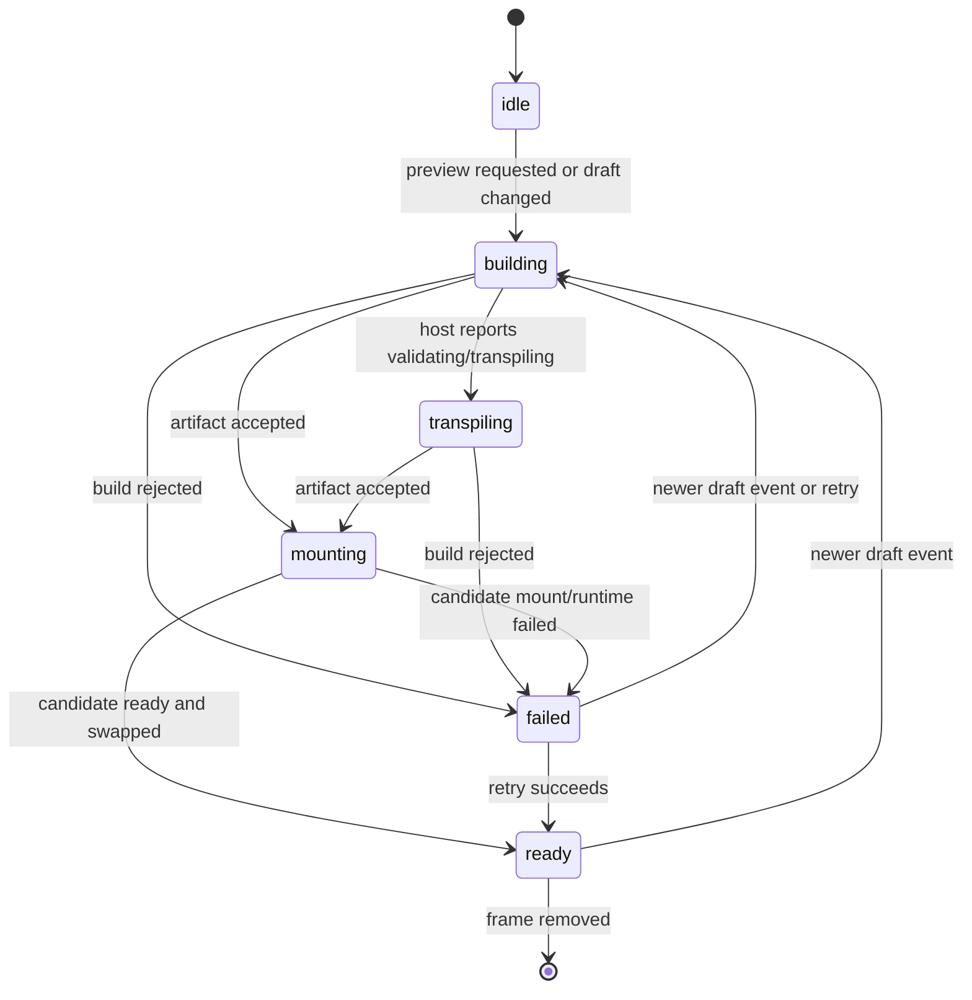

# A121 - AI Chat: automatic Preview lifecycle and last-good rendering
[Overview](../BASED.md)

Make AI-created widget Previews appear automatically and make the Preview frame
continuously explain its lifecycle while preserving the last successfully
mounted widget during rebuilds.

## Context

The current AI Chat result renders an explicit **Open Preview** button. Once a
Preview frame exists, its first mount leaves the content area empty while the
backend builds the widget; a later source change can also look like a blank
frame until the replacement finishes. The backend already emits catalog events
with `previewWidgetKeys`, and the browser mount target already supports a
candidate generation that is hidden until `ready()` succeeds. The missing part
is one frontend-owned, pure projection of the observable Preview lifecycle and
one automatic host orchestration around it.

## Plan

The state record is revision-fenced: a late build or mount result may only
complete the request that created it. `displayed` is separate from
`attempted`, so a failed next build cannot replace the last-good frame.

## Acceptance criteria

- Successful widget-create/validate results automatically ensure one Preview
  frame for that draft; the human does not need to click a result action.
- The initial frame shows an animated “Building Preview” surface immediately.
- A rebuilding frame keeps the current widget interactive and adds a
  non-blocking lifecycle overlay.
- Build, transpile/validation, mounting, ready, and failed states are visible
  through accessible status text.
- A failed replacement keeps the previous mount visible and identifies that
  the displayed widget is the last successful build.
- Catalog events refresh matching Preview frames automatically and coalesce
  bursts so only the latest build is mounted.
- The pure state machine has transition tests for legal, stale, fallback, and
  recovery paths.

## TODOS

- [x] Add the pure revision-fenced Preview state machine and tests.
- [x] Auto-place/focus a draft Preview from successful AI Chat widget results.
- [x] Subscribe Preview frames to matching catalog events with latest-wins
  refresh behavior.
- [x] Add initial/building/transpiling/mounting/failed overlays without
  removing the last-good mount.
- [x] Remove the Preview click requirement while preserving a manual retry
  action where useful.
- [x] Run focused tests, typechecks, and frontend build.
- [x] Keep Preview automation bound across Canvas runtime replacement; unbind
  must not permanently retire `ensure()`.
- [x] Auto-open each draft once from ChatTab history, and serialize `ensure()`
  so create-then-validate cannot place duplicate frames.
- [x] Show the host diagnostic on last-good failures and pass the original
  error to the manual retry toast.
- [x] Restart the catalog-event watcher after a stream error until dispose.
- [x] Cover remount, concurrent ensure, unique-name auto-open, last-good
  diagnostic, and recovery transitions with tests.

## NOTES

- This deliberately replaces A82's human-click gate with automatic
  presentation; A82's safe structured tool-result extraction remains useful.
- The frame remains a normal Canvas widget frame. The automatic behavior does
  not create a second durable authority or persist build output in the Canvas
  document.
- `createWidgetPreviewAutomation()` outlives one Canvas runtime. Unbind is a
  document detach, not composition teardown. Chat should open each draft name
  once; catalog events own later refreshes.

### LOGS

- 2026-08-17: Created from the AI Chat Preview UX investigation. Current code
  has a manual result action, an empty initial mount, and no frame-side
  subscription to `previewWidgetKeys` catalog events.
- 2026-08-17: Implemented automatic Preview placement/focus, the pure
  revision-fenced lifecycle reducer, accessible build/transpile/mount/retry
  status surfaces, catalog-event refresh, and candidate-only replacement so a
  last-good frame remains interactive until its successor is ready. Focused
  tests, typechecks, and the frontend/package builds pass.
- 2026-08-17: Review found sticky `disposed` after Canvas remount, racy
  per-message auto-open, hidden last-good diagnostics, a generic retry toast,
  and a one-shot catalog watcher. Follow-up todos added before the repair.
- 2026-08-17: Repair: Preview automation survives Canvas unbind/rebind and
  serializes `ensure()`; ChatTab auto-opens each draft name once; last-good
  failures keep the host diagnostic; retry toasts use the original error;
  catalog watching reconnects until dispose. Focused tests and typechecks
  pass.
