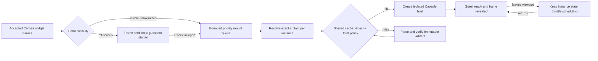

# A124 - Widget runtime: visible-first startup and shared artifact caching
[Overview](../BASED.md)

Make multi-widget canvases become useful sooner by starting visible widgets
first, deferring guest execution for off-screen frames, and sharing immutable
artifact work by exact digest while preserving one isolated Capsule runtime per
widget instance.

## Context

Cold Canvas hydration currently reconciles every accepted widget frame into a
Cangine portal. [`CanvasExtensionBridge.ts`](../../packages/canvas/src/internal/CanvasExtensionBridge.ts)
registers each portal and immediately calls the matching extension's asynchronous
`mount`, which starts transport loading and Capsule for every frame regardless
of whether the frame intersects the viewport.

Cangine already computes and publishes `TPortalState.visible`, supports
`onVisibilityChange`, and hides off-screen portals when
`suspendWhenOffscreen` is enabled. Omnidraw does not currently deliver that
visibility signal to its widget host. The widget viewport projection in
[`fn.widget-viewport.ts`](../../apps/frontend/src/core/widgets/fn.widget-viewport.ts)
also hard-codes `distance: 0`, `priority: 1`, and `occlusion: 0`, so the SDK
cannot distinguish a visible high-priority frame from distant Canvas content.

The SDK browser host has a second repeated cost. In
[`browser-host.ts`](../../packages/sdk/src/internal/browser-host.ts), every
mount creates a new Capsule host and a new `CapsuleMemoryArtifactCache`. The
per-mount host is required for guest isolation, but the cache lifetime means
multiple instances of the same exact signed artifact repeat immutable artifact
preparation instead of sharing the bounded content-addressed result.

This task changes scheduling and caching only. It does not share guest realms,
local-store state, capability bindings, function ports, resource handles, or
instance identity. It does not weaken the published/Preview identity checks in
`widget.runtime.load` or `widget.preview.open`.

## Plan

### 1. Measure and define the scheduling contract

- Add deterministic timing/count evidence for canvases containing repeated and
  distinct DOM, Canvas 2D, and WebGL widgets.
- Record time to first visible ready widget, time until all visible widgets are
  ready, concurrent transport loads, Capsule host creations, artifact cache
  hits, and off-screen guest starts.
- Treat selected, focused, maximized, and viewport-intersecting frames as
  visible priority work. Preserve stable Canvas order as the final tie-breaker.
- Set a small bounded mount concurrency rather than starting every Capsule host
  simultaneously. Cancellation, navigation, and viewport changes must remove
  queued work without reviving stale nodes.

### 2. Deliver real portal visibility to the widget host

- Extend the smallest renderer-neutral `@omnidraw/canvas` widget-host seam so
  a mount owner can observe current Cangine portal visibility without importing
  Cangine or browser-only geometry types.
- Do not begin artifact transport or Capsule guest execution for a cold
  off-screen frame. Keep its normal Cangine frame chrome and B116's loading
  presentation available when it becomes eligible.
- Once an instance has mounted, preserve mount-local guest state when it leaves
  the viewport. Use `setSchedulingMode('throttled')` while off-screen and return
  to `active` on visibility, rather than destroying it on every pan.
- Keep hidden authored nodes, collapsed frames, clipped groups, maximized mode,
  and Canvas teardown distinct from ordinary off-screen throttling.
- Replace the hard-coded viewport scheduling fields with bounded values derived
  from authoritative portal state; guest input never chooses priority.

### 3. Share immutable artifact work, not runtimes

- Move the bounded Capsule artifact cache to the lifetime of one
  `IWidgetBrowserHost`, so its per-mount Capsule hosts can reuse exact immutable
  artifact preparation.
- Key reuse by exact artifact bytes/digest and every trust-policy input required
  by Capsule, including Preview versus release signing authority. A declared
  digest alone is never trusted before byte verification.
- Keep each widget mount on a separate Capsule host/guest realm with distinct
  subject, functions, capabilities, channels, viewport, local store, errors,
  lifecycle, and disposal.
- Deduplicate concurrent cache misses for the same exact key. A cancelled
  waiter must not cancel work still required by another live mount.
- Keep cache size/entry bounds and disposal owned by the browser host. Eviction
  may make a later mount slower but cannot affect a running widget.
- Add a content-addressed transport-byte cache only if measurement proves
  transfer/decoding is still material. Per-instance backend identity validation
  remains mandatory even when bytes are locally reusable.

### 4. Preserve package and architecture boundaries

- Keep Cangine details inside `@omnidraw/canvas`; expose only the minimum
  renderer-neutral visibility/scheduling signal to the application extension.
- Keep Capsule implementation types internal to `@omnidraw/sdk`. Public SDK
  and Canvas APIs remain Effect-free.
- Use exact `effect@4.0.0-rc.108` internally for bounded concurrent mounting,
  cancellation, and lifecycle ownership where complexity requires it.
- Because this changes public runtime code under `packages/canvas/src` and
  `packages/sdk/src`, bump affected package versions semantically and regenerate
  lockfile/public package evidence.

### 5. Verify behavior and performance

- Prove no off-screen guest is evaluated during a cold load until eligible,
  while every visible frame starts in deterministic priority order.
- Pan rapidly and prove stale queued work is cancelled, mounted guests
  throttle/resume without losing local state, and no mount is duplicated.
- Mount many instances of one artifact and prove one bounded immutable cache
  admission with isolated guest instances and per-instance function subjects.
- Cover cache eviction, policy/key changes, Preview/published separation,
  artifact rejection, fatal failure, navigation, Canvas replacement, and host
  disposal.
- Add a real-browser performance gate with relative assertions: visible widgets
  never wait behind off-screen work, and repeated artifacts show cache reuse.

## TODOS

- [ ] Add cold multi-widget lifecycle and cache instrumentation.
- [ ] Expose authoritative portal visibility through the Canvas widget-host seam.
- [ ] Add a bounded visible-first mount queue with cancellation and stable ordering.
- [ ] Defer cold off-screen startup and throttle already-mounted off-screen guests.
- [ ] Replace hard-coded scheduling fields with host-owned visibility projections.
- [ ] Share one bounded artifact cache across isolated hosts owned by one SDK browser host.
- [ ] Deduplicate concurrent exact-key cache misses without sharing guest authority.
- [ ] Add deterministic unit, integration, and real-browser performance coverage.
- [ ] Bump affected public package versions and regenerate release/lockfile evidence.

## Acceptance criteria

- Visible, selected, focused, or maximized widgets start before off-screen
  widgets and never wait behind the full Canvas population.
- A cold off-screen frame does not load artifact bytes or execute guest code
  until it becomes eligible.
- An already-mounted off-screen widget is throttled, not destroyed, and
  preserves mount-local state when it returns.
- Repeated instances of one exact artifact reuse bounded immutable artifact
  work while retaining completely isolated Capsule runtimes and capabilities.
- Preview and release trust policies cannot cross-hit the cache accidentally.
- Rapid pan, navigation, cancellation, failure, and teardown leak no queued
  work, hosts, listeners, cache leases, or guest authority.
- The optimization needs no Canvas document, database, widget release, or
  portable artifact format change.

## NOTES

- [B116](../b/B116.md) owns truthful loading/building presentation. A124 owns
  when expensive runtime work starts and how immutable artifact work is reused.
- Cangine already computes portal visibility and `suspendWhenOffscreen`; the
  missing piece is application lifecycle ownership, not another DOM observer.
- Never cache an `IWidgetBrowserMount`, Capsule host, guest realm, capability
  binding, resource result, or local-store value.
- No mockup is needed because frame appearance is unchanged; the state and
  scheduling diagram is the authoritative plan visual.

### LOGS

- 2026-08-20: Confirmed Canvas registers and mounts every accepted widget
  portal before consuming Cangine's computed `visible` state. Confirmed the
  application viewport projection hard-codes scheduling metadata.
- 2026-08-20: Confirmed the SDK creates a separate Capsule host and a fresh
  `CapsuleMemoryArtifactCache` for every mount. Planned host-lifetime immutable
  cache reuse while retaining per-instance guest isolation.

---
