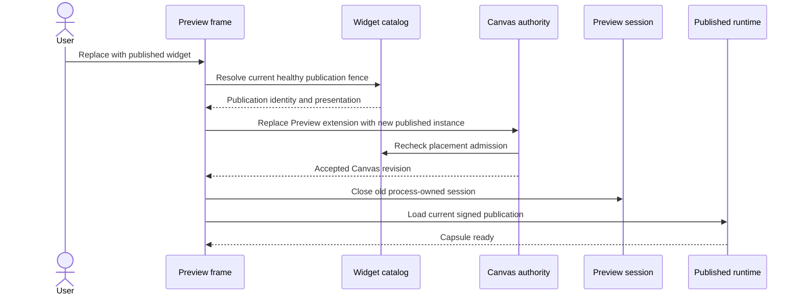

# A125 - Preview: explicitly replace a frame with the published widget
[Overview](../BASED.md)

Add an explicit **Replace with published widget** action that turns one
authoring Preview frame into a normal published placement while preserving its
Canvas layout. Publishing alone continues to leave the Preview intact.

## Context

A Canvas draft placement is persisted as `widget-preview`; a published
placement is persisted as `widget-instance`. Both use the same widget-frame
Canvas schema, but they have different runtime and trust paths:

- Preview recreates a process-owned session and uses the Preview signing key;
- published runtime resolves the current immutable publication and uses the
  release signing key.

The Preview title-bar action in
[`canvas-extension/index.ts`](../../apps/frontend/src/shell/framework/feature/canvas-extension/index.ts)
currently calls `widget.publication.buildAndPublish`, refreshes the catalog,
and shows a success toast. It deliberately performs no Canvas command, so the
existing frame remains `widget-preview` and returns through Preview recovery
after restart. This supports continued authoring, but users need an explicit
way to finish authoring on that frame and make it follow the publication.

Replacing the extension type is not just a presentation edit:

- [`CanvasService.ts`](../../apps/backend/src/shell/canvas/authority/CanvasService.ts)
  must admit the transition against the current healthy publication and retain
  unique published instance identity;
- the Preview session must close only after the Canvas mutation is accepted;
- [`CanvasExtensionBridge.ts`](../../packages/canvas/src/internal/CanvasExtensionBridge.ts)
  currently keeps a portal mounted when the same registration still matches,
  so a Preview-to-published change must force a runtime-mode remount;
- published `widget.runtime.load` rechecks the accepted Canvas item before
  returning release bytes, so optimistic browser state cannot execute as a
  published widget before durable authority accepts it.

This is an explicit user action, not a database migration and not an automatic
side effect of **Build and Publish**.

## Plan

### 1. Define the user action and availability

- Add **Replace with published widget** to Preview title-bar actions only when
  the same widget key has a healthy current publication.
- Keep **Build and Publish** unchanged: it creates/replaces the publication but
  leaves the authoring Preview available for continued editing.
- After successful publication, expose the replacement action immediately and
  make the success copy clear that the current frame remains a Preview.
- If the draft differs from the publication, replacement uses the currently
  published version; it never silently builds or publishes draft changes. Use
  clear confirmation copy when this distinction matters.

### 2. Project the published frame deterministically

- Preserve Canvas item ID, position, size, transform, parent, order, visibility,
  lock state, and supported widget `uiProps`.
- Remove Preview-only presentation: the `Preview:` title prefix, warning title
  color, and Preview action dropdown. Use current published presentation from
  the fenced catalog entry.
- Create a fresh published `instanceId`. Preview session identity and
  mount-local state do not become published authority.
- Change only the `omnidraw:widget` extension from `widget-preview` to
  `widget-instance`. Never persist Preview generation, artifact, resource
  binding, session, or diagnostics in Canvas data.
- Put the projection in a pure frontend function with exact codec tests.

### 3. Admit the transition through durable Canvas authority

- Treat `widget-preview` to `widget-instance` as a new published placement and
  require the same current-publication admission as normal **Add**.
- Fence the action by selected catalog/publication identity. A deleted,
  unhealthy, or changed publication fails safely and leaves Preview untouched.
- Commit one authoritative Canvas upsert so undo/redo treats replacement as one
  action. Do not delete and recreate geometry through separate visible writes.
- Keep backend Canvas authority as durable judge. Optimistic chrome can update,
  but `widget.runtime.load` cannot start until the exact node is accepted.

### 4. Transfer runtime ownership safely

- Make runtime mode or instance-identity change invalidate the existing portal
  mount even though the same frontend registration still matches. Dispose
  Preview status/diagnostics and remount through `widget.runtime.load`.
- Close the old Preview session only after Canvas replacement is durably
  accepted. If resolution or admission fails, preserve the Preview session and
  visible last-good content.
- If published Capsule loading fails after accepted replacement, keep the new
  published identity and show B116's published load-failure state. Never
  silently revert to Preview or rebuild the draft.
- Undo recreates Preview from the accepted draft generation; redo remounts the
  publication. Late Preview events cannot affect the published mount.

### 5. Verify races and user expectations

- Cover healthy replacement, absent/unhealthy publication, catalog change,
  publication deletion, Canvas conflict, load failure, undo, redo, restart,
  frame deletion, and cancellation.
- Prove geometry/order and ordinary Canvas styling remain byte-equivalent
  except for intended title/header/extension projection.
- Prove the new instance follows later publication updates while the draft and
  any other Preview frames remain independent.
- Add pointer and keyboard coverage for availability, confirmation, focus
  preservation, and accessible success/failure feedback.

## TODOS

- [ ] Add the source- and health-aware Preview replacement action.
- [ ] Add the pure Preview-to-published node projection with a fresh instance ID.
- [ ] Require current-publication placement admission for the Canvas transition.
- [ ] Fence replacement against catalog/publication drift.
- [ ] Remount the portal when runtime mode or instance identity changes.
- [ ] Close Preview ownership only after authoritative Canvas acceptance.
- [ ] Add failure, undo/redo, restart, and later-publication-following tests.
- [ ] Update the Canvas Preview actions section of the screen atlas.

## Acceptance criteria

- Publishing never silently converts a Preview frame.
- A human can explicitly replace one Preview with the current healthy published
  widget from the frame's lifecycle actions.
- Replacement preserves Canvas layout and normal props while removing all
  Preview-only chrome and creating a fresh published instance identity.
- Durable Canvas authority rechecks current publication before accepting the
  transition; no optimistic or stale frame can execute published code.
- Failed admission leaves the existing Preview and last-good content unchanged.
- Successful admission closes Preview ownership and remounts through
  `widget.runtime.load`; later publication updates are followed normally.
- Undo/redo and restart preserve correct Preview versus published semantics.
- No database schema, migration, Canvas document schema, widget release format,
  or compatibility path is added.

## NOTES

- [B116](../b/B116.md) makes Preview/published identity and lifecycle truthful.
  A125 adds the explicit action for changing that identity.
- The screen atlas already has the correct compact Preview action-menu visual
  language. This task adds one item and bounded confirmation; a mockup would not
  clarify behavior beyond the sequence diagram.
- Do not reuse a Preview `instanceId` merely because the serialized extension
  shapes are similar. Published instance identity begins at accepted
  replacement.

### LOGS

- 2026-08-20: Confirmed Build and Publish mutates only filesystem publication
  and catalog; the Canvas node remains `widget-preview`.
- 2026-08-20: Confirmed Preview and published extensions share the Canvas
  schema but enter different backend/runtime trust paths. Confirmed Canvas
  authority does not yet treat Preview-to-instance as a fresh published
  placement admission and the portal bridge does not remount solely because
  runtime mode changed.

---
