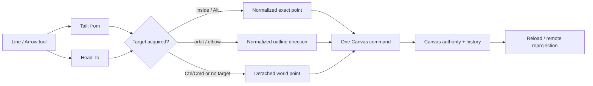

# A126 - canvas: Cangine 0.7 arrow head and tail connections

[Overview](../BASED.md)

Upgrade Omnidraw to `@omnidraw/cangine@0.7.0` and make both ends of an arrow
first-class, durable connections. Users must be able to create, rebind, and
detach the tail and head against shapes and groups while Canvas authority,
history, reload, and remote reprojection preserve the exact attachment.

## Context

The workspace currently qualifies exact Cangine `0.6.1` in the root
[`package.json`](../../package.json), [`packages/canvas/package.json`](../../packages/canvas/package.json),
[`public-package-set.json`](../../public-package-set.json), [`bun.lock`](../../bun.lock),
package verification scripts, frontend diagnostics, and release documentation.
The checked-in [`llm.cangine.md`](../../docs/internal/llm.cangine.md) therefore
still describes the `0.6.1` consumer contract and must stay version-aligned with
the installed declarations.

Omnidraw already exposes separate Line and Arrow tools in
[`FloatingCanvasToolbar/index.tsx`](../../packages/canvas/src/components/FloatingCanvasToolbar/index.tsx),
uses Cangine's standard editor and path controller in
[`runtime.ts`](../../packages/canvas/src/runtime.ts), and persists connector
mutations through the document-owned scene mutation port. Both tools create a
Cangine `connector`; Arrow is distinguished by its end marker. In this task,
**tail** means connector `from` and **head** means connector `to`. Endpoint
connection semantics are separate from start/end marker styling.

The public Canvas contract currently permits a point endpoint or a node plus
named anchor, offset, and gap in
[`types.ts`](../../packages/canvas-contract/src/types.ts). Its strict validation
in [`validation.ts`](../../packages/canvas-contract/src/validation.ts) does not
accept Cangine 0.7's target-relative attachment data or orthogonal fixed
segments. The nearly identity-preserving adapter in
[`cangine-contract-adapter.ts`](../../packages/canvas/src/internal/cangine-contract-adapter.ts)
would therefore reject a valid 0.7 editor commit until the serialized Canvas
contract is extended deliberately.

Cangine 0.7 adds the engine-owned behavior needed for product-quality
connections:

- `inside` attachments retain one exact normalized point inside the target;
- `orbit` attachments retain a normalized direction and resolve on the
  target's supported outline;
- creation and endpoint rebinding use the same group-aware target resolution;
- Alt forces `inside`, while Ctrl/Cmd temporarily disables binding;
- modifier changes update the captured endpoint without another pointer move;
- acquisition shows the target outline and uses a bounded CSS-pixel band;
- endpoint release synchronously flushes the final preview/target decision;
- orthogonal connectors may persist authored `fixedSegments` instead of
  treating an entire elbow route as application-owned waypoints.

This is a public feature and serialized-contract expansion, not a renderer
fork. Do not copy Cangine geometry, candidate queries, overlays, modifier
tracking, or path-edit controllers into Omnidraw. `CANVAS_SCENE_SCHEMA_VERSION`
remains `"1.0.0"`; the new fields are optional additions to the redesigned
clean-install document, not a pre-refactor migration or compatibility reader.

## Plan

### 1. Qualify exact Cangine 0.7.0

- Verify `@omnidraw/cangine@0.7.0` from public npm with no local-registry
  source, inspect its shipped declarations/exports, and record its immutable
  integrity. Do not qualify a tarball whose resolved URL is localhost.
- Replace every intentional `0.6.1` dependency, package-set, diagnostic,
  packed-package assertion, release command, and current consumer-guide
  reference with exact `0.7.0`. Preserve fixture literals that specifically
  test lockfile sanitization rather than treating every text match as a pin.
- Regenerate `bun.lock` through the public-lockfile workflow and keep
  [`check-published-lockfile.ts`](../../scripts/check-published-lockfile.ts)
  green.
- Update [`llm.cangine.md`](../../docs/internal/llm.cangine.md) from the shipped
  0.7 declarations and upstream consumer guide, including attachment modes,
  modifier behavior, group resolution, fixed segments, and the revised public
  API inventory. The installed declarations remain authoritative.
- Prove root, `/types`, `/geometry`, `/scene`, `/testing`, `/backend`, and
  `/editor` imports still resolve without unsupported deep imports.

### 2. Extend the serialized Canvas connector contract

- Add the exact Cangine 0.7 node-endpoint attachment shape to
  `@omnidraw/canvas-contract`: normalized `fixedPoint` plus `inside` or `orbit`
  mode, and the `auto` anchor form required by target-relative attachments.
- Keep point endpoints and existing named-anchor endpoints valid. Do not
  silently reinterpret an authored named anchor, offset, or gap as a new
  attachment.
- Add exact optional orthogonal `fixedSegments` data with bounded finite
  points, unique non-empty IDs, horizontal/vertical segment validation, and
  the 0.7 invariant that fixed segments require orthogonal routing and cannot
  coexist with legacy `waypoints`.
- Update types, validation, codecs, canonical JSON, examples, conformance, and
  strict unknown-field tests together. Invalid normalized coordinates,
  malformed modes, diagonal/zero-length fixed segments, duplicate IDs, and
  illegal route combinations fail at the public boundary.
- Keep the Canvas/Cangine conversion adapter explicit and lossless for all new
  fields in both directions. No runtime-only target outline, acquisition
  state, or transient preview may enter the durable document.
- Treat the Canvas Contract and Canvas runtime changes as public `src/`
  changes: apply semantic version bumps, regenerate `public-package-set.json`
  and `bun.lock`, and qualify downstream package distributions without
  republishing an unchanged version with different bytes.

### 3. Make arrow tail and head connection behavior first class

- Use Cangine 0.7's standard creation/path interaction for both Line and Arrow;
  keep one editor session and one overlay owner. Do not add an Omnidraw DOM/SVG
  endpoint overlay or a second spatial query.
- During creation, allow the initial tail and released head to bind to eligible
  authored shapes. During Select/path editing, either endpoint can be dragged,
  rebound to another target, or detached to a point endpoint.
- Preserve the engine interaction contract:
  - dropping inside a target creates an `inside` attachment;
  - dropping within the engine's ten-CSS-pixel acquisition band creates an
    `orbit` attachment;
  - Alt forces `inside` for the current endpoint;
  - Ctrl/Cmd disables binding and release commits a point endpoint;
  - key-down/key-up republishes the latest captured endpoint immediately;
  - pointer-up flushes pending geometry and commits the actual release target.
- Keep arrow markers independent: the default Arrow still has its head marker,
  Line remains unmarked, and rebinding either endpoint does not add, remove, or
  swap marker style.
- Let Cangine reserve endpoint hit regions and suppress conflicting generic box
  handles. Existing move/rotate/path-edit selection behavior remains available
  without making an arrowhead double as a resize handle.
- Keep the current product routing control. Straight and smooth attachments use
  their authored mode; editor-created elbow attachments use `orbit`, and
  Cangine-owned fixed-segment handles round-trip when an elbow leg is pinned or
  released.

### 4. Preserve target, group, authority, and history semantics

- Use Cangine's bindable descendant/group resolution so a hit on content inside
  a selectable group binds to that group. The attachment domain is the finite
  union of bindable descendants in group-local space, not a new rectangular
  Omnidraw approximation.
- Prove normalized attachments survive target translation, rotation, resize,
  grouping transforms, camera changes, and device-pixel-ratio changes. `inside`
  stays at the exact semantic point; `orbit` stays on the supported outline.
- Persist one authoritative connector mutation through
  `CanvasDocumentService`; undo/redo, optimistic reconciliation, backend
  snapshot reload, and a remote event/reprojection must reproduce identical
  endpoint data and resolved geometry.
- Preserve deterministic unresolved-reference fallback when a connected target
  disappears. Do not cascade-delete the arrow, invent a migration, or allow a
  dangling reference to crash rendering, picking, history, or serialization.
- Keep target identity, authorization, and durable command validation in the
  Canvas authority. Engine candidates and transients never bypass the public
  contract or become a second durable binding authority.

### 5. Verify the interaction in unit, integration, and browser lanes

- Add Canvas Contract coverage for valid and invalid attachments/fixed
  segments, codec round-trips, canonical JSON, snapshots, commands, and
  conformance fixtures.
- Extend the Canvas line/arrow integration tests to cover independent tail and
  head creation, rebind, detach, marker preservation, inside/orbit behavior,
  group targets, elbow fixed segments, undo/redo, and strict adapter
  round-trips.
- Add deterministic editor tests for modifier-only updates, latest-per-frame
  candidate work, release flushing, target deletion fallback, and no duplicate
  durable commits.
- Add a real Chromium acceptance path: create two targets, draw an Arrow from
  one to the other, move/rotate/resize both, reload, rebind each endpoint,
  exercise Alt and Ctrl/Cmd, and prove head/tail remain visually and durably
  connected after backend restart/recovery.
- Run Canvas Contract and Canvas tests/typechecks, frontend tests/typecheck and
  production build, published-lockfile and package-dist gates, packed Canvas
  browser smoke, full live-browser acceptance, and final repository acceptance.

## TODOS

- [x] Pin and publicly qualify exact `@omnidraw/cangine@0.7.0` everywhere.
- [x] Update `llm.cangine.md`, release guidance, diagnostics, and package assertions to 0.7.0.
- [x] Add target-relative endpoint attachments and `auto` anchors to Canvas Contract.
- [x] Add validated orthogonal `fixedSegments` and their waypoint exclusion.
- [x] Keep Canvas/Cangine serialization lossless with no transient-state leakage.
- [x] Enable group-aware tail/head binding during Line and Arrow creation.
- [x] Enable tail/head rebind and detach in Select/path-edit mode.
- [x] Preserve inside/orbit and Alt/Ctrl/Cmd interaction semantics.
- [x] Preserve markers, routing modes, target transforms, history, reload, and remote reprojection.
- [x] Cover target deletion with deterministic unresolved-reference fallback.
- [x] Add contract, adapter, editor, integration, and real-browser acceptance.
- [x] Apply required public package version bumps and regenerate package-set/lockfile evidence.
- [x] Run the complete package, browser, distribution, and final acceptance gates.

## Acceptance criteria

- The workspace and every qualified artifact resolve exact Cangine `0.7.0`
  from public npm, and the checked-in guide describes that exact API.
- A user can draw an Arrow whose tail and head each attach independently to a
  shape or selectable group, then move either target without breaking the
  connection.
- A user can drag either endpoint to rebind it, drag away or hold Ctrl/Cmd to
  detach it, and hold Alt to commit an exact inside attachment.
- `inside` and `orbit` semantics remain correct through target rotation/resize,
  group transforms, reload, backend restart, and remote reprojection.
- Arrowhead/tail marker styling is preserved independently from connection
  state; Line uses the same connection machinery without acquiring Arrow's
  marker.
- Elbow endpoint binding and authored fixed segments survive persistence,
  undo/redo, and mode changes without illegal waypoint combinations.
- One pointer gesture creates one authoritative history/document commit, and
  the committed release target matches the last visible preview even when the
  final change is a modifier key or pointer-up without another frame.
- Invalid attachment data fails at the Canvas Contract boundary; runtime-only
  candidate/outline/preview data is never serialized.
- Existing valid 0.6-style point and named-anchor connectors remain valid under
  the current `1.0.0` clean-install schema without a migration layer.
- No Cangine implementation is copied into Omnidraw, and no second endpoint
  query, overlay, binding authority, or editor session is introduced.

## NOTES

- No mockup is needed. The screen atlas has no distinct arrow-endpoint editor
  baseline, and Cangine owns the 0.7 endpoint handles and target outline. Add
  atlas evidence only if implementation introduces new Omnidraw-owned chrome
  or materially changes an existing product surface.
- The public registry metadata observed during task creation reports Cangine
  `0.7.0` with integrity
  `sha512-mxVflwyy/q1oF0u3XeIQnB7RK6Xkncnh7VSzhsGSLdfzgKdr7TQmwtUV4aPmgPoLA3UkV7O9tt4CuI66nnW6sQ==`.
  The local npm configuration rewrites tarball display URLs to localhost, so
  implementation must rely on the repository's public-lockfile gate rather
  than that displayed URL.
- `from`/tail and `to`/head are endpoint roles. `startMarker`/`endMarker` are
  presentation and must not be used as connection state.
- Keep Cangine's indexed candidate query and frame-bounded preview. A product
  adapter may decorate the final mutation for Canvas semantics, but it must not
  re-run geometry or hit testing.

### LOGS

- 2026-08-21: Task created after auditing the qualified 0.6.1 package pins,
  current Canvas Contract connector schema, strict Cangine adapter, standard
  editor/path-controller integration, Line and Arrow toolbar tools, relevant
  consumer-guide sections, and the screen atlas. Planned 0.7 adoption as one
  public contract plus direct-manipulation feature, not a dependency-only bump.
- 2026-08-21: Qualified public `@omnidraw/cangine@0.7.0` at integrity
  `sha512-mxVflwyy/q1oF0u3XeIQnB7RK6Xkncnh7VSzhsGSLdfzgKdr7TQmwtUV4aPmgPoLA3UkV7O9tt4CuI66nnW6sQ==`,
  pinned every current consumer and release surface, replaced the checked-in
  guide from the shipped package, and added import/declaration/integrity
  qualification for every supported entrypoint.
- 2026-08-21: Added strict public attachment and orthogonal fixed-segment
  contracts, preserved legacy endpoints, allowed deterministic dangling
  endpoint intent after target deletion while keeping new/rebound references
  authority-validated, and bumped Canvas Contract, Canvas, and AI Chat release
  markers to `0.8.0`, `0.12.0`, and `0.3.1` respectively.
- 2026-08-21: Exercised Cangine's one standard editor/path controller for
  group-aware Line/Arrow creation, independent tail/head rebind and detach,
  Alt/Ctrl modifier-only updates, frame-bounded acquisition, release flushing,
  marker independence, elbow/fixed-segment transitions, history, reload,
  remote acknowledgement, and unresolved-target fallback.
- 2026-08-21: Added packed-package Chromium coverage for bound Arrow creation,
  independent Ctrl detach and Alt rebind, target movement, exact payloads, and
  marker preservation across both transport adapters. Extended full live
  Chromium acceptance to recover the exact durable Arrow after a real backend
  restart and page reload.
- 2026-08-21: `bun run test:final-acceptance` passed the complete workspace,
  architecture, conformance, database, packed-package, live-browser, and
  standalone package-distribution gates. `bun run check:published-lockfile`
  also confirmed the sanitized lock resolves the qualified packages from
  public npm.
- 2026-08-21: Reproduced the reported Arrow-to-shape workflow with a fresh
  backend and extended live Chromium coverage to double-click an existing
  Arrow, drag its head onto a third shape, validate the successful RPC, and
  recover the exact rebound endpoint after backend restart. This confirmed the
  reported generic input-validation toast came from a stale pre-A126 backend
  decoder; the current source and built contract both accept the attachment.
- 2026-08-21: Fixed Line/Arrow deletion after Cangine path selection. Canvas
  now reconciles missing selected IDs in an early scene subscriber before the
  path controller can restore the generic transform overlay for a removed
  connector. Live Chromium deletes a newly selected Line and Arrow without a
  stale transform-selection callback or error toast.

---
