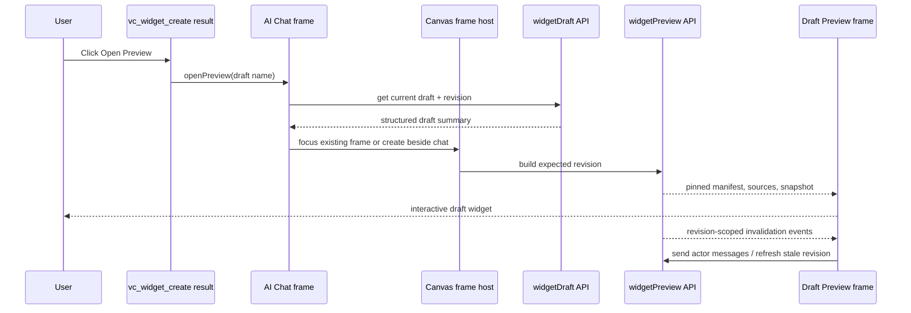

# A82 - AI chat: open draft Preview frame from widget-create result
[Overview](../BASED.md)

Add a trusted **Open Preview** action to successful `vc_widget_create` tool results. The action stays visible while the result card is collapsed and opens the current draft as an interactive canvas frame beside the originating AI Chat.

## Context

The current chat renders every tool result as a compact card and truncates collapsed results to five lines. A successful `vc_widget_create` already returns safe structured details containing the draft name, but the UI only renders its text content. Users must leave the conversation and find the draft elsewhere before they can see it.

Current state supplied by the user:

- the `vc_widget_create` result is collapsed in the AI Chat frame;
- the successful result has enough structured identity to address the draft;
- there is no Preview action in the result card;
- the desired preview is another normal canvas frame, positioned beside the chat rather than a modal or replacement chat view.

Relevant current files:

- [`packages/ai-chat/src/chat/components/tabs/ChatTab.tsx`](../../packages/ai-chat/src/chat/components/tabs/ChatTab.tsx) — tool-result collapse and result actions.
- [`packages/ai-chat/src/chat/components/tabs/fn.tool-call.ts`](../../packages/ai-chat/src/chat/components/tabs/fn.tool-call.ts) — safe structured tool-result extraction.
- [`packages/ai-chat/src/chat/components/index.tsx`](../../packages/ai-chat/src/chat/components/index.tsx) — chat state and callback wiring.
- [`packages/ai-chat/src/ports.ts`](../../packages/ai-chat/src/ports.ts) — chat, preview, transport, and application boundaries.
- [`packages/ai-chat/src/canvas-extension/Ai.plugin.ts`](../../packages/ai-chat/src/canvas-extension/Ai.plugin.ts) — AI Chat registration and canvas-service access.
- [`packages/ai-chat/src/canvas-extension/index.ts`](../../packages/ai-chat/src/canvas-extension/index.ts) — extension composition.
- [`packages/ai-chat/src/widget/WidgetManagerService.ts`](../../packages/ai-chat/src/widget/WidgetManagerService.ts) — normal canvas widget-frame registration, rendering, selection, and removal.
- [`packages/ai-chat/src/widget/mount-arrow-sandbox.ts`](../../packages/ai-chat/src/widget/mount-arrow-sandbox.ts) — existing sandbox and widget SDK bridge behavior.
- [`packages/service-agent/src/tools/tool.widget-workspace.ts`](../../packages/service-agent/src/tools/tool.widget-workspace.ts) — successful create-result `details` contract.
- [`packages/service-agent/src/widget-drafts/WidgetDraftController.ts`](../../packages/service-agent/src/widget-drafts/WidgetDraftController.ts) and [`types.ts`](../../packages/service-agent/src/widget-drafts/types.ts) — revision-pinned draft Preview lifecycle.
- [`packages/api-agent/src/contract.ts`](../../packages/api-agent/src/contract.ts) — existing `widgetDraft` and `widgetPreview` APIs.
- [`packages/service-event-publisher/src/IEventPublisherService.ts`](../../packages/service-event-publisher/src/IEventPublisherService.ts) — draft and Preview invalidation events.
- [`packages/ai-chat/tests/chat/tabs/ChatTab.render.test.ts`](../../packages/ai-chat/tests/chat/tabs/ChatTab.render.test.ts) and [`packages/ai-chat/tests/canvas-extension/extension.integration.test.ts`](../../packages/ai-chat/tests/canvas-extension/extension.integration.test.ts) — focused UI and canvas-extension coverage.

The backend already supports validating, building, refreshing, resetting, reading, and messaging a revision-pinned draft Preview. Reuse that authority instead of compiling mutable draft files directly in the browser or treating a published actor instance as the draft.

## Plan

### 1. Recognize only a trusted widget-create result

- Add a small pure extractor beside the other tool-result helpers.
- Return a draft reference only when all of these are true:
  - `role === "toolResult"`;
  - `toolName === "vc_widget_create"` exactly;
  - `isError !== true`;
  - `details.name` is a non-empty safe string;
  - the structured result identifies `source: "draft"` and `draft: true`.
- Never scrape the summary, model-visible JSON text, assistant Markdown, or arbitrary tool output for a widget name.
- Keep the existing generic resource-result action unchanged.
- Preserve the backend create-result details shape and add a focused contract regression if the UI begins depending on fields that are not currently asserted.

### 2. Render Open Preview outside the collapsible result body

- Add an **Open Preview** button to a successful create result's action area.
- Render the action independently of the five-line collapsed content so it is visible in both collapsed and expanded states.
- Stop button activation from toggling the result card.
- Keep the existing Expand/Collapse control and card-wide toggle behavior intact.
- Give the button a clear accessible name, keyboard focus treatment, and pending/disabled feedback while its open request is being resolved.
- Do not show the button for failed, malformed, or unrelated tool results.

### 3. Route the direct user action to the canvas host

- Thread a typed `onOpenWidgetPreview(draftName)` callback through `ChatTab`, `AiChat`, and the AI widget mount boundary.
- Keep Preview opening user-controlled: receiving a tool result, reconnecting history, or observing a draft event must never spawn a frame automatically.
- Resolve the current draft summary through `agent.widgetDraft.get` at click time. The old transcript result supplies identity only; it must not pin the Preview to stale create-time text.
- Surface missing/deleted draft and transport failures in the originating chat without fabricating a frame that cannot load.
- Expand `TAiChatApiPort` only with the existing `widgetDraft`, `widgetPreview`, and event methods the Preview host actually consumes.

### 4. Create or focus a normal draft Preview frame beside AI Chat

- Register one internal, non-toolbar `ui-widget` kind for draft Preview frames. It must use the same frame chrome, drag, resize, minimize, fullscreen, selection, deletion, Automerge persistence, and DOM-portal behavior as other canvas frames.
- Store only safe reconstruction data in the frame payload: draft identity, pinned revision, and originating chat element ID. Do not persist source code, actor context, absolute paths, or server-only snapshot paths in the canvas document.
- On the first open, place the Preview frame to the right of the originating AI Chat in world coordinates with a small fixed gap and top alignment. Base placement on the chat element's current persisted bounds, not screen pixels or current zoom.
- Add the new element through the normal element/CRDT/render-order path, select and focus it, and draw it immediately.
- Keep one Preview frame per draft on a canvas. A later **Open Preview** click focuses the existing frame and explicitly refreshes it to the latest draft revision instead of creating duplicate frames.
- Do not continuously tether the Preview position to the chat. “Next to chat” defines initial placement; users may move either frame afterward.
- Use a draft-aware frame title such as `<Widget name> Preview` without registering one element kind per draft.

### 5. Render the revision-pinned interactive draft

- On mount, load the payload's draft and Preview state. Build the pinned revision when no backend Preview exists; reuse it only when the backend response matches the frame's draft and revision.
- Mount returned `sources` through the existing Arrow sandbox and SDK widget bridge safety boundary.
- Bridge widget actor reads and messages to `agent.widgetPreview.get` and `agent.widgetPreview.send`; do not route them to a published actor instance.
- Initialize the bridge from the Preview response snapshot and react to matching `widget-preview.changed` invalidations by refetching the authoritative Preview state.
- Keep event subscriptions scoped by draft and revision, cancel obsolete requests, close iterators on cleanup, and ignore late responses after frame removal or revision replacement.
- Present focused loading, not-built, validation, source, resource-binding, actor, compile, runtime, and transport failures inside the Preview frame.
- If the shared draft changes after build, preserve the immutable rendered revision, mark the frame stale, and offer **Refresh Preview**. Never label old running code as the new revision or silently swap mutable source under the actor.
- Refresh must resolve the newest draft summary and call the revision-aware Preview API. Reset remains a separate recovery action when useful.
- Refactor only the reusable sandbox/bootstrap mechanics needed by both published widgets and draft Preview; keep published actor-instance transport and draft Preview transport as separate injected adapters.

### 6. Complete Preview ownership and cleanup

- Add a user-only `agent.widgetPreview.close` operation if no safe public disposal operation exists by implementation time.
- Make close revision-aware so cleanup from an obsolete frame cannot dispose a newer Preview build for the same draft.
- When the Preview frame is removed or its runtime is torn down, stop its actor and release its backend-owned immutable snapshot. Keep the canvas payload so a persisted frame can rebuild when the canvas is opened again; deleting the frame removes that payload normally.
- Ensure refresh/replacement closes the previous build before adopting the next one, preserving the snapshot guarantees established by B48.
- Do not publish, create a published actor instance, or alter draft files as a side effect of opening, refreshing, or closing Preview.

### 7. Style and document the resulting state

- Reuse the existing compact result-action visual language and theme tokens; do not make the collapsed result taller than necessary.
- Give the Preview body full available frame dimensions and preserve sandbox overflow isolation.
- Verify contained, minimized, resized, fullscreen, light-theme, and dark-theme behavior.
- Capture the completed AI Chat + adjacent draft Preview state and update [`docs/internal/screens/SCREENS.md`](../../docs/internal/screens/SCREENS.md) because this adds a materially new canvas interaction state.
- Regenerate [`@FILES.md`](../../@FILES.md) after adding implementation files.

## Fixed behavior decisions

- **Exact button text:** `Open Preview`.
- **Visibility:** successful `vc_widget_create` result only, always visible while that result is collapsed or expanded.
- **Trigger:** direct human button activation only; no automatic companion frame.
- **Surface:** normal persisted canvas frame, not a modal, route, chat tab, or published widget instance.
- **Placement:** initially right of and top-aligned with the originating AI Chat in canvas world coordinates.
- **Duplication:** one frame per draft per canvas; reopen focuses and refreshes it.
- **Revision semantics:** every running Preview is pinned to one accepted draft revision; changed drafts become visibly stale until a user refresh/open action.
- **Publication:** Preview never publishes and never implies publish readiness.
- **Source of truth:** structured tool details identify the draft; draft/Preview query APIs provide current state.

## Test plan

### Tool-result action

- A successful exact `vc_widget_create` result with more than five lines renders **Open Preview** while collapsed.
- Clicking the button calls the Preview callback with the structured draft name and does not expand the card.
- The button remains available after expand/collapse toggles.
- Failed create results, missing/unsafe details, lookalike tool names, assistant prose, and other tool results do not render the action.
- Existing resource-result actions and approval rows still behave normally.

### Canvas frame creation

- A click creates one persisted draft Preview `ui-widget` at `chat.x + chat.width + gap`, aligned to `chat.y`, independent of zoom.
- The frame uses normal element creation, CRDT commit, render ordering, selection, focus, and DOM portal mounting.
- A second click for the same draft focuses/refreshes the existing frame and does not add another element.
- Different drafts may open separate frames.
- No frame is created merely because history reconnects with an old create result or a draft event arrives.
- Hydrating a persisted Preview frame rebuilds its runtime without duplicating the element.

### Interactive Preview

- Build uses the current queried revision and renders the returned manifest/sources/snapshot.
- Widget messages call `widgetPreview.send` with draft ID and expected revision, then update the guest snapshot.
- Matching Preview events refetch state; unrelated draft/revision events and stale request completions are ignored.
- A draft revision change shows stale state and keeps the old revision label until explicit refresh.
- Refresh adopts the newest accepted revision and disposes the old build.
- Validation, missing source, resource-binding, sandbox compile/runtime, and transport failures render actionable frame states.
- Frame removal and runtime teardown close event streams, unmount the sandbox, stop the Preview actor, and clean only the owned snapshot/revision.
- Published widget sandbox behavior is unchanged.

### Verification commands

- Run focused `@vibecanvas/ai-chat` chat render, Preview, widget-host, and canvas-extension tests.
- Run focused `@vibecanvas/service-agent` Preview lifecycle tests and the API contract test if `widgetPreview.close` is added.
- Run package typechecks for `ai-chat`, `api-agent`, `service-agent`, and affected canvas/frontend consumers.
- Run functional-core checks for every added or changed `fn.*.ts`, `fx.*.ts`, and `tx.*.ts` file.
- Run the frontend build and the relevant full workspace test lane before completion.

## Acceptance criteria

- Every successful `vc_widget_create` tool-result card shows **Open Preview** in collapsed and expanded mode.
- The action is absent for failures and cannot be synthesized from prose or untrusted text.
- Clicking it directly opens an interactive draft Preview frame beside the originating AI Chat.
- Opening Preview is always user initiated and never happens from tool completion, event delivery, or history restoration alone.
- The Preview is a normal canvas frame with persisted placement and standard frame controls.
- Reopening the same draft does not create duplicate frames.
- The rendered widget and actor snapshot come from one immutable reported revision.
- Draft changes are represented as stale until an explicit refresh/open action adopts the new revision.
- Preview messages use the draft Preview actor, not a published actor instance.
- Closing/replacing Preview releases event, sandbox, actor, and immutable snapshot ownership safely.
- Preview never publishes or mutates widget source.
- Focus, keyboard activation, loading, error, light/dark theme, resize, minimize, and fullscreen behavior are verified.
- Focused tests, typechecks, functional-core checks, frontend build, screen atlas, and `@FILES.md` are updated.

## TODOS

- [ ] Add safe structured extraction for successful widget-create result details.
- [ ] Render **Open Preview** outside collapsed result content and wire direct user activation.
- [ ] Resolve the latest draft summary at click time through the typed API port.
- [ ] Register the internal draft Preview frame kind and draft-aware title.
- [ ] Create/focus one persisted Preview frame per draft beside the originating chat.
- [ ] Build and render revision-pinned draft sources through the sandbox bridge.
- [ ] Bridge draft actor snapshots, messages, and Preview invalidation events.
- [ ] Add stale, refresh, reset, loading, and actionable failure states.
- [ ] Add revision-safe backend Preview disposal if the public lifecycle lacks it.
- [ ] Clean up sandbox, streams, actors, and owned snapshots on replacement/removal.
- [ ] Add tool-result, placement, deduplication, hydration, Preview, event, and cleanup regressions.
- [ ] Run focused tests, typechecks, functional-core checks, and the frontend build.
- [ ] Update the screen atlas and regenerate `@FILES.md`.

## NOTES

- This intentionally restores an explicit companion Preview frame, not the automatic companion behavior removed by S84.
- Existing draft Preview APIs and B48's immutable snapshot contract should remain the backend authority.
- The create result is a durable entry point, but its old text is not durable revision state; always query current draft state on activation.
- The supplied image is a current-state reference, not a pixel-perfect target mockup.

### LOGS

- 2026-07-19: Inspected the supplied collapsed result, current chat result rendering, AI canvas extension, widget host, sandbox bridge, create-result details, revision-pinned Preview controller, API contracts, events, tests, and prior S84/B48 decisions.
- 2026-07-19: Planned a direct structured action, normal adjacent canvas frame, singleton-per-draft behavior, immutable revision lifecycle, and explicit cleanup without automatic Preview or publication.

---
