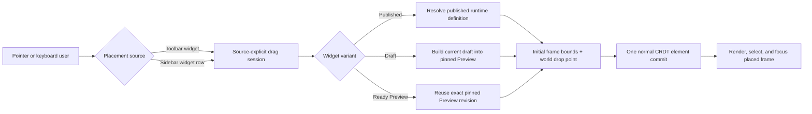

# A83 - widgets: drag published and draft variants onto canvas
[Overview](../BASED.md)

Let users drag widgets directly from either the floating toolbar or the sidebar catalog onto the canvas. Give every draggable widget a deterministic initial frame size and extend placement beyond published widgets to draft and revision-pinned Preview variants.

## Context

Widget discovery and widget placement currently have different capabilities:

- [`packages/canvas/src/components/FloatingCanvasToolbar/RuntimeToolbar.tsx`](../../packages/canvas/src/components/FloatingCanvasToolbar/RuntimeToolbar.tsx) renders the registered runtime tools. Widget buttons are clickable, but they are not drag sources.
- [`packages/canvas/src/services/tool/ToolService.ts`](../../packages/canvas/src/services/tool/ToolService.ts) owns the current draw-create interaction. Selecting a published widget tool and then dragging on the canvas creates a resizable draft before commit.
- [`packages/ai-chat/src/canvas-extension/Widget.plugin.ts`](../../packages/ai-chat/src/canvas-extension/Widget.plugin.ts) discovers and registers only published actor definitions with the canvas runtime, so the toolbar cannot represent draft or Preview variants.
- [`packages/ai-chat/src/widget/fx.register-tool.ts`](../../packages/ai-chat/src/widget/fx.register-tool.ts) maps one published widget configuration to one draw-create tool.
- [`packages/ai-chat/src/sidebar/widgets/components/WidgetsSidebarSection.tsx`](../../packages/ai-chat/src/sidebar/widgets/components/WidgetsSidebarSection.tsx) already lists source-explicit published and draft rows, but a row click navigates to widget management and rows cannot be dragged onto a canvas.
- [`packages/ai-chat/src/sidebar/widgets/WidgetCatalogProvider.tsx`](../../packages/ai-chat/src/sidebar/widgets/WidgetCatalogProvider.tsx), [`packages/api-agent/src/api.widgets.ts`](../../packages/api-agent/src/api.widgets.ts), and [`packages/service-agent/src/widget-management/types.ts`](../../packages/service-agent/src/widget-management/types.ts) provide the version-aware catalog introduced by A76. The catalog currently models `published` and `draft`; it does not expose whether a revision-pinned Preview is ready.
- [`packages/ai-chat/src/widget/fx.draw-host.ts`](../../packages/ai-chat/src/widget/fx.draw-host.ts) creates widget hosts at the current minimum dimensions. Direct drop needs a useful predetermined frame instead of depending on a second canvas drag to establish width and height.
- [`packages/service-actor/src/core/vibecanvasjson.zod.ts`](../../packages/service-actor/src/core/vibecanvasjson.zod.ts) and [`packages/service-actor/src/core/types.ts`](../../packages/service-actor/src/core/types.ts) define widget manifest metadata. There is no author-controlled initial frame size today.
- [`tasks/a/A82.md`](A82.md) defines the normal persisted draft Preview frame, its pinned revision contract, sandbox bridge, refresh behavior, and cleanup. A83 must reuse that Preview authority rather than introduce another draft runtime or compile mutable draft files in the browser.
- [`docs/internal/screens/SCREENS.md`](../../docs/internal/screens/SCREENS.md) already documents the canvas, toolbar, sidebar catalog, published widget frame, and proposed draft Preview frame. A new static mockup would not clarify the pointer interaction more than the flow below.

The new gesture must not weaken existing semantics. A click on a toolbar tool still selects it. A click on a sidebar widget still opens its source-explicit management route. Dragging is an additional path that places one instance at the drop position.

## Plan



### 1. Define source-explicit draggable widget variants

- Use one placement reference throughout the UI and canvas boundary:

  ```ts
  type TWidgetPlacementRef =
    | { source: "published"; name: string; revision: string }
    | { source: "draft"; name: string; revision: string }
    | { source: "preview"; name: string; revision: string };
  ```

- Treat the revision as an optimistic identity, not display-only text. Re-resolve the variant when the drag starts and verify it again before committing the drop.
- Published placement creates the existing persisted `widget` element and published actor instance.
- Draft placement never executes the mutable draft tree directly. It requests a Preview build for the dragged draft revision and creates the normal persisted Preview `ui-widget` frame defined by A82.
- Preview placement references remain a backend lifecycle detail. The sidebar and toolbar expose the Draft as the placement source; dropping it builds that exact revision into a pinned Preview frame.
- If draft and published content are identical, keep A76's single published sidebar row. Do not invent a redundant draft drag source merely for placement.
- Give draft entries visible text badges and accessible names. Color alone must not distinguish source or lifecycle.
- Keep source identity in tool IDs and drag payloads so published and draft variants with the same widget name cannot overwrite one another in the runtime registry.

### 2. Add deterministic initial frame metadata

- Extend `widget` manifest metadata with an optional bounded initial frame declaration, using repository naming conventions at implementation time, for example:

  ```json
  {
    "widget": {
      "frame": { "width": 320, "height": 240 }
    }
  }
  ```

- Width and height are canvas world units, include the widget frame header, must be finite integers, and must be clamped or rejected against shared widget minimums and a documented maximum.
- Use one shared fallback size for older manifests. The fallback must be large enough to present a useful widget body and must not reuse the tiny resize minimum as the intended initial experience.
- The selected source variant owns its frame metadata: published uses its canonical manifest; draft uses its current validated manifest; Preview uses its pinned manifest. A later draft edit must not resize an already placed Preview.
- Return normalized initial bounds in the source-explicit catalog/placement DTO so sidebar and toolbar consumers do not parse manifests or duplicate fallback rules.
- Keep resize minimums separate from initial size. Users can resize a placed frame through existing transformer behavior after creation.
- Update scaffolding and manifest examples to include the default frame declaration for newly created widgets, while remaining backward compatible with existing widgets that omit it.

### 3. Introduce one canvas drop-placement boundary

- Add a canvas-owned placement port/service that accepts a trusted `TWidgetPlacementRef`, initial bounds, and a viewport client point.
- Convert the client drop point to canvas world coordinates with the existing camera/stage transform rules. Do not store screen pixels or apply zoom twice.
- Position the new frame with its top-left corner at the drop point, then keep the complete initial frame inside the currently visible canvas viewport when practical. Define deterministic behavior when the frame is larger than the viewport.
- Show a source-aware frame outline/ghost while the pointer is over a valid canvas. The ghost uses the predetermined size and canvas zoom, and it does not start the widget actor or persist an element.
- A valid drop performs one normal element/CRDT transaction, adds the node through the existing element/render-order path, selects and focuses it, mounts the DOM portal, and records one undoable history action.
- Dropping outside the active canvas, pressing Escape, pointer cancellation, route/canvas change, source deletion, stale revision, or failed Preview build cancels cleanly and removes all transient UI.
- Prevent duplicate commits from overlapping HTML drag events and Konva pointer events. One drag session may create at most one element.
- Do not route direct placement through `ToolService`'s pointer-down/move/up draw state. Extract and share pure widget element/bounds construction where useful, while keeping draw-create and drop-create as separate orchestration paths.

### 4. Make toolbar widget entries draggable without breaking clicks

- Add drag affordance only to tools that expose a widget placement reference; base tools such as Select, Hand, Sidebar, shapes, and actions remain unchanged.
- Support both ungrouped widget buttons and widget buttons inside hover flyouts. Keep the flyout mounted for the active drag and close it after completion/cancellation.
- Preserve existing click behavior: click or keyboard activation selects the widget draw-create tool, after which the user may draw arbitrary bounds on the canvas.
- Start direct placement only after a pointer movement threshold so a normal click does not become a drag accidentally.
- Make the drag preview identify the widget label and source (`Published` or `Draft`) and use the sanitized widget icon.
- Extend toolbar registration/catalog synchronization so source variants update when drafts, Preview builds, publication, deletion, or catalog invalidation events occur. Remove stale source-specific tools without disturbing placed frames.
- Draft toolbar entries must call the same placement boundary as sidebar rows; they must not pretend to be published actor definitions.

### 5. Make sidebar widget rows draggable without breaking navigation

- Keep row click and keyboard activation navigating to `/widgets/:source/:name?tab=overview`.
- Start placement only from a deliberate pointer drag threshold. Do not make group disclosure controls, group action menus, warning controls, or the section menu draggable.
- Allow published and draft rows from the existing A76 projection to start a source-explicit drag. Preview readiness remains internal and must not create a redundant sidebar row.
- Use the normalized initial frame bounds to render the canvas ghost immediately. If bounds or source identity cannot be resolved, keep navigation available but disable dragging with an actionable tooltip/status.
- While a draft Preview build is pending after drop, keep a cancellable placement/loading shell at the intended bounds or delay the CRDT commit until the build succeeds. Never persist a broken half-reference that cannot be reconstructed.
- Ensure sidebar scrolling, section/group expansion, text selection prevention during a drag, and sidebar collapse do not leak global pointer listeners.

### 6. Extend catalog and Preview lifecycle contracts

- Extend the widget catalog with normalized placement metadata for each visible variant and an optional Preview summary containing at least status, pinned revision, and safe failure information.
- Keep the catalog response bounded and source-safe. Do not expose source code, absolute paths, snapshot directories, actor data, or resource secrets.
- Subscribe the frontend projection and runtime toolbar to existing widget catalog and Preview invalidation events. Coalesce refreshes so actor snapshot traffic does not rebuild the entire catalog.
- Add one idempotent backend operation to resolve a placement reference into an authorized placement descriptor. For a draft it may build/reuse the exact expected revision; for Preview it must require that exact ready revision; for published it verifies the canonical definition is still available.
- Return typed errors for not found, invalid manifest, stale revision, Preview not ready/build failed, missing resource binding, unsupported behavior, and unsafe/invalid frame bounds.
- Keep A82's explicit AI Chat **Open Preview** action singleton behavior, but let every direct Draft drop create an independent pinned Preview owner and persisted frame.
- Publication never occurs as a side effect of drag, drop, Preview build, or placement.

### 7. Accessibility and non-pointer placement

- Preserve full keyboard operation for toolbar buttons and sidebar rows.
- Add an explicit **Add to canvas** action to the widget row/menu and toolbar label/menu for users who cannot drag. It places the predetermined frame near the center of the visible canvas using the same placement boundary.
- Give drag sources accurate accessible descriptions, including source and whether a Preview build is required.
- Announce placement success, cancellation, stale revision, build failure, and disabled placement through the existing notification/live-region system.
- Do not depend exclusively on native HTML5 drag-and-drop if it prevents reliable touch/pen behavior or loses pointer ownership across the sidebar, toolbar portals, and Konva stage. Choose one pointer-session implementation that can be tested deterministically.

### 8. Tests, documentation, and repository checks

- Add pure tests for source-specific tool IDs, frame-size normalization, fallback bounds, drop coordinate conversion, viewport clamping, and click-versus-drag threshold decisions.
- Add integration tests for toolbar and sidebar published placement, repeated draft-to-Preview build placement, grouped toolbar flyouts, cancellation, stale revisions, duplicate-event suppression, undo/redo, selection, and hydration.
- Prove existing click-to-select/draw behavior and sidebar navigation remain unchanged.
- Test zoomed/panned canvases, sidebar scroll, light/dark themes, canvas route changes during drag, outside drops, pointer cancellation, and backend errors.
- Verify that drop never publishes, never runs mutable draft files, never creates multiple Preview snapshots for one revision, and never leaks global listeners or actors after cancellation.
- Capture the completed sidebar/toolbar drag ghost and placed Preview state, then update [`docs/internal/screens/SCREENS.md`](../../docs/internal/screens/SCREENS.md) because the interaction adds a materially new canvas state.
- Regenerate [`@FILES.md`](../../@FILES.md) for implementation files and run the functional-core checks for every changed `fn.*.ts`, `fx.*.ts`, and `tx.*.ts` file.

## Fixed behavior decisions

- **Supported sources:** floating toolbar widget entries and sidebar widget rows.
- **Supported variants:** published and draft; ready Preview state is not a separate UI placement variant.
- **Published drop:** creates a normal published widget instance.
- **Draft drop:** builds the exact current draft revision as a new pinned Preview frame.
- **Click behavior:** toolbar click still selects draw-create; sidebar click still navigates to widget management.
- **Drop size:** source manifest initial frame bounds, with one shared backward-compatible fallback.
- **Drop position:** canvas world coordinates derived from the pointer; the frame is kept visible when practical.
- **Persistence:** only a successful resolved placement writes to Automerge.
- **Preview duplication:** each direct Draft drop creates another independent Preview frame; AI Chat's explicit **Open Preview** action remains singleton-oriented.
- **Publication:** no drag or drop path publishes a widget.
- **Accessibility:** every draggable placement also has an explicit keyboard-operable **Add to canvas** action.

## Test plan

### Catalog and toolbar projection

- Published and divergent draft variants receive distinct stable tool/placement identities; Preview readiness does not create another row or tool.
- An identical hidden draft does not produce a duplicate toolbar or sidebar placement entry.
- Draft badges are readable by assistive technology and are not color-only.
- Catalog and Preview invalidations add, update, and remove only the affected runtime entries.
- Invalid or stale variants remain navigable but cannot start a misleading drag.

### Frame sizing and coordinates

- Valid manifest width/height become the initial frame bounds for the selected source.
- Missing metadata uses the documented fallback; undersized, oversized, non-finite, and invalid values are rejected or normalized consistently by the backend and frontend pure helpers.
- Dropping on a 1x, zoomed, panned, and high-DPI canvas produces the same intended world point without double scaling.
- Edge drops clamp the complete frame into the visible viewport when practical.
- A Preview remains at its pinned manifest size after the mutable draft changes.

### Toolbar and sidebar gestures

- Clicking a toolbar widget still selects draw-create and permits arbitrary canvas-drawn bounds.
- Clicking a sidebar row still navigates to its management route.
- Movement below the threshold remains a click; movement above it starts one drag session.
- Ungrouped and flyout toolbar widgets, grouped and ungrouped sidebar rows, and sidebar scrolling all support placement.
- Escape, pointer cancel, outside drop, source deletion, route change, and unmount remove the ghost and listeners without a CRDT commit.
- Native/browser and Konva event overlap cannot create two elements.

### Variant placement

- Published drop resolves the expected published revision, creates one actor widget element, starts the normal actor lifecycle, selects it, and records undo history.
- Draft drop validates/builds the expected revision, creates one pinned Preview frame only after success, and does not publish.
- Repeated Draft drops of the same revision create distinct pinned Preview owners and frames without overwriting or focusing an earlier drop.
- Build, resource-binding, validation, stale-revision, missing-source, and transport errors leave no unreconstructable persisted frame.
- Undo/redo and canvas reload reconstruct published and Preview placements with their correct source/revision semantics.

### Verification commands

- Run focused `@vibecanvas/canvas` toolbar, tool-service, coordinate, history, and runtime integration tests.
- Run focused `@vibecanvas/ai-chat` sidebar catalog, widget placement, Preview frame, and canvas-extension tests.
- Run focused `@vibecanvas/api-agent`, `@vibecanvas/service-agent`, and `@vibecanvas/service-actor` catalog, manifest, placement-resolution, and Preview lifecycle tests.
- Run typechecks for all affected packages, functional-core checks for changed function files, the frontend build, and the relevant full workspace test lane.

## Acceptance criteria

- Users can drag a widget from either the floating toolbar or the sidebar and drop it at a chosen canvas position.
- The drag ghost and committed frame use deterministic source-owned initial dimensions with a backward-compatible fallback.
- Existing toolbar click-to-select/draw and sidebar click-to-navigate behavior are preserved.
- Published and draft variants are visually and programmatically distinct; Preview readiness is not exposed as a redundant source row.
- Published placement creates the existing normal widget instance.
- Draft placement runs only through a revision-pinned Preview build; mutable draft files never execute directly in the canvas.
- Every placed Draft Preview retains its exact pinned revision and does not silently adopt draft changes.
- Drag/drop never publishes a widget.
- One drag session can commit at most one element, and failed/canceled sessions commit nothing.
- Zoom, pan, viewport edges, toolbar flyouts, sidebar groups/scroll, route changes, undo/redo, and reload are covered.
- Keyboard users have an equivalent **Add to canvas** action using the same size and placement path.
- Focused tests, typechecks, functional-core checks, frontend build, screen atlas, and `@FILES.md` are updated.

## TODOS

- [x] Add bounded initial widget-frame metadata and a shared legacy fallback.
- [x] Return normalized placement bounds and Preview readiness in the widget catalog.
- [x] Add source-explicit placement references and backend placement resolution.
- [x] Implement the canvas world-coordinate drop boundary and transient frame ghost.
- [x] Add one transactional, undoable widget/Preview placement commit path.
- [x] Make ungrouped and grouped toolbar widget entries draggable while preserving clicks.
- [x] Register and synchronize published and draft toolbar variants without exposing Preview readiness as another tool.
- [x] Make published and draft sidebar rows draggable while preserving navigation.
- [x] Reuse A82's pinned Preview build, refresh, hydration, and cleanup lifecycle while allowing independent frames for repeated Draft drops.
- [x] Add the keyboard-operable **Add to canvas** placement action.
- [x] Add unit and integration coverage for sizing, coordinates, gestures, variants, failures, history, and reload.
- [x] Run focused tests, typechecks, functional-core checks, frontend build, and the relevant workspace lane.
- [x] Update the screen atlas and regenerate `@FILES.md`.

## NOTES

- A new mockup image is intentionally omitted. The existing screen atlas establishes both source surfaces and frame styling; the inline flow captures the new behavior that a still image would not show.
- A82 owns the draft Preview runtime contract. If A83 is implemented first, extract the shared Preview frame work in dependency order rather than creating a second temporary runtime.
- The initial frame size is authoring metadata and a placement default, not a resize lock or a replacement for widget minimum dimensions.
- Native HTML5 drag-and-drop is an implementation option, not a product requirement; reliable pointer ownership across Solid portals and the Konva canvas is the deciding constraint.

### LOGS

- 2026-07-20: Inspected the current published-only widget registration, toolbar click/draw flow, A76 sidebar catalog, widget-host minimum sizing, manifest schema, A82 Preview contract, and the screen atlas.
- 2026-07-20: Planned source-explicit toolbar/sidebar drag placement, deterministic initial frames, draft-to-Preview resolution, pinned Preview reuse, click preservation, and keyboard-equivalent placement.
- 2026-07-20: Added bounded manifest frame metadata (360×320 fallback, 2048 maximum), source-explicit catalog/Preview placement descriptors, and optimistic backend resolution for published, draft, and ready Preview variants.
- 2026-07-20: Added the canvas-owned pointer session, zoom/pan world conversion, viewport clamping, source ghost, one-commit guard, toolbar/sidebar drag sources, keyboard Add actions, and transactional published/Preview frame placement with history and singleton Preview reuse.
- 2026-07-20: Verified the production frontend build; functional-core lint; affected typechecks; 168 service-actor, 123 service-agent, 4 api-agent, 193 canvas, 164 ai-chat, and 29 frontend tests. Live-tested sidebar published placement and captured `17-canvas-widget-placement.webp` before regenerating `@FILES.md`.
- 2026-07-20: Fixed a catalog/Preview feedback loop by making definition reconciliation revision-aware and global error invalidation idempotent. Active placement now survives unrelated catalog refreshes and cancels only when its exact source revision disappears; added focused regression coverage and reran the full ai-chat/canvas suites, functional-core lint, and frontend build.
- 2026-07-20: Removed the redundant ready Preview row/tool. Draft is now the sole draft-side placement source, and every direct Draft drop gets a unique persisted Preview frame and backend owner so multiple copies can coexist on one canvas.
- 2026-07-20: Reduced perceived Draft-drop latency by retaining the dropped ghost as a `Building … Preview…` shell during the authoritative server build, committing the frame immediately after that build, and removing the redundant client-side draft/Preview verification round trip. Added asynchronous-shell and immediate-frame regression coverage; reran 199 canvas tests, 168 ai-chat tests, affected typechecks, functional-core lint, and the production frontend build.

---
