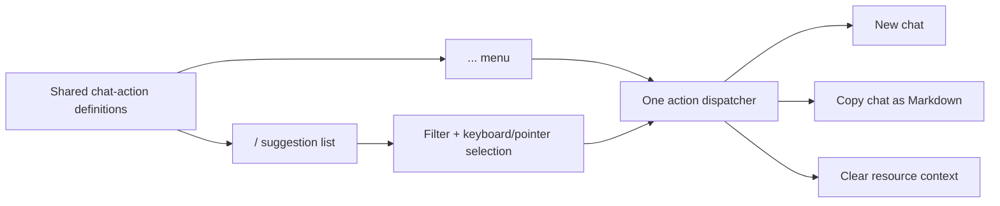

# A84 - AI chat: slash commands for chat actions
[Overview](../BASED.md)

Expose AI Chat actions through the existing `/` suggestion surface. The slash-command list must include every action currently available from the composer’s `...` menu and both entry points must execute the same behavior.

## Context

The AI Chat composer already detects `/` at a prompt boundary and can render, filter, scroll, and keyboard-navigate command suggestions, but the active chat does not provide any command definitions:

- [`packages/ui-ai-chat/src/chat/components/ChatComposer/ChatComposer.tsx`](../../packages/ui-ai-chat/src/chat/components/ChatComposer/ChatComposer.tsx) owns ProseMirror trigger detection, suggestion rendering/navigation, the `...` action menu, command selection, and submit behavior.
- [`packages/ui-ai-chat/src/chat/components/ChatComposer/interface.ts`](../../packages/ui-ai-chat/src/chat/components/ChatComposer/interface.ts) defines command and callback contracts. Commands currently carry display metadata but no executable action contract.
- [`packages/ui-ai-chat/src/chat/components/ChatComposer/fn.trigger.ts`](../../packages/ui-ai-chat/src/chat/components/ChatComposer/fn.trigger.ts) recognizes `/` only at a valid text boundary and excludes whitespace/multiline queries.
- [`packages/ui-ai-chat/src/chat/components/tabs/ChatTab.tsx`](../../packages/ui-ai-chat/src/chat/components/tabs/ChatTab.tsx) owns the concrete **New chat**, **Copy chat**, and **Clear resource context** behavior and passes those callbacks to the composer’s `...` menu.
- [`packages/ui-ai-chat/src/chat/components/tabs/fn.chat-message-markdown.ts`](../../packages/ui-ai-chat/src/chat/components/tabs/fn.chat-message-markdown.ts) provides the Markdown serialization used by **Copy chat**.
- [`packages/ui-ai-chat/src/chat/components/index.tsx`](../../packages/ui-ai-chat/src/chat/components/index.tsx) owns session replacement and resource-binding cleanup.
- [`packages/ui-ai-chat/tests/chat/ChatComposer/ChatComposer.suggestions.test.tsx`](../../packages/ui-ai-chat/tests/chat/ChatComposer/ChatComposer.suggestions.test.tsx) covers generic slash suggestion navigation, but not real action execution.
- [`packages/ui-ai-chat/tests/chat/tabs/ChatTab.render.test.ts`](../../packages/ui-ai-chat/tests/chat/tabs/ChatTab.render.test.ts) and [`packages/ui-ai-chat/tests/chat/index.render.test.ts`](../../packages/ui-ai-chat/tests/chat/index.render.test.ts) cover the existing menu actions and their higher-level effects.
- [`tasks/s/S70.md`](../s/S70.md) intentionally removed placeholder slash values while preserving the command plumbing. A84 replaces placeholders with real product actions rather than restoring demo commands.

The existing `...` menu is the behavior baseline. The initial slash catalog must contain exactly these actions:

1. **New chat**
2. **Copy chat**
3. **Clear resource context**

## Plan

### 1. Define one authoritative chat-action catalog

- Model composer actions with stable IDs, user-facing labels, slash names, descriptions, availability, and the callback/dispatch identity needed to execute them.
- Seed the catalog with `/new`, `/copy`, and `/clear-context`, mapped respectively to **New chat**, **Copy chat**, and **Clear resource context**.
- Keep command names lowercase and kebab-case. Matching remains case-insensitive through the existing suggestion filter.
- Derive both the `...` menu and slash suggestions from this catalog so adding, removing, renaming, disabling, or reordering an action cannot make the two surfaces drift.
- Keep the catalog frontend-local. These commands invoke existing UI/session actions and must not be sent to Pi, stored in chat history, or treated as agent prompt text.
- Preserve extensibility for future chat-local slash actions without introducing a backend command registry or mixing model/provider settings into this task.

### 2. Execute selected slash commands as actions

- Replace the current inert command-selection path with an explicit action activation boundary.
- Selecting a slash item by pointer, Enter, or Tab removes the typed trigger/query, closes the suggestion list, invokes the same action dispatcher as the matching `...` item, and restores focus when the action leaves the current composer mounted.
- A command is an immediate UI action; it does not require additional prompt text or a second submit and does not call `onPrompt`.
- Clear stale command state so a later normal prompt cannot accidentally carry a previously selected command.
- Keep plain text containing `/` unchanged when it is not a valid trigger. Unknown slash text remains ordinary prompt text and may be submitted normally.
- While an agent run is active, retain the same action availability and behavior as the `...` menu rather than creating slash-only restrictions. Existing cancellation behavior remains separate.

### 3. Preserve exact action semantics

- **New chat:** call the existing new-session path once, with the same approval refresh, draft reset, reconnect, and resource-context behavior already exercised by the menu flow.
- **Copy chat:** serialize the same visible/eligible history to Markdown and call the existing clipboard port once. Empty history remains a safe no-op.
- **Clear resource context:** call the existing asynchronous binding cleanup once and preserve current error reporting. Do not clear mentions, history, or unrelated widget context beyond the behavior of the menu action.
- Prevent double execution when Enter is observed by both the ProseMirror keymap and document-level suggestion handler.
- If an action unmounts or replaces the composer, avoid focusing a stale editor instance after dispatch.

### 4. Complete accessibility and interaction behavior

- Opening `/` announces a **Command suggestions** list containing all three menu actions and their descriptions.
- Preserve existing Arrow Up/Down, Page Up/Down, Home/End, Enter, Tab, Escape, pointer selection, active-descendant, listbox sizing, scrolling, and focus behavior.
- Make slash names visible in each result so users can learn and type them directly; retain the plain-language action label and description for discoverability.
- Filtering `/new`, `/copy`, and `/clear` must identify the expected action. A bare `/` must show all menu actions in the same order as `...`.
- Escape dismisses the list without invoking an action or deleting unrelated prompt content.
- Keep the ellipsis menu available; slash commands are an additional access path, not a replacement.

### 5. Tests, documentation, and repository checks

- Add pure coverage for catalog projection/filter metadata if action derivation is extracted into a function file.
- Extend composer tests to prove a bare `/` lists all three actions, query filtering works, keyboard and pointer activation dispatch once, the trigger is removed, and no prompt is submitted.
- Extend `ChatTab` tests to compare slash and ellipsis behavior for new chat, clipboard serialization, empty-copy no-op, async clear-context success, and clear-context errors.
- Extend the chat integration test for the real new-session effect through slash activation, including approval/session refresh behavior.
- Retain regression coverage for unknown slash text, invalid mid-word triggers, Escape, long-list navigation primitives, ordinary prompt submission, mentions, images, and running/canceling state.
- Update [`docs/internal/screens/SCREENS.md`](../../docs/internal/screens/SCREENS.md) with a representative slash-command list if the completed interaction materially differs from the current AI Chat capture.
- Regenerate [`FILES.md`](../../FILES.md) for implementation files and run functional-core checks for every changed `fn.*.ts`, `fx.*.ts`, or `tx.*.ts` file.

## Fixed behavior decisions

- **Initial slash names:** `/new`, `/copy`, `/clear-context`.
- **Required parity:** every `...` menu action appears in the slash list; both surfaces derive from one catalog.
- **Execution:** choosing a command executes immediately; it does not create or submit an agent prompt.
- **Order:** slash actions follow the same order as the `...` menu.
- **Unknown commands:** remain ordinary text and are not intercepted.
- **Ellipsis menu:** remains present and behaviorally unchanged.
- **Backend:** no new API or persisted command registry.

## Test plan

### Catalog and discovery

- Bare `/` opens exactly **New chat**, **Copy chat**, and **Clear resource context**, in ellipsis-menu order.
- Each result displays its slash name, action label, and description with a stable accessible option identity.
- `/new`, `/copy`, and `/clear` filter to the intended actions case-insensitively.
- Mid-word slash characters, multiline/space-containing queries, dismissed suggestions, and unknown commands do not execute actions.

### Activation

- Pointer, Enter, and Tab activation each dispatch the selected action exactly once.
- Activation removes only the slash trigger/query, closes the list, clears transient command state, and does not call the agent prompt callback.
- Escape closes the list and invokes nothing.
- Focus returns to the mounted composer after copy/clear, while new-chat replacement does not target a disposed editor.

### Action parity

- New chat has the same session/reconnect/approval effects from slash and ellipsis activation.
- Copy chat writes identical Markdown from both surfaces and empty history remains a no-op.
- Clear resource context calls the same binding cleanup once from both surfaces and reports failures through the existing error path.
- Every action present in one projection is present in the other, preventing future menu/command drift.

### Verification commands

- Run focused `ChatComposer` trigger, suggestion, and action tests.
- Run focused `ChatTab` render tests and AI Chat integration render tests.
- Run the `@vibecanvas/ui-ai-chat` test suite and typecheck.
- Run functional-core lint for changed function files, the frontend typecheck/build, and `git diff --check`.

## Acceptance criteria

- Typing `/` in the AI Chat composer opens a usable slash-command list.
- The list includes **New chat**, **Copy chat**, and **Clear resource context**, covering every current `...` menu option.
- Slash commands and ellipsis items are generated from one authoritative action catalog and execute the same callbacks.
- `/new`, `/copy`, and `/clear-context` execute immediately without sending text to the agent or adding a chat message.
- Keyboard, pointer, focus, filtering, dismissal, scrolling, and screen-reader semantics remain correct.
- Existing prompt, mention, image, model, thinking-level, cancellation, and ellipsis-menu behavior remains unchanged.
- Focused tests, package checks, documentation when applicable, and `FILES.md` are updated during implementation.

## TODOS

- [ ] Define the shared chat-action catalog and stable slash names.
- [ ] Derive both ellipsis-menu items and slash suggestions from the catalog.
- [ ] Add immediate slash-action dispatch without agent submission or stale command state.
- [ ] Preserve new-chat, copy-chat, and clear-resource-context semantics and errors.
- [ ] Complete keyboard, pointer, focus, dismissal, filtering, and accessibility behavior.
- [ ] Add catalog, composer, tab, and integration regression coverage.
- [ ] Run focused/full checks and update documentation plus `FILES.md` as applicable.

## NOTES

- The supplied screenshot is retained as the source-of-truth inventory for the current ellipsis actions.
- The current composer has generic slash suggestion UI, but the live `ChatTab` passes no commands and selected command metadata is not consumed by its prompt path. This task should complete that product path rather than build a second command popup.
- If implementation introduces a `fn.*.ts` action projection helper, it must remain pure and obey the repository functional-core rules.

### LOGS

- 2026-07-20: Inspected the current composer trigger/suggestion flow, action menu, ChatTab action ownership, related tests, S70 history, supplied screenshot, and screen atlas.
- 2026-07-20: Added a plan for shared action definitions, slash/menu parity, immediate local dispatch, accessibility, and end-to-end action regression coverage. No implementation code changed.

---
