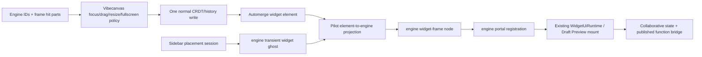

# A85 - canvas-engine real widget-host qualification
[Overview](../BASED.md)

Mount one real published widget and one stateless Draft Preview through a pinned
`@omnidraw/cangine` artifact, then qualify focus, interaction, window
state, transforms, failure isolation, and teardown without replacing the
current production renderer.

## Context

The canvas-engine compatibility audit on branch
`codex/canvas-engine-compatibility` proved the public engine mechanisms with a
synthetic portal and a representative `TCanvasDoc` projection. It did not mount
Vibecanvas’s real widget UI runtime or exercise the current widget business
logic. This task closes that validation gap.

The engine already supplies renderer-neutral `widget-frame` nodes, stable frame
hit parts, HTML portal placement, camera/group projection, clipping, input
surface registration, and lifecycle management. Vibecanvas must continue to
own:

- widget definition/revision/instance identity;
- published versus Draft Preview resolution;
- `WidgetUiRuntime` mounting and host bridges;
- collaborative widget instance state;
- server-function/resource policy;
- menus, delete policy, fullscreen behavior, and theme values.

Current consumer files to inspect before implementation:

- `packages/canvas/src/widget-host/`
- `packages/canvas/src/services/widget-placement/WidgetDropPlacementService.ts`
- `packages/canvas/src/services/widget-placement/fn.widget-placement.ts`
- `packages/canvas/src/services/widget-placement/types.ts`
- `packages/canvas/src/services/scene/SceneService.ts`
- `packages/canvas/src/services/camera/CameraService.ts`
- `packages/canvas/src/plugins/scene-hydrator/SceneHydrator.plugin.ts`
- `packages/canvas/src/runtime.ts`
- `packages/ui-ai-chat/src/widget-runtime/WidgetUiRuntime.ts`
- `packages/ui-ai-chat/src/draft-preview/DraftPreviewFrameService.ts`
- `packages/service-automerge/src/types/canvas-doc.zod.ts`
- `docs/internal/llm.widget-system.md`
- `packages/canvas/tests/widget-host/`
- `packages/canvas/tests/services/widget-placement/`

Existing regressions B7–B9 and A38 are required historical cases: iframe
release capture, resize across DOM, persisted drag, fullscreen identity, and
portal interactivity have failed before. A83 defines sidebar/toolbar placement,
including a ghost and async Preview build state.

Dependencies:

1. canvas-engine E3 accepted;
2. canvas-engine A14 transient service implemented and qualified;
3. canvas-engine D1 provides an immutable packed or registry artifact;
4. the compatibility audit files are committed or otherwise available as a
   test fixture.

This task is a **pilot and qualification gate**, not authorization to delete the
current renderer or migrate every canvas feature.

## Plan



### 1. Pin the engine artifact and preserve the current runtime

- Replace the audit’s absolute `file:` dependency with the immutable artifact
  produced by canvas-engine D1.
- Record package version and integrity in the lockfile/evidence.
- Import only documented package entrypoints; no path under engine `src`.
- Add a runtime/test feature gate such as `canvasEnginePilot` that is off by
  default.
- Do not remove or rewrite the current scene/widget implementation in this
  task. The same product fixture must be runnable through the current path and
  pilot path for behavioral comparison.

### 2. Build the minimum deterministic widget projection

Create a pilot adapter with pure projection functions:

```ts
type TWidgetEngineProjection = {
  nodes: readonly TSceneNode[];
  portal: TProjectedPortalRegistration;
  transient?: TTransientSceneProjection;
};
```

Required behavior:

- one stable semantic root per widget product element for the pilot;
- one `widget-frame` child with resolved theme colors, title/subtitle, controls,
  collapsed/active state, and deterministic order;
- one portal anchor/registration referencing the existing mounted DOM element;
- no actor/client/callback/DOM values in engine scene nodes or snapshots;
- published widget instance identity and Draft Preview identity remain in
  `TCanvasDoc`/runtime side tables;
- degrees-to-radians conversion is localized in the projection boundary until
  a separate product-schema decision changes persisted units;
- resource and portal ownership is released on element deletion, definition
  replacement, canvas switch, runtime stop, and failed mount.

Add full projection and incremental update equivalence tests for one widget,
nested groups, ordering, theme change, collapse, and window mode.

### 3. Reuse the existing widget runtime and DOM identity

- Mount the existing published `WidgetUiRuntime` into the engine-managed portal
  surface; do not create a second widget runtime.
- Mount the existing stateless UI-only Draft Preview path with ephemeral
  collaborative state and no functions/resources, as defined by
  `docs/internal/llm.widget-system.md`.
- Preserve the same widget body DOM element across camera changes, resize,
  focus changes, collapse/restore, fullscreen enter/exit, offscreen suspension,
  and engine repaint.
- Ensure a remount occurs only when current product semantics require it
  (definition/revision/runtime identity change or explicit reset).
- Mount failures must remain inside the affected frame and must not fail the
  canvas engine or sibling widgets.

### 4. Map frame input to product policy

Use engine hit IDs/parts and normalized input; keep policy in Vibecanvas:

- header press selects/focuses and may start move;
- body press focuses, then allows widget DOM interaction without replaying the
  browser event;
- resize control starts one transform session and disables body interaction
  until release/cancel;
- minimize/collapse and frame controls dispatch existing product actions;
- fullscreen remains a product window mode and reuses the same body element;
- Delete/context-menu behavior uses stable product IDs, never runtime objects.

Explicitly test capture when the pointer crosses:

- canvas → ordinary DOM widget body;
- canvas → iframe content boundary;
- resize handle → body → outside host;
- external sidebar → canvas ghost → drop;
- host/window blur and browser `pointercancel`.

One physical gesture may commit at most one CRDT/history action.

### 5. Use engine transients for external placement

Replace only the pilot ghost rendering in
`WidgetDropPlacementService` with the A14 service:

- the document-level pointer session remains application-owned because it
  begins outside engine input;
- publish a world-space `widget-frame` plus label/commit-state transient owner;
- use the existing camera conversion and viewport clamping policy;
- no ghost ID enters the engine durable snapshot, scene journal, product
  Automerge doc, export, or accessibility tree;
- clear on outside drop, Escape, pointer cancel, route/canvas change, stale
  source/revision, Preview build failure, successful commit, and runtime stop;
- preserve “one session creates at most one element.”

### 6. Browser qualification matrix

Run real product-host tests in Chromium, Firefox, and WebKit for:

| Area | Required cases |
|---|---|
| Mount | published widget, Draft Preview, failure frame, sibling isolation |
| Focus | header, body, toolbar return, canvas return, keyboard focus ring |
| DOM type | ordinary DOM, iframe where supported, shadow-root fixture |
| Move | header drag, canvas/frame drag, crossing portal, lost capture |
| Resize | every corner/edge required by product, crossing body, cancel |
| Window | collapse/restore, fullscreen/return, scene resize while fullscreen |
| Geometry | zoom, camera rotation, nested translated/rotated/scaled groups |
| Visibility | offscreen suspension/remount, hidden ancestor, clipping |
| Theme | live light/dark/theme token update without remount |
| Lifecycle | canvas switch, element delete, source failure, engine destroy |
| Placement | published and Draft Preview sidebar/toolbar ghost + async commit |

Tests must assert state/identity and CRDT effects, not screenshots alone.
Add focused screenshots for frame/portal alignment and clipping at DPR 1 and 2.

### 7. Leak and failure evidence

Instrument logical counts for:

- portal registrations and event surfaces;
- widget runtime mounts;
- document/window listeners;
- transient owners/nodes;
- resource owners;
- DOM nodes under the engine host.

Run at least 1,000 mount/focus/resize/clear or placement-cancel cycles in a
bounded fixture. After teardown, counts must return to baseline and late async
Preview/mount settlements must not resurrect UI.

### 8. Acceptance and handoff

The task closes only when:

- the pilot consumes an immutable engine artifact;
- one real published widget and one Draft Preview pass the three-browser matrix;
- pointer/focus/resize/fullscreen regressions B7–B9/A38 are represented;
- transient placement leaves no durable trace before commit;
- widget business/CRDT authority stays outside the engine;
- complete `@vibecanvas/canvas` tests/typecheck/build remain green;
- evidence identifies any behavior difference that blocks broader migration.

Do not remove the feature gate or make the pilot production-default here.

## TODOS

- [ ] Pin the immutable engine artifact and import only public entrypoints.
- [ ] Commit/adapt the compatibility projection fixture and add a disabled pilot runtime.
- [ ] Implement pure widget-frame/portal projection with explicit ownership cleanup.
- [ ] Mount real published and Draft Preview widget runtimes without duplicating business logic.
- [ ] Route frame hit parts and input into existing product focus/move/resize/window policy.
- [ ] Replace pilot external-placement ghost rendering with engine transients.
- [ ] Add projection/full-vs-incremental equivalence tests.
- [ ] Add Chromium/Firefox/WebKit widget-host and pointer-capture matrix.
- [ ] Add DPR/theme/group/offscreen/failure/lifecycle visual and behavioral cases.
- [ ] Run leak stress and prove late async work cannot remount after cleanup.
- [ ] Run full canvas/monorepo gates and record a durable qualification report.

## NOTES

- The engine does not own widget business logic, Automerge, functions,
  resources, publication, or Draft Preview builds.
- Preserve current production behavior behind the feature gate; this task
  validates a seam rather than performing the renderer cutover.
- Do not use the complete engine scene snapshot as `TCanvasDoc`.
- Do not persist viewport-derived fullscreen bounds as contained geometry.
- Use current post-S106/S107/S108 widget documentation; old actor/Preview task
  plans are historical and may not describe current runtime authority.

### LOGS

- 2026-07-23: Detailed consumer qualification plan created from the engine
  compatibility audit and current widget-host/placement/runtime architecture.
  Implementation waits on engine E3/A14/D1.

---
