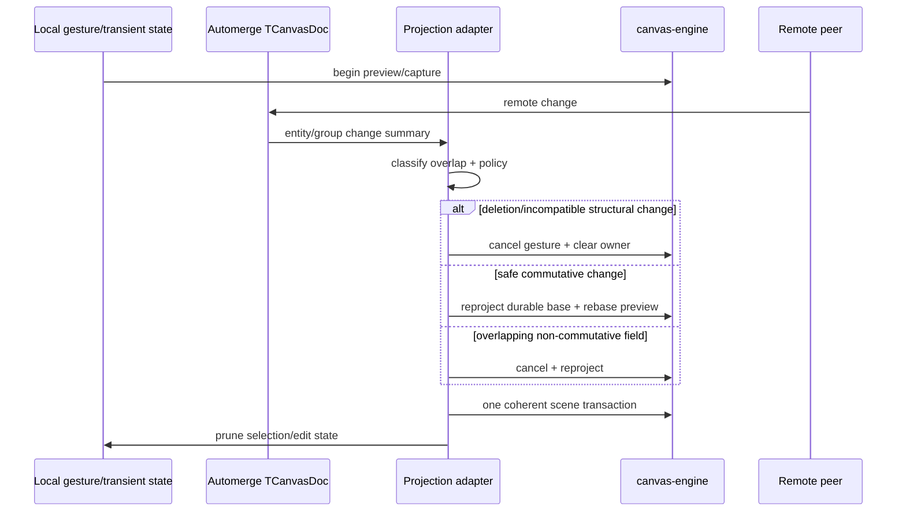

# A86 - canvas-engine collaboration and active-gesture conflict contract
[Overview](../BASED.md)

Superseded by the centrally authoritative CanvasService collaboration and
cutover tasks [`A90`](./A90.md) and [`A92`](./A92.md). Retain this file as the
historical Automerge-era conflict investigation; its useful active-gesture
conflict matrix is carried into A92 acceptance.

Define and prove deterministic behavior when remote Automerge changes touch
product elements that are selected, transiently previewed, edited, or captured
by a local canvas-engine gesture.

## Context

Automerge remains the only durable/collaborative authority. The engine scene is
a retained projection and engine transient state is presentation/interaction
mechanism only.

The current `CrdtService` emits entity-level change summaries for elements and
groups. `SceneHydrator.plugin.ts` incrementally reloads changed elements and
falls back to full reload for broader structural changes. Existing logic was
designed around mutable runtime nodes and local change suppression; the
canvas-engine pilot needs an explicit conflict policy so remote changes cannot:

- commit stale local values over newer remote values;
- leave a preview for a deleted/reparented node;
- keep selection IDs that no longer resolve;
- leak pointer capture or text/point-edit sessions;
- create a second durable authority in the engine;
- add engine transient operations to Automerge/history.

Relevant files:

- `packages/canvas/src/services/crdt/CrdtService.ts`
- `packages/canvas/src/services/crdt/fxBuilder.ts`
- `packages/canvas/src/services/crdt/tx.apply-ops.ts`
- `packages/canvas/src/plugins/scene-hydrator/SceneHydrator.plugin.ts`
- `packages/canvas/src/services/selection/SelectionService.ts`
- `packages/canvas/src/plugins/transform/Transform.plugin.ts`
- `packages/canvas/src/plugins/text/`
- `packages/canvas/src/plugins/shape1d/`
- `packages/canvas/src/services/group/`
- `packages/canvas/src/services/clone/CloneService.ts`
- `packages/canvas/src/services/widget-placement/WidgetDropPlacementService.ts`
- `packages/canvas/src/services/history/HistoryService.ts`
- `packages/canvas/tests/services/crdt/`
- `packages/canvas/tests/plugins/scene-hydrator/`

Use the compatibility audit’s projection PoC as a starting point, but replace
test-local whole-document projection with the same adapter/diff path used by
the pilot runtime.

Dependencies:

- engine E3/A14 transient contract and service;
- engine D1 immutable package;
- A85 pilot composition/projection boundary, or a smaller shared adapter
  extracted first.

## Plan



### 1. Write the product conflict policy before code

Create a short normative canvas document or a dedicated section in this task’s
evidence that fixes these defaults:

1. Automerge materialized state is authoritative.
2. Local engine transient state never writes durable engine scene state as a
   second product database.
3. Remote deletion of an active/selected/editing node cancels the affected
   session before projection removal.
4. Remote reparent/group deletion cancels when local coordinates or ownership
   would become ambiguous.
5. Remote transform/style/content changes rebase only when the product
   operation is explicitly classified commutative and has an adversarial test;
   otherwise cancel and reproject.
6. Selection/focus/edit IDs are pruned after every coherent projection.
7. Pointer capture, transient owners, DOM editors, and portal interaction are
   released on every cancellation path.
8. A local commit rereads the current document and applies semantic intent; it
   must not serialize stale runtime/engine node state wholesale.

Keep policy in Vibecanvas. Do not add Automerge types or merge rules to
canvas-engine.

### 2. Define the active-session registry

Introduce one canvas-owned registry/arbiter for active product sessions rather
than distributing conflict logic across plugins:

```ts
type TCanvasActiveSession =
  | { kind: "transform"; elementIds: readonly string[]; cancel(): void }
  | { kind: "text-edit"; elementIds: readonly string[]; cancel(): void }
  | { kind: "line-point-edit"; elementIds: readonly string[]; cancel(): void }
  | { kind: "clone-drag"; elementIds: readonly string[]; cancel(): void }
  | { kind: "widget-drop"; elementIds: readonly string[]; cancel(): void };
```

Final types should follow repository conventions. Required properties:

- one stable session ID and captured starting document heads/revision marker;
- exact durable element/group dependencies, including ancestors;
- idempotent cancel/cleanup;
- optional rebase handler only for a proven session kind;
- no renderer-native values in policy logic;
- registration replacement/destroy semantics;
- visibility through debug diagnostics/tests without production console logs.

### 3. Improve change summaries only as needed

Current entity summaries identify added/updated/deleted IDs but not changed
fields or old/new parent relationships. First determine the minimum additional
data needed by policy.

Prefer one of:

- derive affected fields/parents from Automerge patches/heads;
- capture bounded before/after entity snapshots at the adapter boundary;
- classify every update conservatively as conflict until field-level evidence
  is available.

Do not use full-document JSON comparison on every remote event in production.
Any richer summary must remain deterministic, bounded by changed entities, and
covered by existing local-write/echo suppression tests.

### 4. Apply remote changes as one coherent projection transaction

For each remote materialization:

1. capture current active session and selection/edit state;
2. classify changed elements/groups against session dependencies;
3. cancel or compute a tested rebase before changing effective scene state;
4. project changed product entities/resources/portals;
5. apply one coherent engine scene transaction/diff;
6. clear/rebuild affected transient owners;
7. prune selection/focus/edit IDs;
8. release obsolete resources/portals after successful handoff;
9. fall back to full projection only on explicit invariant failure and record a
   diagnostic counter.

Never expose a frame where a transient preview references a removed durable
parent or endpoint.

### 5. Define behavior by conflict class

Implement and test this matrix:

| Remote change | Default local outcome |
|---|---|
| Delete selected inactive node | remove + prune selection |
| Delete active transform target | cancel capture/preview, remove, prune |
| Delete active text target | cancel editor without local commit |
| Delete line under point edit | clear handles/session, remove |
| Transform/style active target | cancel unless explicit safe rebase exists |
| Change unrelated field/node | continue session; incrementally project remote change |
| Reparent active target | cancel, reproject under new parent |
| Delete/reparent ancestor group | cancel all dependent descendant sessions |
| Replace connector endpoint | cancel point edit; reroute from authoritative state |
| Remove widget during portal focus | release focus/capture/portal, remove |
| Source invalidates widget drop | clear ghost, reject pending commit |
| Remote order-only update | keep gesture if geometry independent; reproject order |
| Concurrent local/remote delete | remove-wins UI outcome, idempotent cleanup |

If product requirements choose a different outcome, update the table first and
add a test demonstrating convergence.

### 6. Prevent stale local commits

Every session commit must translate user intent against current authoritative
data:

- move: apply captured pointer/world delta to current element transform, not a
  stale full element snapshot;
- resize/rotate: use current base only if the operation’s rebase rule is
  accepted; otherwise the prior remote overlap must have cancelled;
- text: commit only if the session target still exists and conflict policy
  allows the content replacement;
- line point edit: apply point operation to the current point identity/index
  contract or cancel if it cannot be located deterministically;
- clone: create one new product ID from the accepted current source snapshot;
- widget drop: verify source/revision and canvas identity immediately before
  commit.

One user step must create one application history unit and the intended bounded
Automerge change count.

### 7. Adversarial two-peer test harness

Build deterministic tests with two Automerge handles/peers and a controllable
delivery schedule:

- local gesture begins, remote change is withheld, then delivered at begin,
  first update, before release, during commit callback, and after commit;
- reverse delivery order and duplicate/replay change delivery;
- simulate remote deletion during pointer capture and DOM text composition;
- concurrent ancestor/descendant group changes;
- concurrent order-key edits;
- remote widget deletion during portal focus/iframe interaction;
- engine/backend failure during remote projection rollback;
- canvas/runtime destroy while remote event and async widget/drop work settle.

For every schedule assert:

- both documents converge after sync;
- engine durable projection equals authoritative product state;
- no transient owner/capture/editor/portal survives cancellation;
- selection references only existing semantic IDs;
- history has no transient or duplicate step;
- no local echo loop or full-scene fallback unless expected.

### 8. Browser and performance evidence

Run the highest-risk cases in Chromium, Firefox, and WebKit with real pointer
capture and text composition. Record:

- remote-event-to-coherent-frame latency;
- changed entities and projected nodes;
- cancel/rebase decision;
- projection transaction time;
- unexpected full-reload count;
- Automerge changes/bytes per local step.

The ordinary unrelated remote update must remain incremental and must not scan
or recreate the full document.

## TODOS

- [ ] Write and review the authoritative conflict-policy matrix.
- [ ] Introduce one canvas-owned active-session registry with idempotent cleanup.
- [ ] Determine and implement the minimum bounded CRDT change-summary detail.
- [ ] Apply remote changes through one coherent engine projection transaction.
- [ ] Implement deletion/reparent/update/order conflict classification.
- [ ] Make local commits semantic-intent operations against current document state.
- [ ] Prune selection/focus/edit state after every projection.
- [ ] Add deterministic two-peer adversarial scheduling harness.
- [ ] Cover transform, text, line edit, groups, clone, widget drop, and portal focus.
- [ ] Add Chromium/Firefox/WebKit pointer-capture/composition cases.
- [ ] Measure latency/change count/fallbacks and record durable evidence.
- [ ] Run complete canvas/Automerge/monorepo gates.

## NOTES

- “Rebase” is not the default. It is allowed only for a specific commutative
  product operation with tests.
- Do not let engine scene-journal entries become a collaboration authority.
- Do not keep a live engine node reference in the active-session policy.
- Treat remote deletion during active capture as normal lifecycle, not an
  exceptional error.
- This task should improve the existing incremental hydrator rather than create
  a parallel remote-change listener.

### LOGS

- 2026-07-27: Dropped after the Automerge authority premise was replaced by
  CanvasService. Conflict-policy outcomes move to A90/A92.

- 2026-07-23: Detailed collaboration/gesture qualification plan created from
  the compatibility audit and current `CrdtService`/scene-hydrator behavior.
  Implementation waits on the engine pilot dependencies.

---
