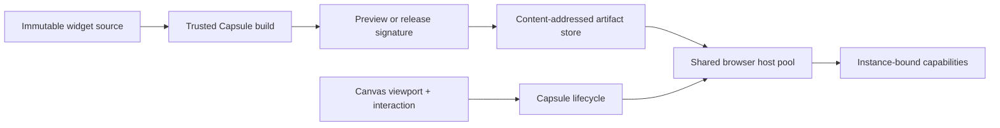

# A87 - widgets: migrate the untrusted browser runtime to Capsule
[Overview](../BASED.md)

Replace the Arrow-based widget path atomically with Capsule, from trusted
build/sign/store through browser hosting, SDK bridges, and canvas lifecycle.

## Context

The migration is governed by:

- [`llm.capsule-migration.md`](../../docs/internal/llm.capsule-migration.md)
- [`llm.capsule.md`](../../docs/internal/llm.capsule.md)
- [`llm.capsule-repository.md`](../../docs/internal/llm.capsule-repository.md)
- Capsule's public [`library-guide.md`](/Users/omarezzat/Workspace/vibecanvas/capsule/docs/library-guide.md)

The migration document wins where older notes conflict. This is a clean
cutover: no Arrow compatibility mode, dual runtime, old manifest parser, or
source-compilation fallback. The first release supports active, throttled,
frozen, and destroyed states; parking is deferred.

## Plan

1. Add a public-only Vibecanvas adapter around Capsule build, host,
   capabilities, contracts, and test helpers.
2. Replace the widget manifest/artifact model with strict Capsule v3
   descriptors and trusted build/sign/store services.
3. Move guest SDK functions, collaboration, props, theme, output, and local
   store onto Capsule capabilities and channels.
4. Mount preview and published artifacts through the same browser host path
   with exact target, signature, capability, and budget enforcement.
5. Drive runtime lifecycle from canvas visibility, geometry, priority,
   interaction, collapse, fullscreen, removal, and teardown.
6. Delete Arrow dependencies, patches, prompts, fixtures, and runtime code,
   then pass clean-install, public-composition, package, and acceptance gates.

## TODOS

- [x] Add the Capsule adapter and public dependency boundary.
- [x] Replace widget contracts and generated clients with Capsule v3.
- [x] Migrate SDK guest bridges and authoring scaffolds.
- [x] Implement trusted Capsule build, preview/release signing, and storage.
- [x] Complete browser host composition and exact verification.
- [x] Complete canvas-driven Capsule lifecycle.
- [x] Remove live Arrow code and dependencies.
- [x] Run the final clean-install and full acceptance matrix.
- [x] Update migration evidence and close this task.

## NOTES

- Capsule package: `@omnidraw/capsule@0.9.1`.
- Capsule source revision:
  `7a3df22c5fdd841c9baad84ea24088ca17d773e7`.
- Preview and release use distinct persistent Ed25519 keys.
- Private keys remain server-only; browsers receive only public verification
  material.
- The browser host is pooled by exact immutable Capsule policy because Capsule
  0.9 host policies cannot be widened after construction.

### LOGS

- 2026-07-24: Confirmed the clean-cutover scope and baseline.
- 2026-07-24: Added and verified the adapter, v3 contracts, SDK, authoring,
  database/API model, and trusted build/sign/store path.
- 2026-07-24: Removed the Arrow package, patch hook, snapshots, prompts, and
  live runtime references.
- 2026-07-24: Moved all hostile browser UI parsing, typechecking, CSS/asset
  closure, and compilation into the pinned networkless Capsule OCI worker;
  retained only the separately required server-function build in the trusted
  process.
- 2026-07-24: Bound the signed server-function capability selector to the
  canonical browser-safe descriptor digest and independently reverified it at
  build, API, preview, and mount boundaries before provider construction.
- 2026-07-24: Production browser, OCI, package, scale, typecheck, release build,
  and compiled-binary gates pass. The complete evidence and the one unrelated
  pre-existing Cangine audit-fixture failure are recorded in
  [`CAPSULE-MIGRATION-PROGRESS.md`](../../CAPSULE-MIGRATION-PROGRESS.md).

---
