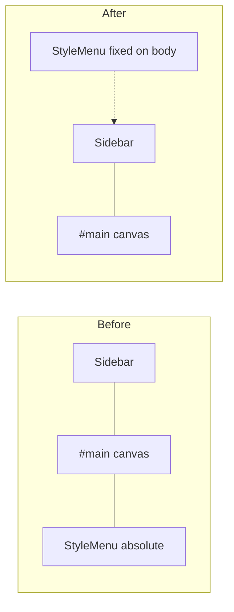

# A88 - style menu: pin left to screen, not canvas
[Overview](../BASED.md)

Pin the selection style (FILL) menu to the viewport top-left so it can use sidebar space when the sidebar is open, instead of sitting at the canvas edge inside `#main`.

## Context

Today the style menu is mounted into `scene.container` (inside `#main`) and positioned with `position: absolute; left/top: 0.75rem`. Opening the sidebar shrinks `#main`, so the menu moves right with the canvas.

Relevant files:

- [`packages/canvas/src/plugins/selection-style-menu/tx.mount-selection-style-menu.ts`](../../packages/canvas/src/plugins/selection-style-menu/tx.mount-selection-style-menu.ts) — mount target
- [`packages/canvas/src/components/SelectionStyleMenu/index.tsx`](../../packages/canvas/src/components/SelectionStyleMenu/index.tsx) — absolute left/top chrome
- [`apps/frontend/src/App.module.css`](../../apps/frontend/src/App.module.css) — `#main { overflow: hidden }` clips canvas-mounted UI that tries to paint into sidebar space
- [`packages/canvas/tests/plugins/selection-style-menu/SelectionStyleMenu.plugin.test.ts`](../../packages/canvas/tests/plugins/selection-style-menu/SelectionStyleMenu.plugin.test.ts) — asserts mount under canvas container

Before (menu glued to canvas, right of open sidebar):

## Plan

1. Remount `#selection-style-menu` onto `portal.scene.container.ownerDocument.body` with a fixed, pointer-events-none overlay (same escape hatch as text editing).
2. Change the SelectionStyleMenu outer wrapper from `position: absolute` to `position: fixed`, keep `left/top: 0.75rem`.
3. Update the plugin test mount/unmount assertions to look on `document.body`.

## TODOS

- [x] Remount selection-style-menu overlay onto `ownerDocument.body`
- [x] Change SelectionStyleMenu wrapper to `position: fixed`
- [x] Update SelectionStyleMenu.plugin.test for body mount

## NOTES

- No sidebar-width wiring needed: viewport-left already overlaps sidebar space when open.
- Do not change `#main` overflow or other floating UI.

### LOGS

- 2026-07-26: Task created from screen-left style menu plan; implementation starting.
- 2026-07-26: Remounted overlay to `ownerDocument.body` with `position: fixed`; menu chrome `absolute` → `fixed` at `0.75rem`.
- 2026-07-26: Updated plugin test mount assertions for body; `SelectionStyleMenu.plugin.test.ts` 3/3 pass.
- 2026-07-29: Restored viewport-fixed positioning after the Cangine cutover
  mounted the replacement Solid menu inside the canvas host.

---
