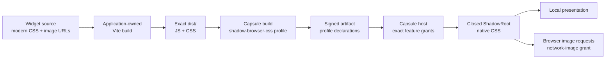

# A89 - widgets: adopt Capsule native CSS and network image profiles

[Overview](../BASED.md)

Adopt Capsule's forthcoming opt-in native Shadow DOM CSS and CSS network-image
profiles so ordinary modern React and DOM widget styling passes validation,
external image URLs work under an explicit host grant, and agents receive
actionable CSS diagnostics.

## Status

Blocked on a production Capsule release that ships the accepted
`shadow-browser-css-v1` direction, the separate CSS network-image authority,
their public build/host contracts, and machine-readable diagnostics.

Do not approximate the release with private Capsule imports, source patches,
local allowlist exceptions, or Vibecanvas-owned CSS rewriting. Continue using
the current conservative Capsule profile until the public contract is ready.

## Context

S114 moved widget compilation to application-owned npm projects and sends exact
Vite `dist/` bytes through Capsule's external-distribution API. That integration
works, but Capsule's current static CSS allowlist rejects normal presentation
CSS generated for React and plain-DOM widgets.

The first reproduced failure was a React counter whose Vite build succeeded
but Capsule rejected the emitted stylesheet. The unsupported constructs were:

- `clamp(...)`;
- `font-variant-numeric: tabular-nums`;
- `font: inherit`.

Removing those constructs from a temporary distribution made the complete
React artifact pass Capsule ingestion. The problem is therefore Capsule CSS
compatibility, not npm, Vite, React, or the external-distribution boundary.

Vibecanvas and Capsule agreed on the following direction:

- every guest UI remains mounted in a dedicated Capsule-owned closed
  ShadowRoot;
- native Shadow DOM selector matching is the CSS scope;
- the existing conservative CSS behavior remains the default;
- a broader native CSS contract is opt-in and versioned;
- the broader profile supports custom properties, modern value functions,
  gradients, typography, logical layout, Grid/Flexbox, transitions,
  animations, media queries, container queries, and `@supports`;
- blanket `:where([data-capsule-root])` selector rewriting is removed for the
  broader profile, while `html`, `body`, and `:root` retain compatibility
  mapping;
- runtime image networking is a separate authority and never implied by local
  CSS compatibility;
- custom-property values containing `url(...)`, including inherited or
  dynamically assigned values, cannot bypass the image-network grant;
- document-global and host-crossing facilities such as `:host`,
  `:host-context`, `::slotted`, document-level view transitions, `@property`,
  and host-registered `paint()` remain outside the initial profile;
- rejected CSS produces precise diagnostics with path, location, construct,
  active profile, and required profile.

Vibecanvas intentionally wants the native CSS profile and the separate
network-image capability. Standard browser credential, cookie, CORS, referrer,
redirect, caching, CSP, tracking, and decoding behavior is accepted for granted
CSS image requests. The profile must make this authority explicit so a host
that does not grant it remains networkless.

Relevant Vibecanvas surfaces:

- [`WidgetArtifactBuilderCapsule.ts`](../../packages/capsule-vibecanvas/src/build/WidgetArtifactBuilderCapsule.ts)
- [`fn.policy.ts`](../../packages/capsule-vibecanvas/src/build/fn.policy.ts)
- [`CONSTANTS.ts`](../../packages/capsule-vibecanvas/src/build/CONSTANTS.ts)
- [`fn.build-error.ts`](../../packages/capsule-vibecanvas/src/build/fn.build-error.ts)
- [`WidgetNpmDistributionBuild.ts`](../../apps/cli/src/services/WidgetNpmDistributionBuild.ts)
- [`setup-services.ts`](../../apps/cli/src/setup-services.ts)
- [`CapsuleWidgetHostCoordinator.ts`](../../packages/ui-ai-chat/src/widget-runtime/CapsuleWidgetHostCoordinator.ts)
- [`mount-widget-ui-artifact.ts`](../../packages/ui-ai-chat/src/widget-runtime/mount-widget-ui-artifact.ts)
- [`prompt.capsule.md`](../../packages/service-agent/src/prompts/prompt.capsule.md)
- [`prompt.style-guide.md`](../../packages/service-agent/src/prompts/prompt.style-guide.md)
- [`llm.widget-system.md`](../../docs/internal/llm.widget-system.md)
- [`llm.capsule-documentation.md`](../../docs/internal/llm.capsule-documentation.md)

## Plan

### Verify and pin the released Capsule contract

- Record the Capsule package version, source revision, package digest, build API
  version, runtime build digest, CSS profile identifiers, and network-image
  policy schema.
- Use only documented public `@omnidraw/capsule` entrypoints and constants.
- Port Capsule's positive and negative profile examples into a focused
  Vibecanvas integration proof before changing widget defaults.
- Confirm static stylesheets and dynamic inline declarations share the promised
  behavior.
- Confirm inherited and dynamically assigned custom properties cannot use
  `url(...)` unless the network-image grant is present.
- Confirm the released diagnostic record contains stable codes, distribution
  path, line, column, rejected construct, active profile, and required profile.

### Extend the widget target and artifact contract

- Add the released native-CSS and network-image feature identifiers to the
  exact Capsule target allowlist.
- Preserve canonical feature-profile ordering and bind the selected profiles
  into source, build, artifact, preview, publication, and runtime identities.
- Update widget scaffolds and authoring defaults to request the native CSS
  profile and the network-image profile.
- Preserve conservative behavior for older manifests and artifacts that do not
  declare the new profiles; do not silently widen an existing signed artifact.
- Reject build/host profile mismatches before guest evaluation.

### Configure explicit host grants

- Grant native CSS only when the artifact declares the exact released profile.
- Configure the shipped CSS image URL/origin policy for Vibecanvas's accepted
  browser-resolved image behavior.
- Grant network images only when both the artifact declares the profile and the
  mounting Vibecanvas policy enables it.
- Preserve Capsule's default-deny behavior for hosts and artifacts without the
  network-image authority.
- Bind the grant and URL/origin policy into immutable host-pool identity so a
  narrower host is never accidentally reused as a wider host.
- Keep JavaScript network, capabilities, DOM mediation, artifact verification,
  signing, and resource budgets independent from CSS image networking.

### Preserve native Shadow DOM and theme behavior

- Use Capsule's native selector behavior under the new profile; do not add a
  Vibecanvas selector-prefixing transform.
- Verify `html`, `body`, and `:root` compatibility mapping against the virtual
  guest document.
- Prove selector specificity is unchanged by the integration.
- Verify host CSS custom properties inherit into the closed ShadowRoot and can
  be consumed through `var(...)` with fallbacks.
- Keep `getWidgetTheme()` and `subscribeWidgetTheme()` as the stable semantic
  theme API; inherited CSS variables are an additional browser-native path, not
  a replacement for the SDK contract.

### Surface actionable diagnostics

- Preserve Capsule's structured CSS diagnostic through
  `WidgetArtifactBuilderCapsule`, `WidgetService.validateBuild`, durable draft
  validation, agent tool results, Preview, publication, and user-visible error
  states.
- Bound diagnostic text and counts without discarding stable code, path,
  location, construct, active profile, or required profile.
- Distinguish missing CSS profile, missing network-image grant, rejected URL or
  origin, malformed CSS, and resource-budget failures.
- Stop returning only `Widget ui build failed.` or file-level
  `TRANSFORM_FAILED` when Capsule supplies a more specific diagnostic.

### Update widget authoring guidance

- Remove prompt rules that prohibit all CSS custom properties and `var(...)`.
- Teach agents the native CSS profile, inherited variables, modern layout and
  responsive CSS, and the separate network-image authority.
- Explain that external image URLs are runtime dependencies whose response
  bytes are not covered by the artifact hash.
- Keep external runtime stylesheet `@import` out of the authoring contract
  unless Capsule explicitly ships it; Vite should bundle stylesheet imports.
- Instruct agents to run `vc_widget_validate` and repair the exact structured
  diagnostic rather than guessing from a generic UI-build failure.

### Add integration and browser acceptance coverage

- Build, ingest, mount, and interact with the original React counter using
  `clamp()`, `font-variant-numeric`, and `font: inherit`.
- Cover custom-property declarations, inherited host variables, fallbacks,
  `calc()`, `min()`, `max()`, gradients, logical properties, media queries,
  container queries, `@supports`, transitions, and animations.
- Verify static stylesheet and React/DOM inline-style parity.
- Serve an image from a controlled local HTTP origin and prove it loads only
  with the exact network-image declaration and host grant.
- Cover same-origin, cross-origin, root-relative, distribution-relative, data,
  redirect, denied-origin, oversized response, invalid MIME, decode failure,
  and offline behavior as supported by the final Capsule policy.
- Prove a custom property containing `url(...)` fails without the network grant
  and succeeds under the same URL/origin rules when granted.
- Prove missing-profile errors report the exact source location and required
  profile.
- Prove conservative artifacts retain their previous behavior.
- Prove omitted grants, target mismatch, and policy mismatch fail before guest
  evaluation.

### Update documentation and release evidence

- Refresh the internal Capsule consumer documentation from the shipped public
  contract.
- Document native Shadow DOM scoping, profile selection, host grants, external
  image reproducibility limits, and the explicitly accepted browser-network
  risks in the widget-system guide.
- Update package-boundary, clean-install, browser acceptance, release build,
  and compiled-binary evidence.
- Regenerate derived repository documentation required by changed code.

## TODOS

- [ ] Pin and verify the released Capsule CSS and network-image contracts.
- [ ] Add public-API integration proofs for both profiles.
- [ ] Extend widget target/profile allowlists and canonical identities.
- [ ] Request the new profiles from generated widget manifests.
- [ ] Configure exact browser-host feature grants and URL/origin policy.
- [ ] Preserve native selector specificity and root compatibility mapping.
- [ ] Verify inherited host custom properties and SDK theme coexistence.
- [ ] Preserve structured CSS diagnostics through every product boundary.
- [ ] Update prompts for modern CSS, variables, image URLs, and repair actions.
- [ ] Add React counter and modern local-CSS acceptance coverage.
- [ ] Add granted and denied CSS network-image browser coverage.
- [ ] Prove custom-property URLs cannot bypass the network grant.
- [ ] Preserve conservative behavior for artifacts without the new profiles.
- [ ] Update documentation, package boundaries, and release evidence.

## Acceptance criteria

- The original React counter validates and mounts without removing
  `clamp()`, `font-variant-numeric`, or `font: inherit`.
- Modern fully parsed local CSS works under the explicit native CSS profile and
  remains rejected or profile-gated under the conservative profile.
- Native Shadow DOM selector specificity is preserved without a blanket
  Vibecanvas prefix transform.
- Host CSS custom properties inherit into the widget and work with `var()`
  fallbacks.
- Static stylesheets and dynamic inline styles follow one documented
  declaration contract.
- Browser-resolved CSS images load only when the artifact and host both select
  the network-image capability and the URL/origin policy admits the request.
- A `url(...)` introduced through an inherited or dynamic custom property
  cannot bypass the network-image grant.
- External image response bytes are explicitly excluded from artifact
  reproducibility claims.
- Missing profiles, grants, and URL authority return bounded diagnostics with
  stable code, path, line, column, construct, active profile, and required
  profile where applicable.
- Existing conservative artifacts remain valid and are never silently widened.
- Capsule runtime isolation, DOM mediation, signing, verification, budgets, and
  non-CSS capability boundaries remain unchanged.

## NOTES

- No mockup is useful. This is a build/runtime capability integration with no
  intended product-layout change.
- The tentative names `shadow-browser-css-v1` and
  `css-network-images-v1` are placeholders until Capsule publishes exact
  constants.
- The selector prefix is not the current blocker. Do not remove or fork Capsule
  behavior before the native profile ships.
- Direct CSS image networking is an intentional authority. Browser cookie and
  CORS policy narrows some risks but does not make runtime responses immutable
  or part of the signed artifact.

### LOGS

- 2026-07-27: Reproduced the React counter failure. Vite built successfully;
  Capsule rejected three ordinary CSS constructs, and a temporary compatible
  stylesheet produced a valid Capsule artifact.
- 2026-07-27: Requested a versioned native Shadow DOM CSS profile, separate CSS
  image-network authority, and structured diagnostics.
- 2026-07-27: Capsule accepted the direction in principle. Integration remains
  blocked until the production profile names, public APIs, host policy, and
  diagnostics contract ship.

---
