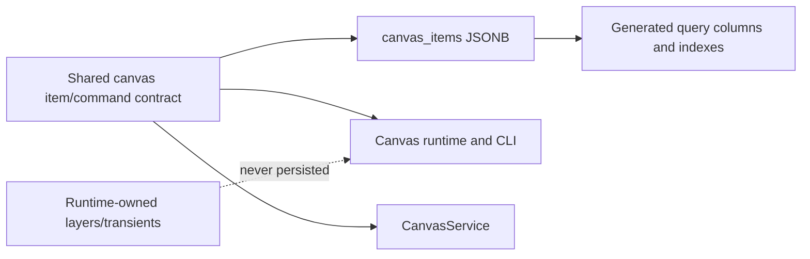

# A89 - canvas persistence: add the shared item contract and JSONB canvas_items
[Overview](../BASED.md)

Define one persisted canvas-item vocabulary around Cangine nodes and add the
queryable JSONB schema used by the authoritative CanvasService.

## Context

The previous A89 planned a versioned Automerge document. That plan is
superseded: Vibecanvas has one central server authority, no deployed canvas
data, and no requirement to migrate or roll back Automerge documents.

The new persistence boundary is one `canvas_items` row per authored Cangine
node. Groups and drawable nodes share the table. Canvas identity and name
remain in `canvases`; runtime layers, previews, selection, resources, portal
hosts, and other transient values are never persisted.

Relevant code:

- [`000-initial.sql`](../../packages/service-db/src/migrations/000-initial.sql)
- [`expected-schema.ts`](../../packages/service-db/src/schema/expected-schema.ts)
- [`canvas-doc.zod.ts`](../../packages/service-automerge/src/types/canvas-doc.zod.ts)
- [`types.d.ts`](../../packages/canvas/vendor/omnidraw-cangine-0.2.2.tgz)

The bundled database currently uses SQLite 3.50.4. SQLite JSONB is stored as a
`BLOB`; STRICT tables must therefore declare the storage column as `BLOB` and
write values through `jsonb(...)`.

## Plan



### 1. Add a dependency-light shared contract

Create `@vibecanvas/canvas-contract` for persistence and transport contracts.
Use Cangine `TSceneNode` directly; do not recreate a Vibecanvas geometry union
or retain `TElement`/`TGroup` as compatibility types.

The contract owns:

- authored item snapshots keyed by stable node ID;
- canvas revision and per-item revision values;
- atomic command and changed-item event envelopes;
- namespaced Vibecanvas widget/authoring extensions;
- field/path preconditions used by collaborative writes and local undo;
- query filters and pagination contracts.

Cangine owns node geometry, transform, hierarchy, ordering, paint, text, and
scene validation. Vibecanvas owns authorization and its narrow extensions.
System content/background/overlay/debug layers are materialized at runtime;
top-level authored items persist `parentId: null`.

### 2. Add the unreleased schema

Add `revision INTEGER NOT NULL DEFAULT 0 CHECK (revision >= 0)` to `canvases`.
Add a STRICT `canvas_items` table with:

```text
org_id             TEXT
canvas_id          TEXT
id                 TEXT
item_json          BLOB
item_revision      INTEGER
created_at_ms      INTEGER
updated_at_ms      INTEGER
kind               generated/stored from item_json
parent_id          generated/stored from item_json
order_key          generated/stored from item_json
widget_instance_id generated/stored from the Vibecanvas widget extension
definition_id      generated/stored from the Vibecanvas widget extension
revision_id        generated/stored from the Vibecanvas widget extension
```

Required constraints:

- primary key `(org_id, canvas_id, id)`;
- canvas foreign key with `ON DELETE CASCADE`;
- `typeof(item_json) = 'blob'`;
- `json_valid(item_json, 8)`;
- JSON node ID equals the row ID;
- non-empty `kind` and `order_key`;
- non-negative item revision and timestamps;
- widget identity columns are either all present for a widget instance or all
  absent.

Required indexes:

- `(org_id, canvas_id, kind, id)`;
- `(org_id, canvas_id, parent_id, order_key, id)`;
- unique partial widget-instance identity per organization;
- widget definition/revision lookup needed by runtime authorization.

Store the complete authored node once in `item_json`. Generated columns are
indexes over that source of truth; application writes must not maintain a
second copy of common fields.

### 3. Add typed database capabilities

Add query and transaction helpers that:

- encode JSON with `jsonb(?)` and decode with `json(item_json)`;
- list a complete canvas in stable hierarchy/order order;
- fetch items by ID, kind, parent, or widget identity;
- insert/update/delete a bounded item set in one database transaction;
- compare and increment canvas/item revisions atomically;
- return only touched rows for mutation paths.

Do not add a durable command log, undo table, migration table, document
version, Automerge URL, or dual-write path.

### 4. Validate and qualify the boundary

Validate node batches with the public Cangine scene validator plus the narrow
Vibecanvas extension validators before database mutation. Add schema contract,
JSONB round-trip, malformed blob, generated-column, index, cascade, tenant
isolation, hierarchy, widget identity, and transaction rollback tests.

## TODOS

- [ ] Create `@vibecanvas/canvas-contract` and package exports
- [ ] Define snapshot, command, event, query, and precondition contracts
- [ ] Use Cangine node types directly without a duplicate geometry union
- [ ] Add `canvases.revision` and STRICT `canvas_items`
- [ ] Add JSONB constraints, generated columns, and indexes
- [ ] Add typed canvas-item database query/transaction capabilities
- [ ] Add Cangine and Vibecanvas extension validation
- [ ] Update expected-schema and schema verification fixtures
- [ ] Add JSONB/query/constraint/transaction tests

## Acceptance criteria

- One authored canvas node is stored once as SQLite JSONB and is queryable by
  canvas, kind, parent/order, ID, and widget identity through indexes.
- Server, API, CLI, and browser packages can share the contract without
  importing canvas UI/runtime code.
- No new `TElement`/`TGroup` geometry facade, Automerge document envelope,
  migration record, or command-history table exists.
- One canvas mutation can update a bounded set of rows and one canvas revision
  atomically.
- Existing Automerge production paths remain unchanged until A92; A89 does
  not dual-write live edits.

## NOTES

- A UI mockup is not useful; the persistence/ownership Mermaid is the relevant
  visual.
- The development database will be deleted at cutover. Modify the unreleased
  canonical schema and its generated/embedded forms rather than creating a
  v1-to-v2 data migration.

### LOGS

- 2026-07-26: Original Automerge/Cangine contract task created from E39.
- 2026-07-27: Original plan dropped and replaced in place after deciding on a
  centrally authoritative CanvasService and queryable JSONB rows.

---
