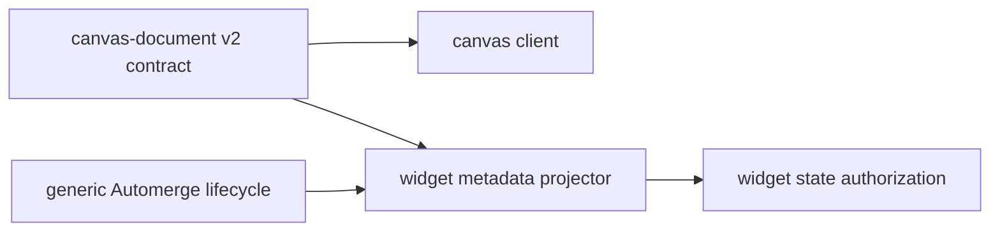

# A89 - canvas document: add the versioned Cangine-node contract
[Overview](../BASED.md)

Create the shared v2 canvas-document contract and move server-readable widget
projection to it without changing the production runtime's active schema.

## Context

[`E39`](../e/E39.md) accepted an Automerge-normalized map of Cangine nodes as
the target and recorded the complete decision in
[`llm.canvas-document-architecture.md`](../../docs/internal/llm.canvas-document-architecture.md).
The contract cannot stay in `service-automerge`, which should become generic,
and cannot live in `packages/canvas`, which already depends on
`service-automerge`.

Relevant code:

- [`canvas-doc.zod.ts`](../../packages/service-automerge/src/types/canvas-doc.zod.ts)
- [`AutomergeService.ts`](../../packages/service-automerge/src/AutomergeService.ts)
- [`WidgetInstanceMetadataProjector.ts`](../../packages/service-automerge/src/projection/WidgetInstanceMetadataProjector.ts)
- [`fn.widget-instance-projection.ts`](../../packages/service-automerge/src/projection/fn.widget-instance-projection.ts)
- [`api.create-canvas.ts`](../../packages/api/src/canvas/api.create-canvas.ts)

## Plan

1. Add a dependency-light `@vibecanvas/canvas-document` package containing the
   v2 envelope, asset and extension contracts, pure materializer, validation,
   quotas, and widget-instance extractor.
2. Bind document v2 to Cangine scene schema `1.0.0` and enforce map-key/node-ID
   identity.
3. Replace canvas-shaped Automerge element callbacks with generic
   document/version events while preserving ordering and persisted projection
   semantics.
4. Teach widget metadata projection to consume the narrow versioned
   widget-frame extension and preserve uniqueness, sequence, quarantine, and
   authorization.
5. Add contract, malformed-input, quota, and projector compatibility tests.
   Do not switch existing canvases or delete v1 here.

## TODOS

- [ ] Create `@vibecanvas/canvas-document` package and exports
- [ ] Define v2 envelope, asset descriptors, and namespaced extensions
- [ ] Add pure snapshot materializer and layered validators/quotas
- [ ] Add server-readable widget-instance extractor
- [ ] Generalize Automerge lifecycle events without weakening sequencing
- [ ] Adapt widget metadata projection and authorization
- [ ] Add contract, malformed-input, quota, and compatibility tests
- [ ] Document exact Cangine version/schema pin

## Acceptance criteria

- Server, API, CLI, and canvas can import the contract without dependency
  cycles or importing UI code.
- Full scene geometry is typed by Cangine, not redefined by Vibecanvas.
- Widget authorization consumes v1 or v2 through explicit version adapters and
  has the same sequence/quarantine/uniqueness guarantees.
- Production canvas creation and editing remain on v1 until later cutover.

## NOTES

- Do not add a second v2 geometry validator that drifts from Cangine.
- The package owns application envelope/extensions, not persistence or UI.
- No dual write.

### LOGS

- 2026-07-26: Created from accepted E39 architecture decision.

---
