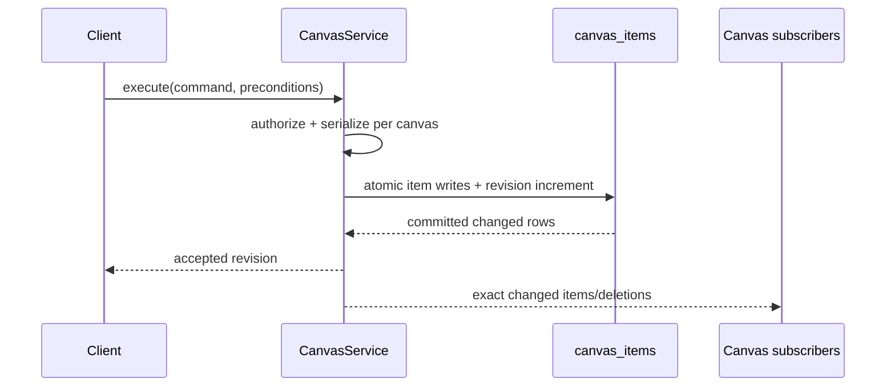

# A90 - canvas: implement the authoritative CanvasService
[Overview](../BASED.md)

Add the central server authority for canvas snapshots, queries, atomic
commands, revisions, and realtime multiplayer events.

## Context

The previous A90 planned an Automerge/Cangine synchronization bridge. That
bridge is no longer wanted. Multiplayer canvas writes will be serialized and
validated by one server-side `CanvasService`, backed by A89's `canvas_items`.

This task depends on [`A89`](./A89.md). It builds the service and protocol but
does not switch production API, CLI, or browser runtime; coordinated cutover is
A92.

Relevant code:

- [`setup-services.ts`](../../apps/cli/src/setup-services.ts)
- [`EventBus.ts`](../../packages/service-event-publisher/src/EventBus.ts)
- [`contract.ts`](../../packages/api/src/canvas/contract.ts)
- [`CrdtService.ts`](../../packages/canvas/src/services/crdt/CrdtService.ts)
- [`CanvasActiveSessionService.ts`](../../packages/canvas/src/services/active-session/CanvasActiveSessionService.ts)

## Plan



### 1. Add the service package and interface

Create `@vibecanvas/service-canvas` with an `ICanvasService` exposing:

```ts
getSnapshot(tenant, { canvasId })
queryItems(tenant, query)
execute(tenant, command)
subscribe(tenant, { canvasId, afterRevision })
release(tenant, { canvasId })
getMetrics(tenant)
```

Snapshots contain the current canvas revision and authored items. Commands
contain a stable client command ID, canvas ID, base revision, one atomic action
group, bounded operations, and path/item preconditions.

Supported primitive operations:

- insert a complete item with an absent-ID precondition;
- patch explicit JSON paths with expected current values;
- replace a complete item with an expected item revision;
- delete an item with expected revision/value preconditions;
- atomic reparent/reorder of bounded item sets.

Product APIs may expose semantic operations, but they must compile to these
validated primitives before persistence.

### 2. Serialize and validate centrally

Use one lifecycle-managed queue per active canvas. For each command:

1. authorize current canvas membership and editor role;
2. enforce operation/item/JSON/path/depth/byte limits;
3. load the current affected rows;
4. validate base revision and narrow preconditions;
5. apply operations to a candidate item map;
6. validate node IDs, hierarchy, order, Cangine scene, widget extensions, and
   product invariants;
7. write touched rows and increment `canvases.revision` once in one DB
   transaction;
8. update/invalidate the active cache only after commit;
9. publish the exact committed changed rows and deleted IDs.

Stale canvas revisions are not an automatic rejection. Accept a command when
all touched-path preconditions still hold; reject only the conflicting action
group. Delete beats a stale patch. Structural operations are atomic.

### 3. Use bounded memory, not durable history

Keep active canvas items in `Map<id, item>` and maintain a bounded in-memory
event ring keyed by actual canvas revision. Do not persist commands or undo
records.

Subscription behavior:

- if all revisions after `afterRevision` remain in the ring, replay them then
  continue live;
- otherwise emit `resync-required` with the current revision;
- after process restart, clients obtain a fresh snapshot;
- publish only after the DB transaction commits;
- invalidate and reload a cache if post-commit publication/application fails.

Command retry behavior uses stable item IDs plus operation preconditions. A
client that loses an acknowledgement must resync before retrying; no durable
idempotency table is required.

### 4. Make widget metadata transactional

When a command inserts, changes, or deletes a widget-instance item, update the
existing query-friendly widget-instance metadata in the same database
transaction. Replace the asynchronous persisted-canvas snapshot projector;
authorization must never observe canvas JSONB and widget metadata at different
committed revisions.

### 5. Test authority and performance

Add deterministic two-client scheduling tests for unrelated fields, same
field, move, delete/update, reparent, group delete, reorder, widget identity,
duplicate/retry, reconnect replay, resync, authorization changes, service
restart, and transaction failure.

Measure:

- ordinary single-item command latency at 5k/50k/100k rows;
- changed rows and JSON bytes read/written;
- event replay depth and subscriber cleanup;
- active cache lifecycle and tenant isolation.

No ordinary one-item command may scan or materialize the whole canvas.

## TODOS

- [ ] Create `@vibecanvas/service-canvas` and `ICanvasService`
- [ ] Implement snapshot and indexed query operations
- [ ] Implement per-canvas serialized atomic command execution
- [ ] Implement path/item preconditions and conflict results
- [ ] Add active item caches with bounded lifecycle and metrics
- [ ] Add revisioned event ring, replay, resync, and subscription cleanup
- [ ] Move widget-instance metadata updates into the canvas transaction
- [ ] Add authorization, quota, hierarchy, and Cangine validation
- [ ] Add two-client/reconnect/restart/failure tests
- [ ] Add 5k/50k/100k bounded-work performance evidence

## Acceptance criteria

- The server is the only durable and semantic canvas authority.
- Every accepted action group produces exactly one canvas revision and one
  committed event containing only touched items/deletions.
- Conflicting touched fields reject deterministically; unrelated concurrent
  fields remain independently editable.
- Reconnect either replays a contiguous bounded revision tail or requests a
  complete snapshot.
- No Automerge type, merge rule, document handle, durable command log, or
  server undo store exists in CanvasService.
- One-item mutation work is bounded by touched items and required ancestors,
  not total canvas size.

## NOTES

- The existing generic `EventPublisherService` uses process-local sequences
  unrelated to canvas revisions. CanvasService owns its revision ring so
  reconnect semantics cannot confuse the two counters.
- A UI mockup is not useful; the sequence diagram captures the authority path.

### LOGS

- 2026-07-26: Original Automerge/Cangine bridge task created from E39.
- 2026-07-27: Original plan dropped and replaced in place with the central
  CanvasService implementation.

---
