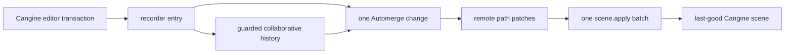

# A90 - canvas: productionize the Automerge/Cangine bridge and history
[Overview](../BASED.md)

Replace the v2 runtime projection hypothesis with one tested synchronization
bridge between normalized Automerge node maps and Cangine transactions.

## Context

The executable E39 prototype is
[`cangine-automerge-document.test.ts`](../../packages/canvas/tests/exploration/cangine-automerge-document.test.ts).
It proves nested merge, creation, hierarchy/order, delete/update conflict,
last-good invalid-state handling, echo suppression, standard-editor delete,
collaborative undo/redo, migration round-trip, and O(changed-nodes) patch work.

This task depends on [`A89`](./A89.md). It does not migrate documents or remove
the v1 runtime.

## Plan

1. Extract pure node-map reconciliation, patch classification, topological
   batching, and materialization from the prototype.
2. Add a lifecycle-safe bridge using Automerge Repo handle events and Cangine
   recorder sources; one Cangine transaction equals one Automerge change.
3. Keep invalid merged documents durable but retain the last-good rendered
   scene and publish actionable diagnostics.
4. Replace local linear history for v2 with guarded compensating changes that
   preserve unrelated remote fields and report same-leaf conflicts.
5. Integrate standard editor mechanics while retaining application policies for
   widgets, resources, gestures, permissions, and tool defaults.
6. Qualify real two-peer/browser, offline replay, lifecycle, quota, and
   performance behavior.

## TODOS

- [ ] Extract and test pure v2 materializer/reconciler/patch classifier
- [ ] Implement local recorder-to-Automerge transaction path
- [ ] Implement remote patches-to-atomic-Cangine path
- [ ] Add source-based echo suppression and teardown safety
- [ ] Contain local recorder/write failure and rehydrate from Automerge authority
- [ ] Add last-good invalid-state quarantine and recovery diagnostics
- [ ] Implement guarded collaborative undo/redo and coalescing
- [ ] Integrate standard editor and product command adapter
- [ ] Add two-browser/offline/reconnect/conflict tests
- [ ] Meet E39 5k/50k/100k work and performance gates

## Acceptance criteria

- V2 has one synchronization boundary and no projection signatures, JSON
  hashing, derived ID index, or whole-document scan on a single-node edit.
- One remote Automerge change produces at most one durable Cangine revision.
- Disjoint nested edits merge, same-leaf conflicts remain inspectable,
  delete/update is deterministic, and invalid scenes recover after a later
  repair.
- Undo/redo is itself collaborative and never silently clobbers an unrelated
  remote field.

## NOTES

- New-object Automerge writes emit many nested patches; always deduplicate by
  changed node ID.
- Arrays are atomic authored values in document v2.

### LOGS

- 2026-07-26: Created from accepted E39 architecture decision and passing
  seven-case bridge prototype.

---
