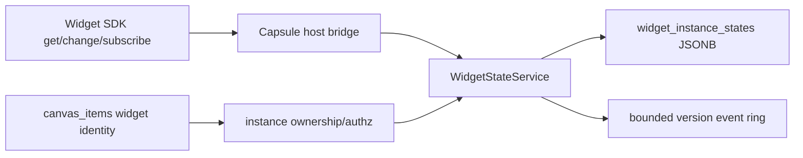

# A91 - widget state: replace Automerge with a centralized JSONB service
[Overview](../BASED.md)

Replace the remaining widget collaborative-state use of Automerge so
`AutomergeService` can be removed from the server without losing the public
widget state capability.

## Context

The previous A91 was v1-to-v2 Automerge migration tooling. No migration,
version gate, rollback record, or observation window is required because the
application has not been deployed and the development database will be
deleted.

`AutomergeService` currently serves both canvas documents and widget-instance
state documents. A90 replaces canvas collaboration, but deleting the service
would still break widget `get/change/subscribe`, runtime load authorization,
state quotas, and instance ownership. Widget state does not belong in
CanvasService or in `canvas_items`; it receives a small centralized service
and table.

Relevant code:

- [`widget-collaborative-state.ts`](../../apps/frontend/src/services/widget-collaborative-state.ts)
- [`api.runtime-load-widget.ts`](../../packages/api/src/widget/api.runtime-load-widget.ts)
- [`create-widget-collaborative-state-port.ts`](../../packages/ui-ai-chat/src/widget-runtime/create-widget-collaborative-state-port.ts)
- [`widget-state.types.ts`](../../packages/service-automerge/src/types/widget-state.types.ts)
- [`WidgetInstanceMetadataStoreTurso.ts`](../../packages/service-db/src/WidgetInstanceMetadataStoreTurso.ts)

## Plan



### 1. Add centralized state persistence

Add a STRICT `widget_instance_states` table:

```text
org_id             TEXT
widget_instance_id TEXT
version            INTEGER
state_json         BLOB
created_at_ms      INTEGER
updated_at_ms      INTEGER
```

Use primary key `(org_id, widget_instance_id)`, a cascading foreign key to the
widget instance, `json_valid(state_json, 8)`, non-negative monotonic versions,
and JSONB writes through `jsonb(?)`.

Delete `stateDocumentId` from the widget item extension and public runtime
identity. Widget instance ID is the state identity.

### 2. Add WidgetStateService

Create a narrow centralized service exposing:

```ts
get(tenant, { widgetInstanceId })
change(tenant, { widgetInstanceId, expectedVersion, value })
subscribe(tenant, { widgetInstanceId, afterVersion })
dispose(...)
```

Preserve current JSON-only validation, byte/depth/node quotas, mutation rate
limits, exact widget/canvas/tenant ownership, archived-instance behavior, and
capability authorization. A successful change writes one new version and
publishes only after commit.

Use a bounded in-memory event ring. If a requested version is unavailable,
return the latest complete state. No CRDT merge, offline divergent write,
Automerge URL, chunk history, or durable mutation log remains.

### 3. Adapt the existing public capability

Keep the SDK and Capsule-facing `get/change/subscribe` semantics stable where
possible. Replace browser Automerge document handles with the host/API bridge.
Changes use compare-and-swap on `expectedVersion`; conflicts return the latest
snapshot so the widget can retry deliberately.

Update runtime load authorization to resolve the widget item and instance
metadata through CanvasService/database identity rather than loading the whole
canvas Automerge document.

### 4. Qualify containment

Port the valuable Automerge widget-state tests to the centralized authority:

- tenant and widget-instance isolation;
- reader/editor capability distinctions;
- stale-version conflicts;
- rate/byte/depth/node quotas;
- reconnect/resubscribe and service restart;
- archived/replaced/deleted instance behavior;
- concurrent changes with deterministic single-winner CAS;
- subscriber and cache cleanup.

Do not preserve Automerge encoding/chunk tests that no longer describe the
product.

## TODOS

- [ ] Add STRICT `widget_instance_states` JSONB schema and expected-schema checks
- [ ] Create `WidgetStateService` and typed service capability
- [ ] Preserve state validation, quotas, rate limits, and tenant ownership
- [ ] Add versioned get/change/subscribe with bounded replay
- [ ] Remove `stateDocumentId` from widget item/runtime contracts
- [ ] Replace runtime-load canvas document reads with indexed identity checks
- [ ] Replace frontend Automerge widget-state handles with the API/host bridge
- [ ] Port relevant authority, conflict, reconnect, and containment tests
- [ ] Remove obsolete Automerge-specific widget-state tests/contracts

## Acceptance criteria

- Published widget state `get/change/subscribe` works without
  `AutomergeService`, document URLs, Repo handles, or collaboration chunks.
- State is one JSONB row per widget instance with monotonic compare-and-swap
  versions.
- Authorization resolves exact tenant, canvas, widget instance, definition,
  and revision identity without loading an entire canvas.
- Limits and rate controls are no weaker than the current public capability.
- No widget state is stored in `canvas_items` or owned by CanvasService.

## NOTES

- A UI mockup is not useful; this is a service and capability replacement.
- If the product chooses to remove widget collaborative state instead, replace
  this task with an explicit subtraction before A92. A92 may not delete
  Automerge while leaving the capability unresolved.

### LOGS

- 2026-07-26: Original Automerge document migration task created from E39.
- 2026-07-27: Original migration plan dropped; task number retained for the
  centralized widget-state prerequisite to Automerge removal.

---
