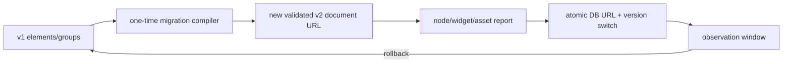

# A91 - canvas: build copy-on-write v1-to-v2 migration and version gates
[Overview](../BASED.md)

Build the deterministic migration, validation report, rollback record, and
client/server version gates required to move persisted canvases safely.

## Context

[`E39`](../e/E39.md) rejected in-place migration and permanent dual writes.
The accepted rollout creates a new Automerge document URL, validates semantic
equivalence, and atomically switches the database canvas row. The old URL is
the bounded rollback point.

This task depends on [`A89`](./A89.md) and can reuse the current projectors only
as a migration compiler.

## Plan

1. Compile every v1 discriminator/group through the current validated
   projection and attach only the approved widget, lock, pen, and asset data.
2. Resolve theme tokens to concrete Cangine values, convert degrees to radians,
   convert connectors to endpoints, and deterministically report ID remaps and
   lossy fields.
3. Validate Cangine snapshot, extensions, assets, widget projection, node
   counts, hierarchy, and semantic inventory before cutover.
4. Add database document-version metadata, old/new URL migration records,
   idempotency, quiesced final replay, atomic switch, and bounded rollback.
5. Reject unsupported versions before a client can mutate a document. Old and
   new clients may not join the same canvas.
6. Add golden fixtures for all current shapes, nested groups, inline text,
   bindings, assets, pen source, UI widgets, and widget instances.

## TODOS

- [ ] Add deterministic v1-to-v2 compiler and migration report
- [ ] Cover ID collision/remap and every v1 discriminator
- [ ] Resolve themes, rotations, connectors, assets, widgets, and pen source
- [ ] Add semantic and server-projection equivalence validation
- [ ] Add DB document version and migration/rollback records
- [ ] Implement idempotent new-URL copy, final replay, and atomic switch
- [ ] Add explicit unsupported-version gates for all connection paths
- [ ] Add golden, retry, partial-failure, rollback, and offline-client tests

## Acceptance criteria

- Migration never edits a v1 Automerge document in place.
- A failed or interrupted run is safely retryable and never changes the active
  canvas URL.
- Cutover occurs only after scene, widget, asset, and semantic checks pass.
- Rollback restores the old URL while v1 code remains available.
- No steady-state dual write exists.

## NOTES

- The projector becomes migration-only after runtime cutover and is deleted by
  S116 after the migration window.

### LOGS

- 2026-07-26: Created from accepted E39 migration decision.

---
