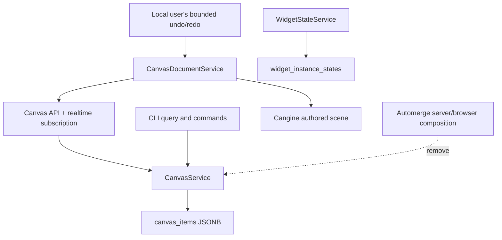

# A92 - canvas: cut API, CLI, and runtime over to CanvasService
[Overview](../BASED.md)

Perform the coordinated flag-day cutover to CanvasService, local per-user
history, and centralized widget state, then remove Automerge from every
production server and browser composition path.

## Context

This task follows [`A89`](./A89.md), [`A90`](./A90.md), and
[`A91`](./A91.md). The previous A92 planned versioned Automerge cutover,
migration, rollback drills, and an observation window. None apply: there is no
deployed data, the development database will be deleted, and the old/new
systems must not coexist after cutover.

Permanent source deletion is completed immediately afterward by
[`S116`](../s/S116.md), not delayed behind a rollback window.

Relevant code:

- [`api.create-canvas.ts`](../../packages/api/src/canvas/api.create-canvas.ts)
- [`AutomergePlugin.ts`](../../apps/cli/src/plugins/automerge/AutomergePlugin.ts)
- [`automerge.ts`](../../packages/canvas/src/automerge.ts)
- [`runtime.ts`](../../packages/canvas/src/runtime.ts)
- [`HistoryService.ts`](../../packages/canvas/src/services/history/HistoryService.ts)

## Plan

### 1. Switch canvas lifecycle and API

- Create a canvas and revision-zero state atomically in the database; do not
  create a collaboration document or separate document ID.
- Return canvas identity/name/revision without `automerge_url`.
- Expose snapshot, indexed query, atomic command, and revisioned subscription
  contracts through the typed oRPC WebSocket API.
- Delete canvas metadata and all `canvas_items` atomically through FK cascade.
- Route API authorization and command execution through CanvasService only.

### 2. Replace the browser document facade

Replace browser Repo/`DocHandle`/IndexedDB composition with a
`CanvasDocumentService` that:

- loads one authoritative snapshot;
- materializes authored Cangine nodes and runtime-owned system layers;
- sends atomic commands and applies optimistic local results;
- consumes exact accepted changed-item events;
- reconciles acknowledgements by command ID and revision;
- requests a new snapshot on `resync-required`;
- exposes revisioned changed IDs/fields directly to projection/session policy;
- serializes teardown and canvas/tenant replacement.

Do not recreate Automerge APIs under neutral names. Keep the temporary facade
only as narrow as required to cut existing plugins over.

### 3. Switch product tools and CLI

Change shape, text, pen, line/arrow, image, group, order, clone, style, widget,
selection, and active-session code to read/write Cangine nodes plus narrow
extensions. Use stable scene IDs directly and remove product-to-engine ID
mapping from production flows.

Switch CLI list/query/add/patch/move/group/ungroup/reorder/delete and dry-run
paths to the same CanvasService command compiler and validators. CLI writes
must publish live revisions visible in already-open browsers.

### 4. Keep undo local and user-owned

Retain a bounded in-memory undo/redo stack, default 100 action groups, for only
the current user's accepted/optimistic commands. Never add remote actions.

Each entry stores local inverse/redo operations and touched-path expected
values. Undo/redo submits an ordinary CanvasService command:

- unrelated remote fields do not invalidate the entry;
- a changed touched field produces a visible conflict and leaves global state
  unchanged;
- relative semantic operations may derive their inverse;
- pending unacknowledged actions can be cancelled locally;
- history is cleared on reload/tenant/canvas replacement;
- no server undo or durable client undo storage is introduced.

### 5. Remove Automerge from production composition

- Remove `AutomergeService` registration from server setup.
- Remove the `/automerge` server plugin/route.
- Remove Automerge from canvas and widget API contexts.
- Remove browser Repo, WebSocket adapter, IndexedDB adapter, leases, URLs, and
  tenant Repo lifecycle.
- Switch widget runtime state to A91.
- Remove `collaboration_documents`, `collaboration_chunks`, `automerge_url`,
  and state document IDs from the canonical unreleased schema.
- Delete the development database and recreate it from the new schema.

S116 deletes now-unused source packages, adapters, legacy projections, tests,
and dependencies immediately after this cutover passes.

### 6. Run coordinated acceptance

Qualify:

- two real browsers editing unrelated and conflicting fields;
- local gesture versus remote delete/reparent/style/content/order;
- local-only undo/redo under remote edits;
- CLI mutation appearing live in browsers;
- reconnect replay, resync, server restart, tenant switch, and teardown;
- widget placement/runtime/state/authorization;
- create/rename/delete and database reset from an empty home;
- browser and 5k/50k/100k performance/leak gates.

## TODOS

- [ ] Switch canvas API lifecycle, snapshot, command, query, and subscription
- [ ] Add browser `CanvasDocumentService` and revision reconciliation
- [ ] Switch runtime/plugins/services to Cangine items and direct scene IDs
- [ ] Switch CLI commands and dry-run to CanvasService
- [ ] Implement bounded local-user-only undo/redo with path preconditions
- [ ] Switch widget runtime state and authorization to A91
- [ ] Remove Automerge from server and browser production composition
- [ ] Remove collaboration schema and reset development DB fixtures
- [ ] Add two-browser/CLI/reconnect/undo/widget acceptance coverage
- [ ] Pass full typecheck, tests, browser, performance, and leak gates

## Acceptance criteria

- API, CLI, browser runtime, and widgets operate without an Automerge server,
  route, URL, handle, sync message, or browser Repo.
- New and reset databases contain `canvas_items` and widget JSONB state but no
  collaboration document/chunk tables.
- Every durable canvas edit passes through CanvasService and appears as one
  authoritative revision.
- Undo/redo contains only the local user's bounded in-memory actions and
  cannot blindly overwrite a collaborator's touched field.
- CLI and browser use the same command semantics and observe each other's
  accepted revisions live.
- No migration, dual-write, old-client version gate, rollback path, or
  observation window remains.

## NOTES

- A UI mockup is not useful; product visuals remain unchanged.
- Keep S116 small in elapsed time: it is immediate dead-code deletion after
  cutover, not a later release phase.

### LOGS

- 2026-07-26: Original versioned Automerge cutover task created from E39.
- 2026-07-27: Original plan dropped and replaced in place with the flag-day
  CanvasService cutover.

---
