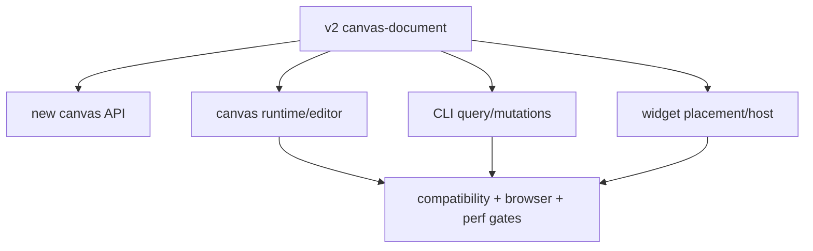

# A92 - canvas: cut API, CLI, and product tools over to Cangine nodes
[Overview](../BASED.md)

Switch new-canvas creation and all supported editing/query surfaces from
`TElement`/`TGroup` to the v2 Cangine-node document after bridge and migration
qualification.

## Context

This is the coordinated production cutover after [`A89`](./A89.md),
[`A90`](./A90.md), and [`A91`](./A91.md). It is intentionally separate from
deletion task [`S116`](../s/S116.md) so rollback remains possible during the
observation window.

## Plan

1. Create new canvases as v2 with one authored content layer and database-owned
   identity/name.
2. Rewrite shape/text/path/group/order/selection/clone/style commands to
   operate on Cangine nodes and atomic group subtrees.
3. Switch image assets, widget placement/clone/portal derivation, active
   gesture conflict classification, and server projection to v2.
4. Replace CLI element schemas with node/extension discovery, validation,
   query, add, patch, group, order, and delete commands.
5. Run migration/cutover in supported environments and complete the
   observation window with rollback drills.
6. Freeze v1 creation and hand permanent cleanup to S116.

## TODOS

- [ ] Switch new-canvas API and frontend bootstrap to v2
- [ ] Rewrite product tools and services around scene IDs/nodes
- [ ] Switch assets, widgets, portals, selection, and gestures
- [ ] Replace CLI/API element schemas and commands
- [ ] Update public help, schemas, fixtures, and extension authoring contracts
- [ ] Run complete compatibility, browser, collaboration, lifecycle, and perf gates
- [ ] Migrate environments and perform rollback drill
- [ ] Complete observation window and disable v1 creation

## Acceptance criteria

- Every supported canvas operation reads and writes v2 without recreating an
  element-like geometry facade.
- New canvases contain no `id`, `name`, `elements`, or `groups` document fields.
- CLI and API expose Cangine nodes plus narrow product extensions.
- Widget authorization, assets, history, offline replay, and browser
  collaboration pass their non-regression gates.
- The system is ready for v1 removal and no production dual write exists.

## NOTES

- Do not hide v1 behind a permanent compatibility repository. Rollback is the
  database URL switch defined in A91.

### LOGS

- 2026-07-26: Created from accepted E39 cutover plan.

---
