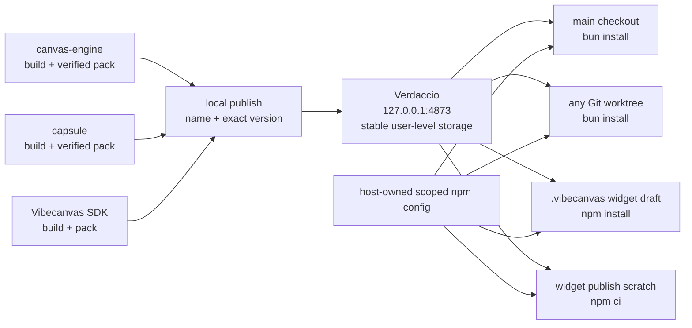

# A95 - local Verdaccio registry for Cangine, Capsule, and widget SDK
[Overview](../BASED.md)

Run one stable local npm registry for the Vibecanvas development ecosystem so
normal exact package versions work from the main checkout, arbitrary Git
worktrees, and generated widget projects below `.vibecanvas`. Remove absolute
and relative `file:` coupling to the Cangine and Capsule sibling repositories.

## Context

Vibecanvas currently consumes sibling packages through machine-specific paths:

- `@omnidraw/cangine@0.2.3` points at an absolute tarball path in
  `packages/canvas`, `packages/canvas-contract`, and `packages/ui-ai-chat`.
- `@omnidraw/capsule@0.9.4` points at an absolute sibling-repository directory
  from the SDK, CLI, and Capsule integration package.
- generated widgets receive a materialized `@vibecanvas/sdk` through `file:`,
  duplicate Capsule as another local dependency, enable `preserveSymlinks`, and
  later stage the resulting local dependency graph into `.vibecanvas-links`.

Those paths depend on one checkout layout. A Git worktree may live elsewhere,
and widget draft/publish commands run under the configured Vibecanvas data
directory rather than the repository root. TypeScript or Vite aliases cannot
solve this boundary because `npm install` and `npm ci` must resolve package
manifests, exports, transitive dependencies, and lockfile entries before a
bundle exists.

Relevant Vibecanvas surfaces:

- [`packages/canvas/package.json`](../../packages/canvas/package.json)
- [`packages/canvas-contract/package.json`](../../packages/canvas-contract/package.json)
- [`packages/ui-ai-chat/package.json`](../../packages/ui-ai-chat/package.json)
- [`packages/sdk/package.json`](../../packages/sdk/package.json)
- [`packages/service-agent/src/workspace/CONSTANTS.ts`](../../packages/service-agent/src/workspace/CONSTANTS.ts)
- [`packages/service-agent/src/workspace/tx.materialize-sdk-package.ts`](../../packages/service-agent/src/workspace/tx.materialize-sdk-package.ts)
- [`packages/service-agent/src/tools/tx.scaffold.ts`](../../packages/service-agent/src/tools/tx.scaffold.ts)
- [`packages/service-agent/src/tools/tx.npm-install.ts`](../../packages/service-agent/src/tools/tx.npm-install.ts)
- [`apps/cli/src/services/WidgetNpmDistributionBuild.ts`](../../apps/cli/src/services/WidgetNpmDistributionBuild.ts)

Sibling producer repositories:

- `canvas-engine` already builds and verifies the publishable
  `@omnidraw/cangine` tarball; its source manifest is private while the staged
  artifact manifest is publishable.
- `capsule` owns the publishable `@omnidraw/capsule` root package and its build
  output.

## Fixed decisions

### Registry ownership

- Use Verdaccio as a development npm registry bound only to
  `127.0.0.1:4873`.
- Run one registry per developer machine, shared by every Vibecanvas worktree.
  Do not make its process, storage, or identity belong to a Git worktree.
- Store registry configuration, package storage, PID/ownership metadata, logs,
  and the npm user config in a stable user-level development directory. Keep it
  separate from any worktree-local `.vibecanvas` database.
- Permit configuration overrides for the URL and state directory, but keep one
  canonical default so generated lockfiles and concurrent worktrees agree.
- Proxy public npm for packages outside the owned scopes. Never expose the
  unauthenticated development registry on a LAN interface.

### Package identity

- Consumers use exact versions such as `@omnidraw/cangine: "0.2.3"` and
  `@omnidraw/capsule: "0.9.4"`; they never reference a sibling path.
- Publish `@vibecanvas/sdk` to the same registry and make generated widget
  manifests depend on its exact version. Remove the materialized SDK link once
  registry installation is authoritative.
- Route both `@omnidraw/*` and the locally published `@vibecanvas/*` packages to
  Verdaccio. Leave ordinary public dependencies on the public npm registry or
  Verdaccio's public uplink.
- Published name/version pairs are immutable. Publishing identical bytes is an
  idempotent no-op; publishing different bytes under an existing version fails
  and requires a version bump or explicit development prerelease.
- Package locks may contain the canonical local registry URL but must contain no
  absolute sibling paths, `workspace:` entries, symlink targets, or staged
  `.vibecanvas-links` dependencies.

### Cross-repository boundary

- Cangine and Capsule own their build, pack, verification, and local-publish
  commands. Vibecanvas may verify required versions but must not build packages
  by reaching through hard-coded sibling paths.
- A bootstrap command may accept explicit producer repository or tarball paths
  for first publication. Those paths are command inputs only and are never
  persisted into package manifests or locks.
- Worktrees consume already-published packages. They do not need to discover
  where the sibling repositories live.
- Production registry selection is a later release concern. Package manifests
  remain valid because changing registry configuration does not change package
  names or versions.

## Plan

### 1. Add a worktree-independent registry lifecycle

- Pin one Verdaccio version in an isolated bootstrap tool that can be installed
  from public npm before the Vibecanvas workspace dependencies exist.
- Add `start`, `ensure`, `status`, and `stop` commands with bounded health
  checks, race-safe ownership, actionable port-conflict errors, and clean
  shutdown.
- Keep storage durable across registry restarts and worktree deletion.
- Refuse to stop a process not proven to be the registry instance started by
  this tooling.
- Generate a host-owned npm config mapping `@omnidraw` and `@vibecanvas` to the
  registry without changing the developer's global npm configuration.

### 2. Give sibling producers explicit local-publish commands

- In `canvas-engine`, publish only the verified artifact created by
  `package:artifact`; never publish the private source workspace directly.
- In `capsule`, add the equivalent build, pack, package-consumer verification,
  and local-publish sequence.
- Add package-integrity inspection before publication and compare an existing
  registry version before deciding whether publication is a no-op or conflict.
- Return machine-readable package name, version, integrity, and registry URL so
  bootstrap and CI-style checks can verify the result.

### 3. Convert Vibecanvas dependencies to registry versions

- Replace every absolute Cangine and Capsule `file:` dependency with its exact
  semantic version.
- Publish the packed `@vibecanvas/sdk` and any required publishable transitive
  Vibecanvas contracts using normal versions rather than `workspace:` metadata.
- Update the Bun lockfile through the local registry and assert it contains no
  paths into `canvas-engine`, `capsule`, or another worktree.
- Remove TypeScript/Vitest path workarounds that select a dependency through
  another package's `node_modules` once normal package resolution proves them
  unnecessary.

### 4. Make generated widget installation registry-native

- Generate widget manifests with exact `@vibecanvas/sdk` and
  `@omnidraw/capsule` versions.
- Remove the materialized SDK directory, duplicated local-Capsule workaround,
  and `preserveSymlinks` configuration.
- Extend the injected npm execution port so draft `npm install` receives the
  host-owned registry user config explicitly. Do not depend on the current
  working directory finding the repository `.npmrc`.
- Apply the same registry configuration to the isolated distribution builder's
  `npm install --package-lock-only`, frozen `npm ci`, and any package repair
  operation.
- Delete `.vibecanvas-links` staging after a registry-only package-lock fixture
  proves it is no longer needed for supported widget dependencies.

### 5. Qualify clean checkouts, worktrees, and `.vibecanvas`

- Bootstrap the registry from an environment with no Vibecanvas `node_modules`.
- Publish and install exact Cangine, Capsule, and SDK versions.
- Create a Git worktree outside the sibling repositories' parent directory and
  run a frozen Vibecanvas install, typecheck, relevant tests, and build there.
- Use a separate worktree-local `VIBECANVAS_HOME`, create a widget draft, run
  its `npm install`, validate it, and publish it through the frozen scratch
  build.
- Stop and restart Verdaccio, then repeat frozen installs from persisted
  storage without republishing.
- Assert manifests, Bun/npm locks, diagnostics, and captured widget source
  contain no absolute producer/worktree paths or `file:` package dependencies.

## Acceptance criteria

- `@omnidraw/cangine@0.2.3`, `@omnidraw/capsule@0.9.4`, and the matching
  `@vibecanvas/sdk` version install through normal package specifications.
- One localhost Verdaccio instance and persistent store serve the main checkout
  and multiple concurrent worktrees.
- A fresh worktree located outside the sibling checkout layout installs and
  builds without knowing the Cangine or Capsule repository paths.
- Widget creation, validation, and publish succeed when their project and
  scratch directories live below a worktree-local `.vibecanvas`.
- Draft and frozen publish npm commands receive registry configuration from the
  host explicitly, independent of npm's directory traversal.
- No supported manifest or lockfile contains absolute sibling paths,
  `workspace:` dependencies, `preserveSymlinks`, or `.vibecanvas-links`.
- Re-publishing identical bytes is safe; version-content conflicts fail rather
  than silently replacing a package.
- The registry listens only on loopback, survives worktree deletion, and can be
  safely started, inspected, restarted, and stopped.
- Existing Cangine package-consumer, Capsule independence, widget validation,
  distribution build, and packed public composition gates pass.

## TODOS

- [ ] Add the isolated, pinned Verdaccio bootstrap and lifecycle commands
- [ ] Add stable user-level storage, health, ownership, and scoped npm config
- [ ] Add verified local-publish commands to Cangine and Capsule
- [ ] Publish the Vibecanvas SDK and required contract dependency closure
- [ ] Replace Cangine and Capsule absolute `file:` dependencies with versions
- [ ] Replace generated-widget SDK/Capsule links with exact versions
- [ ] Inject the registry config into draft and distribution npm commands
- [ ] Remove `preserveSymlinks` and `.vibecanvas-links` staging
- [ ] Add immutable-version and package-integrity checks
- [ ] Verify bootstrap, restart, external worktree, and `.vibecanvas` publish
- [ ] Run package, typecheck, build, and packed-consumer gates

## NOTES

- A mockup is not useful because this task changes package distribution and
  process ownership, not product UI. The Mermaid flow is the plan visual.
- Cangine is consumed by Vibecanvas packages, not by generated widget source.
  Capsule and the SDK must also use the registry to eliminate the generated
  widget's local-link workaround.
- A repository-root `.npmrc` alone is insufficient: npm commands launched from
  `.vibecanvas` and isolated publish scratch directories do not reliably inherit
  it. The registry config must be passed by the host.

### LOGS

- 2026-07-28: Created from the decision to replace sibling `file:` dependencies
  with a shared local Verdaccio registry that works across worktrees and widget
  publishing.

---
