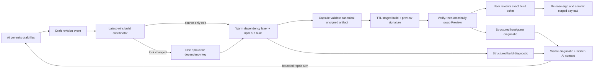

# A96 - AI widgets: live Preview, exact promotion, and diagnostic repair loop
[Overview](../BASED.md)

Restore Draft Preview after the Cangine cutover and replace the old
validate/build/refresh flow with one fast, observable authoring loop. AI edits
must rebuild the open Preview automatically, Preview failures must reach both
the user and the originating AI session, and Publish must promote the exact
reviewed executable payload without running the guest build again.

## Decision dependency

Do not begin implementation from this plan until
[`E40`](../e/E40.md) resolves the Preview surface, pre-publication authority,
staged-build, build-isolation, Capsule diagnostic, AI repair, and publication
questions. The decisions below are proposed defaults and may be revised by that
exploration.

## Context

The backend Preview contract still exists, but the current frontend no longer
uses it:

- [`canvas-extension/index.ts`](../../packages/ui-ai-chat/src/canvas-extension/index.ts)
  wires **Open Preview** to an informational notification instead of
  `agent.widgetPreview.build`.
- The same adapter accepts only direct published placement. Draft placement
  descriptors still exist in the catalog and API, but the Cangine placement
  commit rejects them.
- No current frontend caller consumes the Preview response's `bytesBase64`.
  Only published runtime loading reaches
  [`fx.decode-and-verify-ui-artifact.ts`](../../packages/ui-ai-chat/src/widget-runtime/fx.decode-and-verify-ui-artifact.ts).
- Commit `3db71817` removed `DraftPreviewFrameService`, the Preview mount, and
  their integration tests during the CanvasService/Cangine authority cutover.
  [`A94`](./A94.md) already records functional Draft Preview as missing.

Restoring those deleted files unchanged would recover rendering but would not
meet the product goal:

1. [`WidgetDraftController.buildPreview()`](../../packages/service-agent/src/widget-drafts/WidgetDraftController.ts)
   calls `#validateCaptured()`, which invokes the complete trusted build, and
   then calls `widgets.buildPreview()`, which invokes the complete build again.
2. Publish has the same shape: complete validation build followed by a complete
   release build.
3. Every UI build in
   [`WidgetNpmDistributionBuild.ts`](../../apps/cli/src/services/WidgetNpmDistributionBuild.ts)
   creates a fresh temporary project, probes Node/npm, runs `npm ci`, and then
   runs `npm run build`.
4. Preview is stateless while publication rebuilds from source. The source
   digest is checked, but the release is not the already reviewed build output.
5. Successful Capsule diagnostics are discarded when
   `WidgetDraftController.#previewReady()` returns `diagnostics: []`.
6. Browser runtime failures stop at the Preview/widget frame. Capsule exposes a
   safe structured error, but
   [`WidgetUiRuntime.ts`](../../packages/ui-ai-chat/src/widget-runtime/WidgetUiRuntime.ts)
   extracts messages only from `Error` instances, so a mapped Capsule error
   object becomes the generic “Widget UI artifact could not be loaded.”
7. There is no browser-to-agent diagnostic route. The AI can see errors returned
   by `vc_widget_validate`, but it cannot see mount, guest-runtime, capability,
   channel, or browser-host failures.
8. Capsule runtime events are intentionally message-free, and the current
   production bundle retains no source map. A `CALL_FAILED` event alone cannot
   tell the AI which widget file or line to repair.

The existing component and service tests cover the API, chat callback, artifact
verification, and published runtime independently. No current Cangine
integration test proves that **Open Preview** builds and mounts a draft or that
a Draft catalog row can be placed.

## Proposed decisions pending E40

- Preview remains non-authoritative for execution. It gets ephemeral local
  state and cannot invoke server functions or access resource bindings.
- An open Preview follows the latest committed draft source automatically.
  The canvas frame persists only draft identity and presentation data.
- Keep the last known good artifact mounted while the next revision builds.
  A build failure never replaces working content with a blank frame.
- Introduce a content-addressed, expiring **staged build**, not a second durable
  Preview revision model. A staged build is tenant/draft/revision bound, has no
  function or resource authority, and may be discarded at any time.
- Publish accepts an exact staged-build ticket. It validates current draft and
  binding preconditions, release-signs the same canonical unsigned Capsule
  artifact, and commits the same source snapshot, server artifact, descriptors,
  and provenance without rerunning `npm ci` or `npm run build`.
- Preview and release signature envelopes will differ because they use separate
  keys. “Publish this Preview” means identical executable payload and Capsule
  artifact hash, not reuse of the Preview signature as release authority.
- Preview diagnostics may trigger a hidden AI repair turn only for the
  originating draft/chat and only under bounded loop controls. Published-widget
  failures do not automatically wake an authoring chat.

## Plan

### 1. Restore one end-to-end Preview boundary

- Port the useful presentation/runtime portions of the pre-cutover
  `DraftPreviewFrameService` and Preview mount to current Cangine widget frames
  and CanvasDocumentService commands. Do not restore Automerge, legacy actors,
  or old scene/service authority.
- Make **Open Preview** create or focus one companion frame for the draft beside
  its originating AI Chat. Once open, it follows later draft revisions.
- Make direct Draft placement create an independent Preview frame at the drop
  point. Published placement continues to create a pinned widget instance.
- Decode, hash, verify, and mount Preview bytes through the same
  `CapsuleWidgetHostCoordinator` path used by published artifacts, with Preview
  signing policy and unavailable function/resource providers.
- Add an integration test that starts at the chat action or Draft placement
  descriptor and proves a Preview artifact reaches a Cangine portal.

### 2. Replace repeated builds with a latest-wins coordinator

- Add one draft-scoped build coordinator at the service/build edge. Its build
  key binds source digest, canonical manifest, lockfile digest, builder
  identity, Capsule build identity, build policy, Node/npm/platform identity,
  and relevant toolchain inputs.
- Every committed widget file mutation emits the current revision and marks an
  open Preview as building. Debounce short edit bursts and cancel superseded
  process groups; only the latest revision may become current.
- Split cheap manifest/source checks from artifact construction.
  `vc_widget_validate`, Preview, and Publish must await or reuse the same
  staged build for an unchanged build key instead of invoking independent
  builders.
- Cache an immutable dependency layer by the exact dependency/environment key.
  Run each guest build in a private copy-on-write/scratch project so a build
  script cannot mutate a shared dependency tree or contaminate another draft.
- Retain complete provenance for every staged result. Expiry or process restart
  may invalidate the ticket; the user then reviews a newly built Preview before
  publishing.
- Emit bounded progress (`queued`, `installing`, `building`, `validating`,
  `ready`, `failed`, `superseded`) so the Preview and chat never appear frozen.

### 3. Make the Preview swap fast and visually stable

- Keep the last known good handle live during a new build and show a small
  non-blocking “Building…” status with the pending revision.
- Verify the replacement off to the side, mount it into a new Preview content
  root, and swap only after `handle.ready()`. Destroy the previous handle after
  the replacement is ready.
- On build failure, retain the last good output and show the failed revision and
  actionable diagnostics. On first build failure, show an explicit error state
  rather than an empty frame.
- Preserve ephemeral state across source-only hot swaps when the state schema
  remains compatible; make **Reset** deliberately create a fresh local state
  bridge. Never present this state as published/durable.
- Disable Publish while the mounted build is stale, failed, expired, or no
  longer matches the current draft revision.

Target local UX budgets:

- committed edit to visible `building` state: under 100 ms;
- warm source-only edit to mounted Preview: p95 under 2 seconds;
- dependency changes: explicit install progress, with no UI freeze;
- Publish of a current staged build: no guest build and p95 under 1 second.

### 4. Create one structured diagnostic contract

- Define a reusable diagnostic value with stable ID/fingerprint, origin
  (`source`, `install`, `build`, `capsule`, `host`, `guest`, `capability`,
  `channel`), phase, code, severity, safe message, optional file/line/column,
  draft revision, staged build ID, retryability, and occurrence count.
- Preserve structured `WidgetNpmDistributionBuild`, Bun, Vite, Capsule-build,
  artifact-verification, mount, and runtime errors instead of repeatedly
  reducing them to one string.
- Fix mapped Capsule error rendering so product-safe object messages and codes
  survive the `WidgetUiRuntime` boundary.
- Extend Capsule's Preview-only debug boundary if necessary to report bounded
  guest exception locations. Keep production host telemetry message-free.
  Retain source maps as trusted build metadata and map locations before sending
  diagnostics to the AI; do not expose host paths, environment values,
  credentials, arbitrary DOM, or dependency source.
- Keep the latest diagnostics queryable by draft and staged build so reconnects
  do not depend on catching one transient event.

### 5. Feed Preview failures back to the originating AI safely

- Add an authorized diagnostic-report route bound to exact account, chat,
  draft, revision, and staged build identity. Reject stale or cross-owner
  reports.
- Render the same normalized diagnostic in the Preview frame and the AI Chat
  transcript/status area.
- Deliver diagnostics to Pi as a hidden custom message. While the agent is
  running, use `deliverAs: "followUp"`; while idle, use a guarded
  `triggerTurn: true` repair message when automatic repair is enabled.
- Treat all guest-provided text as untrusted diagnostic data, never as
  instructions. Give the model stable codes and source locations first.
- Deduplicate by diagnostic fingerprint and revision. Stop automatic repair
  after three turns for one revision, after the same fingerprint repeats
  without a source change, on user cancel, or when the Preview closes.
- Show that auto-repair is active and provide **Pause fixes**, **Retry build**,
  and **Ask AI to fix** controls. The user must never be trapped in a hidden
  token-consuming loop.

### 6. Promote the reviewed staged build

- Refactor the builder so construction returns canonical unsigned Capsule bytes
  plus source/server artifacts and provenance; Preview/release signing becomes
  a separate operation over that immutable result.
- Return a bounded opaque staged-build ticket with Preview results. Bind it to
  tenant, draft, source digest, contract digest, Capsule artifact hash, builder
  identities, policy, and expiry.
- Change publication confirmation to submit the mounted ticket. Recheck current
  draft revision, definition CAS, resource bindings, ticket integrity, and
  expiry before mutation.
- Release-sign the staged unsigned bytes, recompute only signature-dependent
  digests, store the already-built source/UI/server artifacts, and commit the
  active revision atomically.
- If the ticket is missing, expired, stale, or corrupt, fail without rebuilding
  and require a fresh Preview review.

### 7. Verification and documentation

- Add call-count regressions proving one unchanged revision causes one guest
  build across validation, Preview, and Publish.
- Prove rapid edits cancel/supersede older builds and never mount stale output.
- Prove the last good Preview survives a failed build and cleanup leaves no
  Capsule handle, process, temp project, staged ticket, or event subscription.
- Prove build, mount, runtime, capability, and budget errors reach both visible
  UI and the correct AI session, with deduplication and loop limits.
- Prove publication preserves the staged Capsule artifact hash and server/source
  digests while using release signing and performing no npm command.
- Update
  [`llm.widget-system.md`](../../docs/internal/llm.widget-system.md),
  [`SCREENS.md`](../../docs/internal/screens/SCREENS.md), affected prompts, and
  `FILES.md` after implementation.

No new static mockup is needed. The companion Preview frame in screen atlas
state `16` remains the visual contract; the material change is its live status,
error, and promotion behavior, which is clearer as the state flow above.

## TODOS

- [ ] Restore functional Cangine Draft Preview and direct Draft placement.
- [ ] Add an end-to-end chat/draft-to-Capsule-portal regression.
- [ ] Introduce the latest-wins staged build coordinator and build key.
- [ ] Reuse immutable dependency layers without cross-draft mutation.
- [ ] Make validation, Preview, and Publish reuse one staged build.
- [ ] Keep last known good output and atomically swap ready Preview handles.
- [ ] Add structured, queryable build/host/guest diagnostics.
- [ ] Add Preview-only source-location diagnostics where Capsule currently lacks them.
- [ ] Deliver bounded diagnostics to the originating AI repair loop.
- [ ] Publish the exact staged executable payload without a guest rebuild.
- [ ] Add latency, cancellation, deduplication, promotion, and cleanup regressions.
- [ ] Update architecture, prompts, screen atlas, and `FILES.md`.
- [ ] Run focused tests, typechecks, functional-core lint, frontend build, and live browser qualification.

## Acceptance criteria

- **Open Preview** and direct Draft placement render a verified current draft in
  a Cangine portal.
- An open Preview updates automatically after committed AI edits and never
  mounts an obsolete revision.
- A warm source-only edit reaches the Preview within the target budget without
  running `npm ci`.
- Validation, Preview, and Publish perform one guest build for one exact build
  key; Publish runs no npm command.
- Publish commits the reviewed Capsule executable hash, source snapshot, server
  artifact, function descriptors, and provenance under release signing.
- Build and runtime failures are actionable in the Preview and AI Chat, reach
  only the owning AI session, and cannot create an unbounded repair loop.
- The last good Preview stays interactive during a rebuild or failed revision.
- Preview retains no server-function/resource authority and does not become a
  second durable widget revision model.

## NOTES

- This task deliberately challenges S108's “always rebuild on Publish” outcome.
  It preserves S108's removal of Preview execution authority and durable
  Preview revisions, but adds an expiring build cache because exact promotion
  and seamless UX are otherwise impossible.

### LOGS

- 2026-07-28: Traced the current backend, browser, Capsule, error, event, and
  publication paths; compared them with the pre-cutover Preview implementation
  and the screen atlas.
- 2026-07-28: Confirmed commit `3db71817` disconnected Preview during the
  Cangine/CanvasService cutover. Current focused backend contract tests and
  frontend component/runtime tests pass, demonstrating that the missing
  end-to-end Preview boundary is not covered.
- 2026-07-28: Recorded the staged-build, live-swap, diagnostic feedback, bounded
  AI repair, and exact-promotion architecture.

---
