# A96 - AI widgets: live Preview, exact promotion, and structured diagnostics
[Overview](../BASED.md)

Restore Draft Preview after the Cangine cutover and replace the old
validate/build/refresh flow with one fast, observable authoring loop. AI edits
must rebuild the open Preview automatically, Preview failures must remain
visible and queryable in their owning frame, and Publish must promote the exact
reviewed executable payload without running the guest build again.

**Status: in progress.** The durable Preview loop and exact promotion path are
implemented. Verified runtime source locations remain blocked on Capsule
0.9.4's public API, and reference-machine latency measurement remains pending.

## Decisions resolved by E40

[`E40`](../e/E40.md) resolved the Preview surface, frame-owned authoring
authority, durable revision, host/Docker build runner, Capsule diagnostic, and
publication questions. Its proposed AI sharing and repair controls were later
removed from A96 as premature.

## Context at task start

The backend Preview contract still existed, but the Cangine frontend no longer
used it:

- [`canvas-extension/index.ts`](../../packages/ui-ai-chat/src/canvas-extension/index.ts)
  wired **Open Preview** to an informational notification instead of
  `agent.widgetPreview.build`.
- The same adapter accepted only direct published placement. Draft placement
  descriptors still existed in the catalog and API, but the Cangine placement
  commit rejected them.
- No frontend caller consumed the Preview response's `bytesBase64`.
  Only published runtime loading reaches
  [`fx.decode-and-verify-ui-artifact.ts`](../../packages/ui-ai-chat/src/widget-runtime/fx.decode-and-verify-ui-artifact.ts).
- Commit `3db71817` removed `DraftPreviewFrameService`, the Preview mount, and
  their integration tests during the CanvasService/Cangine authority cutover.
  [`A94`](./A94.md) already records functional Draft Preview as missing.

Restoring those deleted files unchanged would have recovered rendering but
would not have met the product goal:

1. [`WidgetDraftController.buildPreview()`](../../packages/service-agent/src/widget-drafts/WidgetDraftController.ts)
   called `#validateCaptured()`, which invoked the complete trusted build, and
   then called `widgets.buildPreview()`, which invoked the complete build again.
2. Publish had the same shape: complete validation build followed by a complete
   release build.
3. Every UI build in
   [`WidgetNpmDistributionBuild.ts`](../../apps/cli/src/services/WidgetNpmDistributionBuild.ts)
   created a fresh temporary project, probed Node/npm, ran `npm ci`, and then
   ran `npm run build`.
4. The backend Preview endpoint was stateless while publication rebuilt from
   source. The source digest was checked, but the release was not the already
   reviewed build output.
5. Successful Capsule diagnostics were discarded when
   `WidgetDraftController.#previewReady()` returned `diagnostics: []`.
6. Browser runtime failures stopped at the Preview/widget frame. Capsule
   exposed a safe structured error, but
   [`WidgetUiRuntime.ts`](../../packages/ui-ai-chat/src/widget-runtime/WidgetUiRuntime.ts)
   extracted messages only from `Error` instances, so a mapped Capsule error
   object became the generic “Widget UI artifact could not be loaded.”
7. There was no browser-to-agent diagnostic route. The AI could see errors
   returned by `vc_widget_validate`, but it could not see mount, guest-runtime,
   capability, channel, or browser-host failures.
8. Capsule runtime events were intentionally message-free, and the production
   bundle retained no source map. A `CALL_FAILED` event alone could not tell
   the AI which widget file or line to repair.

The existing component and service tests covered the API, chat callback,
artifact verification, and published runtime independently. No Cangine
integration test proved that **Open Preview** built and mounted a draft or that
a Draft catalog row could be placed.

## Fixed decisions

- Preview is a durable Cangine companion frame beside its originating AI Chat.
  The frame owns a durable Preview identity, active Preview revision, exact
  source/UI/server artifact roots, function subject, and selected resource
  bindings. Direct Draft placement may create more independently owned frames.
- Preview is a full-stack authoring runtime. Its UI invokes the exact active
  server artifact with real selected resource bindings, and host/server/runtime
  failures surface within the owning frame.
- An open Preview follows the latest committed draft source automatically.
  The canvas frame persists Preview/draft/origin/role identity and presentation
  data; backend control state owns the active revision and artifact roots.
- Keep the last known good artifact mounted while the next revision builds.
  A build failure never replaces working content with a blank frame.
- Introduce a content-addressed, durable **Preview revision** distinct from a
  published widget revision. The active revision remains rooted while at least
  one Preview frame owns it; superseded revisions remain only for mounted
  handles and in-flight function invocations, then GC.
- Publish accepts the exact active Preview revision. It validates current
  draft, frame, revision, and binding preconditions, release-signs the same
  canonical unsigned Capsule
  artifact, and commits the same source snapshot, server artifact, descriptors,
  and provenance without rerunning `npm ci` or `npm run build`.
- Preview and release signature envelopes will differ because they use separate
  keys. “Publish this Preview” means identical executable payload and Capsule
  artifact hash, not reuse of the Preview signature as release authority.
- Preview diagnostics are durable, structured authoring records for the owning
  frame. They do not enter AI context or trigger hidden model work.
- Capsule is the browser guest security boundary. Package installation, guest
  build scripts/plugins, and descriptor extraction execute with the selected
  build runner's authority. Preview server functions remain operator-trusted
  host execution. Docker is an optional operator-selected build runner, not a
  release requirement.

## Plan

```mermaid
flowchart LR
  Edit["AI commits draft files"] --> Event["Draft revision event"]
  Event --> Coordinator["Latest-wins build coordinator"]
  Coordinator -->|"source-only edit"| Warm["Draft-private warm build workspace"]
  Coordinator -->|"package or lock changed"| Install["npm ci; lifecycle scripts allowed"]
  Install --> Warm
  Warm -->|"project build script"| Output["UI + server outputs"]
  Output --> Capsule["Capsule validate canonical unsigned UI artifact"]
  Output --> Server["Preview function runtime"]
  Capsule --> Revision["Durable frame-owned Preview revision"]
  Server --> Revision
  Revision --> Swap["Verify, then atomically swap Preview"]
  Swap --> Review["User exercises UI + server + real bindings"]
  Review --> Publish["Release-sign and commit exact Preview revision"]

  Warm --> BuildError["Structured build diagnostic"]
  Swap --> RuntimeError["Structured host/guest diagnostic"]
  BuildError --> Diagnostic["Visible structured diagnostic"]
  RuntimeError --> Diagnostic
```

### 1. Restore one end-to-end Preview boundary

- Port the useful presentation/runtime portions of the pre-cutover
  `DraftPreviewFrameService` and Preview mount to current Cangine widget frames
  and `CanvasService` commands. Do not restore Automerge, legacy actors,
  or old scene/service authority.
- Make **Open Preview** create or focus one companion frame for the draft beside
  its originating AI Chat. Once open, it follows later draft revisions.
- Make direct Draft placement create an independent Preview frame at the drop
  point. Published placement continues to create a pinned widget instance.
- Decode, hash, verify, and mount Preview bytes through the same
  `CapsuleWidgetHostCoordinator` path used by published artifacts, with Preview
  signing policy and Preview function/resource providers bound to the exact
  active Preview revision.
- Restore the Preview authoring records removed by S108, adapted to the current
  Cangine model: frame-owned Preview owner, active revision pointer,
  source/UI/server artifact roots, function subject, invocation/idempotency
  state, selected resource bindings, leases, and cleanup status.
- Rehydrate that exact active revision after application restart. Do not rebuild
  merely because the process restarted.
- Add an integration test that starts at the chat action or Draft placement
  descriptor and proves a Preview artifact reaches a Cangine portal.

### 2. Replace repeated builds with a latest-wins coordinator

- Add one draft-scoped build coordinator at the service/build edge. Its build
  key binds source digest, canonical manifest, lockfile digest, builder
  identity, Capsule build identity, build policy, Node/npm/platform identity,
  and relevant toolchain inputs.
- Every committed widget file mutation emits the current revision and marks an
  open Preview as building. Add a committed mutation ID, debounce short edit
  bursts for 250 ms, and cancel superseded process groups; only the latest
  build sequence and revision may become current.
- Split cheap manifest/source checks from artifact construction.
  `vc_widget_validate`, Preview, and Publish must await or reuse the same
  Preview revision build for an unchanged build key instead of invoking independent
  builders.
- Use the project's package-manager install and declared build script, including
  lifecycle scripts, framework configuration, and plugins. Keep one
  draft-private warm workspace while any Preview frame for that draft exists.
  Run install only when package/lock inputs change; reuse the incremental build
  graph for source edits.
- Share package download caches where useful, but never share mutable
  `node_modules`, generated output, or guest process state across drafts.
- Define a build-runner adapter. The default may run on the application host;
  Docker or another isolated executor is an operator configuration.
- Retain complete provenance for every Preview revision. The durable control
  store holds owner/revision/binding metadata and the artifact store holds exact
  outputs; a warm local workspace may be discarded and reconstructed.
- Keep the active revision without a fixed TTL for as long as its frame exists.
  Apply byte/count limits as explicit errors, never silent expiry. GC
  superseded revisions after mount/invocation leases finish.
- Emit bounded progress (`queued`, `installing`, `building`, `validating`,
  `ready`, `failed`, `superseded`) so the Preview and chat never appear frozen.

### 3. Make the Preview swap fast and visually stable

- Keep the last known good handle live during a new build and show a small
  non-blocking “Building…” status with the pending revision.
- Verify the replacement in a same-size sibling container using the real
  viewport, mount it without `display: none`, and swap after `handle.ready()`
  plus two host animation frames. Destroy the previous handle after the
  replacement is visible.
- On build failure, retain the last good output and show the failed revision and
  actionable diagnostics. On first build failure, show an explicit error state
  rather than an empty frame.
- Preserve Preview state across source-only hot swaps when the state schema
  remains compatible; make **Reset** deliberately create a fresh local state
  bridge. Preview state remains authoring state and is not WidgetStateService
  published-instance state.
- Disable Publish while the mounted build is stale, failed, unavailable, or no
  longer matches the current draft revision.

Target local UX budgets:

- committed edit to visible `building` state: under 100 ms;
- warm source-only edit to mounted Preview: p95 under 2 seconds;
- dependency changes: explicit install progress, with no UI freeze;
- Publish of the current Preview revision: no guest build and p95 under 1 second.

### 4. Create one structured diagnostic contract

- Define a reusable diagnostic value with stable ID/fingerprint, origin
  (`source`, `install`, `build`, `capsule`, `host`, `guest`, `capability`,
  `channel`), phase, code, severity, safe message, optional file/line/column,
  draft revision, Preview revision ID, retryability, and occurrence count.
- Preserve structured `WidgetNpmDistributionBuild`, Bun, Vite, Capsule-build,
  artifact-verification, mount, and runtime errors instead of repeatedly
  reducing them to one string.
- Fix mapped Capsule error rendering so product-safe object messages and codes
  survive the `WidgetUiRuntime` boundary.
- Extend Capsule's authoring-only debug boundary to report bounded generated
  module/line/column data for guest exceptions. Capsule 0.9.4 does not expose
  this location today. Keep production host telemetry message-free.
  Retain source maps as trusted build metadata and map locations before sending
  diagnostics to the AI; do not expose host paths, environment values,
  credentials, arbitrary DOM, or dependency source.
- Keep the latest diagnostics queryable by draft and Preview revision so reconnects
  do not depend on catching one transient event.

### 5. Keep Preview failures visible and queryable

- Add an authorized diagnostic-report route bound to exact account, chat,
  draft, revision, and Preview identity. Reject stale or cross-owner
  reports.
- Render normalized diagnostics in the Preview frame and retain the current
  records for reconnect.
- Treat all guest-provided text as untrusted diagnostic data.
- Deduplicate by diagnostic fingerprint and revision.
- Do not forward diagnostics into AI context or expose visual-sharing and
  AI-repair controls in the Preview title bar.

### 6. Promote the reviewed Preview revision

- Refactor the builder so construction returns canonical unsigned Capsule bytes
  plus source/server artifacts and provenance; Preview/release signing becomes
  a separate operation over that immutable result.
- Persist a durable Preview revision bound to tenant, frame owner, draft,
  source digest, contract digest, Capsule artifact hash, server artifact,
  builder identities, policy, and selected binding revision.
- Change publication confirmation to submit the mounted Preview revision.
  Recheck frame ownership, current draft revision, Preview active-revision CAS,
  definition CAS, and resource bindings before mutation.
- Release-sign the Preview revision's unsigned bytes, recompute only signature-dependent
  digests, store the already-built source/UI/server artifacts, and commit the
  active revision atomically.
- If the active revision is missing, stale, or corrupt, fail without publishing,
  visibly rebuild, and require review of the replacement.

### 7. Verification and documentation

- Add call-count regressions proving one unchanged revision causes one guest
  build across validation, Preview, and Publish.
- Prove rapid edits cancel/supersede older builds and never mount stale output.
- Prove the last good Preview survives a failed build; restart remounts the
  exact retained revision; and frame deletion eventually leaves no Capsule
  handle, function invocation, resource binding, process, workspace, artifact
  lease, or event subscription.
- Prove Preview server functions execute the active server artifact against
  real selected bindings and report function/provider failures in the owning
  Preview.
- Prove build, mount, runtime, capability, and budget errors reach visible UI
  with correct ownership and deduplication.
- Prove publication preserves the Preview Capsule artifact hash and server/source
  digests while using release signing and performing no npm command.
- Update
  [`llm.widget-system.md`](../../docs/internal/llm.widget-system.md),
  [`SCREENS.md`](../../docs/internal/screens/SCREENS.md), affected prompts, and
  `FILES.md` after implementation.

No new static mockup is needed. The companion Preview frame in screen atlas
state `16` remains the visual contract; the material change is its live status,
error, and promotion behavior, which is clearer as the state flow above.

## TODOS

- [x] Restore functional Cangine Draft Preview and direct Draft placement.
- [x] Add an end-to-end chat/draft-to-Capsule-portal regression.
- [x] Restore durable frame-owned Preview owners, revisions, artifacts, bindings, and function subjects.
- [x] Introduce the latest-wins Preview build coordinator and build key.
- [x] Reuse draft-private warm workspaces and package caches without cross-draft mutation.
- [x] Add the optional hardened Docker build runner and bind its identity into provenance.
- [x] Make validation, Preview, and Publish reuse one Preview revision build.
- [x] Execute Preview server functions with real selected resource bindings.
- [x] Keep last known good output and atomically swap ready Preview handles.
- [x] Stream owner-fenced build progress and expose explicit recovery controls.
- [x] Add structured, queryable build/host/runtime diagnostics.
- [ ] Add verified Preview runtime source-location diagnostics after Capsule
  exposes a safe public authoring hook; blocked on Capsule 0.9.4.
- [x] Keep diagnostics visible and queryable in the owning Preview.
- [x] Publish the exact active Preview revision without a guest rebuild.
- [x] Add cancellation, deduplication, exact-promotion, mount/invocation lease,
  and cleanup regressions.
- [ ] Measure the local Preview and Publish latency budgets; do not infer them from unit tests.
- [x] Update architecture, prompts, and the screen atlas.
- [x] Regenerate and review `FILES.md` after the implementation settles.
- [x] Run focused tests, typechecks, functional-core lint, frontend build, and live browser qualification.

## Acceptance criteria

- **Open Preview** and direct Draft placement render a verified current draft in
  a Cangine portal.
- An open Preview updates automatically after committed AI edits and never
  mounts an obsolete revision.
- A warm source-only edit reaches the Preview within the target budget without
  reinstalling unchanged dependencies.
- Preview remains available across application restart and for as long as its
  frame remains on the canvas; it has no fixed ready-stage TTL.
- Guest install/build scripts work on the selected build runner, with Docker
  available as the operator-selected hardened build boundary. Preview server
  functions remain bounded operator-trusted host execution.
- Validation, Preview, and Publish perform one guest build for one exact build
  key; Publish runs no npm command.
- Publish commits the reviewed Capsule executable hash, source snapshot, server
  artifact, function descriptors, and provenance under release signing.
- Build and runtime failures are actionable in the owning Preview and cannot
  trigger hidden model work.
- The last good Preview stays interactive during a rebuild or failed revision.
- Preview server functions use the exact active server artifact and real
  selected bindings; their errors and host failures reach AI Chat.
- Preview remains a distinct durable authoring model and becomes an immutable
  published widget revision only through explicit Publish.

The durable Preview, exact function/resource revision binding, structured
diagnostics, hardened optional Docker runner, and exact
retained-construction publication are implemented. The unchecked work above
keeps this task open.

## NOTES

- This task supersedes S108's UI-only/stateless Preview outcome. It restores
  durable authoring authority because frame-lifetime continuity, full-stack
  testing, and exact promotion require it. It preserves explicit publication,
  immutable published revisions, CanvasService authority, WidgetStateService
  authority for published instances, and Capsule's browser sandbox.

### LOGS

- 2026-07-28: Traced the current backend, browser, Capsule, error, event, and
  publication paths; compared them with the pre-cutover Preview implementation
  and the screen atlas.
- 2026-07-28: Confirmed commit `3db71817` disconnected Preview during the
  Cangine/CanvasService cutover. Current focused backend contract tests and
  frontend component/runtime tests pass, demonstrating that the missing
  end-to-end Preview boundary is not covered.
- 2026-07-28: Recorded the staged-build, live-swap, structured diagnostic, and
  exact-promotion architecture.
- 2026-07-28: E40 resolved all 130 questions.
- 2026-07-28: Replaced the UI-only 30-minute stage with durable frame-owned
  full-stack Preview revisions, real selected bindings, host-authority guest
  builds, and an optional Docker runner.
- 2026-07-28: Restored companion and directly placed Cangine Preview frames,
  automatic latest-wins rebuilds, streamed build phases, last-good two-frame
  swaps, durable diagnostics, **Retry**, and **Reset**.
- 2026-07-28: Bound Preview function calls to the exact retained server
  artifact and binding revision, and changed Publish to release-sign and commit
  that Preview construction without another npm or Capsule construction run.
- 2026-07-28: Bound both the Preview title-bar and draft-detail Publish surfaces
  to an exact ready frame-owned Preview selection. The detail page refreshes
  that owner/revision/binding/canvas/frame selection immediately before submit,
  requires a choice when several are ready, and fails closed if none remains.
- 2026-07-28: Confirmed a remaining upstream blocker: Capsule 0.9.4 exposes a
  message-free `CapsuleMountErrorEvent` with no module/line/column, has no
  public authoring diagnostic hook, reduces DOM guest exceptions to
  `guestCallbackFailures` plus `lastErrorCode: "GUEST_CALLBACK"`, and rejects
  external-distribution JavaScript source-map references as `producer-denied`.
  Package-boundary tests prohibit private Capsule imports. A safe
  implementation requires a Capsule-provided, authoring-only bounded generated
  location event before Vibecanvas can retain and apply trusted source maps.
- 2026-07-28: Left local latency targets unclaimed pending reference-machine
  measurement.
- 2026-07-28: Added durable mounted-handle leases with bounded renewal and
  expiry. Superseded or closed Preview revisions prune only after both mounted
  leases and invocation pins clear.
- 2026-07-28: Qualified focused package suites, TypeScript, functional-core and
  architecture gates, production builds, and the real Chromium Capsule path;
  regenerated `FILES.md`.
- 2026-07-28: Added a durable committed-mutation fence through source tools,
  events, build coordination, restart, and exact promotion; separated retained
  runtime diagnostics from build failures with exact retest/resolve fences; and
  persisted an atomic exact-selection publication marker for reconnect and
  lost-response idempotency.
- 2026-07-28: Removed the premature Preview visual-sharing and AI-repair
  controls together with their capture, API, persistence, event, delivery, and
  automatic-repair paths. Structured diagnostics remain visible and queryable
  within the owning Preview.
- 2026-07-28: Closed the durability acceptance audit with strict draft/owner
  mutation-fence CAS transitions, durable coordinator sequencing, single-fence
  rename and Bash mutations, fail-closed reconnect reconciliation, and live
  same-fence resource-binding refresh. Migration, restart, package, typecheck,
  functional-core, and architecture regressions pass.

---
