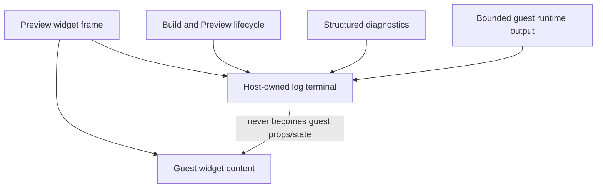

# A97 - AI Preview: host-owned log terminal below widget content
[Overview](../BASED.md)

Give every draft Preview a small host-owned, terminal-like log pane below the
guest content. Preview status, build progress, diagnostics, and runtime output
belong in this pane instead of covering the widget or requiring generated
widget UI to explain its own execution state.

## Context

The selected status strip in the current Preview is already created by the
host in
[`PreviewPortalRuntime.ts`](../../packages/ui-ai-chat/src/canvas-extension/PreviewPortalRuntime.ts),
but it is absolutely positioned over the guest content. It currently renders
messages such as the active draft revision and binding revision, plus the
latest structured runtime diagnostic.

The Preview itself is mounted from
[`canvas-extension/index.ts`](../../packages/ui-ai-chat/src/canvas-extension/index.ts)
into a durable Cangine widget frame created by
[`fn.canvas-widget.ts`](../../packages/ui-ai-chat/src/canvas-extension/fn.canvas-widget.ts).
The existing structured Preview diagnostic records and lifecycle state should
remain authoritative. This addition is a presentation and log-routing
boundary, not a real shell, PTY, or new source of durable runtime truth.

The screen atlas documents the current Preview contract in
[`SCREENS.md`](../../docs/internal/screens/SCREENS.md). Update it when the
dedicated log pane materially changes the Preview layout.

## Plan

### 1. Define the Preview log model

- Add a small typed projection that turns existing Preview lifecycle,
  revision/binding, build, and structured diagnostic state into ordered display
  entries.
- Accept bounded guest runtime output only through an explicit Capsule/host
  diagnostic or logging port. Do not expose browser globals, a shell, or a PTY
  to the guest.
- Bound memory, entry size, and entry count; preserve ordering and make repeated
  or superseded build messages understandable.
- Keep authoritative diagnostics and build state in their existing services.
  The terminal is a disposable view and may be reconstructed after remount.

### 2. Dock the terminal below guest content

- Replace the absolute status overlay with a two-row Preview layout: flexible
  guest content above and a compact terminal-like pane below.
- Keep the log pane outside the guest mount container so widget CSS and DOM
  cannot style, erase, or impersonate it.
- Make the pane readable in light and dark themes, keyboard accessible, and
  usable at the Preview frame's minimum size. Provide a bounded scrollback and
  a clear affordance; collapse/resize behavior may be added only if it remains
  deterministic and does not change durable canvas geometry.
- Keep errors visible without blanking the last known good widget.

### 3. Remove status UI from the guest-content lane

- Route the existing `Showing <revision> • bindings #<revision>` message,
  lifecycle progress, and diagnostic summary into the terminal.
- Do not require generated widget source, widget props, or collaborative state
  to render Preview logs.
- Preserve the existing Resolve diagnostic action in host-owned UI, either in
  the terminal entry or adjacent terminal chrome.

### 4. Verify the boundary

- Add pure tests for log projection, ordering, truncation, and bounded
  retention.
- Extend Preview integration coverage to prove the guest mount and log terminal
  are siblings, lifecycle and diagnostic entries appear in the terminal, and
  guest content remains unobscured.
- Prove guest markup/CSS cannot replace the terminal and that remount,
  superseded build, reset, and last-known-good failure paths leave coherent
  output.
- Update the AI draft Preview capture and description in
  [`SCREENS.md`](../../docs/internal/screens/SCREENS.md).

## TODOS

- [ ] Define a bounded, ordered Preview log-entry projection.
- [ ] Route lifecycle, build, revision/binding, and diagnostic state to it.
- [ ] Add a bounded Capsule/host path for guest runtime output if supported.
- [ ] Dock the host-owned terminal below guest content.
- [ ] Preserve diagnostic resolution and last-known-good behavior.
- [ ] Add pure and Preview integration tests.
- [ ] Update the Preview screen-atlas capture and description.

## NOTES

- The selected `Showing 645157ed • bindings #1` strip is host UI from
  `PreviewPortalRuntime`; it is not currently emitted by the widget source.
- “Terminal” is a visual metaphor for ordered logs. This task must not create a
  command prompt or grant additional guest authority.
- The written contract is authoritative over the illustrative screenshot.

### LOGS

- 2026-07-29: Created from browser comment 1 after inspecting the current
  Preview frame, `PreviewPortalRuntime`, the canvas extension, and the screen
  atlas.

---
