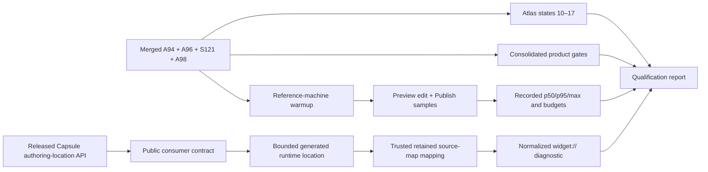

# A99 - qualify recovered canvas and updated Capsule Preview diagnostics
[Overview](../BASED.md)

Finish the qualification work left after the A94 canvas recovery and A96 live
Preview implementation. Prove the recovered canvas against the current screen
atlas, integrate Capsule's forthcoming public authoring-location API without
crossing package boundaries, and measure Preview and exact-promotion latency on
a named reference machine.

## Context

[A94](./A94.md) and [A96](./A96.md) are implemented and merged:

- A94's canvas shell, interactions, widget placement, and AI Chat recovery
  landed through `b6ec8009`.
- [S121](../s/S121.md) restored durable clipboard, drop, and file-picker image
  insertion through Cangine's controlled image port.
- A96's durable live Preview and exact-promotion implementation landed through
  `a344095b`; [B67](../b/B67.md) later hardened its construction identity and
  added a headless authoring scenario.
- [A98](./A98.md) completed the remaining connector style controls and updated
  the selection-style atlas capture.

The remaining work was split across the two old tasks and therefore looked
like unfinished implementation:

1. A94 did not record one final live comparison of canvas atlas states `10`
   through `17` or one consolidated post-recovery gate run.
2. A96 could not report verified guest runtime source locations because
   `@omnidraw/capsule` `0.9.4` exposes no safe public authoring event carrying a
   bounded generated module/line/column.
3. A96 recorded useful single-run timings through B67 but did not run a
   reference-machine sample large enough to claim the target p95 budgets.

Capsule is currently being updated to expose the required public API. Do not
implement the source-location lane until an immutable released package and its
public contract are available. Do not import Capsule source, `dist` files, or
private package paths, and do not infer a location from message text.

## Plan

No new product mockup is useful. This task verifies the existing visual
contract in [`SCREENS.md`](../../docs/internal/screens/SCREENS.md); it should
replace an atlas image only when the live product has materially changed, not
add duplicate qualification screenshots.

### 1. Qualify the recovered canvas against the atlas

- Start from a clean, production-wired local home with clearly fake data.
- Use one recorded desktop viewport and browser/device-scale configuration for
  all full-canvas comparisons.
- Exercise atlas states `10` through `17`: populated widget, connector selection
  styles, widget actions, canvas maximize/restore, AI Chat, AI settings, live
  Draft Preview, and direct published/Draft placement.
- Include durable image insertion in the populated-canvas pass: import a local
  image through one public Cangine controller, manipulate it before upload
  settles when practical, reload, and confirm the durable media URL resolves.
- Check keyboard ownership, selection chrome, toolbar layout, widget focus,
  Preview Manage actions, last-known-good behavior, and persistence while the
  corresponding state is open.
- Compare each live state with the atlas. Update and optimize an existing WebP
  only when the live product is now authoritative and materially different.
  Record the viewport, inspected states, differences, and resulting asset
  changes in this task.

### 2. Consume Capsule's public authoring-location contract

- Wait for a released Capsule version and record its version, immutable package
  identity, public export, event schema, safety bounds, and upstream
  conformance evidence.
- Upgrade all coordinated Capsule consumers and the lockfile together. Keep
  package-boundary tests fail-closed against private imports.
- Add a consumer contract test for the exact public authoring-location type and
  subscription/mount boundary before adapting Vibecanvas runtime code.
- Accept locations only from the verified authoring event for the exact mounted
  artifact/revision. Require bounded generated module, line, and column values;
  reject stale, malformed, cross-revision, or production-only events.
- Retain source maps as trusted authoring metadata outside the guest artifact.
  Map the generated location at the trusted host/service edge and emit only a
  normalized `widget://` authored file plus bounded line and column.
- Never expose host paths, environment values, dependency source, source-map
  contents, arbitrary guest text, or credentials. Preserve the existing safe
  diagnostic code/message behavior when no verified location is available.
- Prove build, mount, synchronous guest callback, asynchronous guest callback,
  capability, and channel failures remain visible and queryable in the owning
  Preview. Only failures with a verified runtime location gain source fields.
- Update the widget architecture document and authoring prompt so they describe
  the released API rather than Capsule `0.9.4`'s limitation.

### 3. Measure Preview and exact-promotion latency

- Define the reference machine before sampling: hardware, OS, filesystem,
  Node/npm/Bun versions, Capsule identity, build runner, browser, viewport, and
  whether caches are cold or warm.
- Reuse the permanent B67 counter scenario and production-wired Preview path.
  Add instrumentation only at stable product boundaries and keep it out of
  product output.
- Separate cold dependency installation from the warm source-edit budget.
  Confirm an unchanged input does not rebuild and a dependency edit explicitly
  installs again.
- After warmup, collect at least 30 successful warm source-only edit-to-visible
  Preview samples and at least 30 successful current-Preview Publish samples.
  Do not discard valid slow samples. Report failures separately.
- Measure edit commit to visible `building`, edit commit to replacement
  visibility, and Publish request to durable success. Report sample count,
  p50, p95, maximum, failures, and raw bounded timing output.
- Accept warm source-only Preview at p95 under 2 seconds and exact promotion at
  p95 under 1 second. Confirm every Publish sample performs zero npm commands
  and zero guest construction runs.
- If a budget fails, retain the evidence and diagnose the dominant phase; do
  not weaken the budget or relabel a cold install as a warm edit.

### 4. Run one consolidated qualification gate

- Run focused canvas, canvas-contract, service-canvas, widget-contract,
  Capsule adapter, service-agent, database, API, ui-ai-chat, frontend, and
  widget-debug-tools tests affected by A94/A96.
- Run the relevant typechecks, functional-core lint, architecture/package
  boundary checks, production frontend build, and `git diff --check`.
- Run the Capsule browser acceptance required by the upgraded public API and
  the live browser atlas/Preview checks above.
- Record exact commands, versions, counts, skips, failures, and follow-up fixes
  in this task. Do not close from inherited green results alone.

## TODOS

- [ ] Record the reference machine and deterministic qualification fixture.
- [ ] Verify live atlas canvas states `10` through `17` at one viewport.
- [ ] Verify durable public-controller image insertion and reload.
- [ ] Record or update only materially changed screen-atlas assets.
- [ ] Adopt the released Capsule public authoring-location API.
- [ ] Add strict public-contract and package-boundary coverage.
- [ ] Map verified generated locations to normalized authored `widget://`
      diagnostics at the trusted edge.
- [ ] Prove safe visible/queryable runtime diagnostics and rejection cases.
- [ ] Collect at least 30 warm Preview and 30 exact-Publish timing samples.
- [ ] Report p50, p95, maximum, failures, raw timings, and build-call counts.
- [ ] Meet or explicitly diagnose the Preview and Publish latency budgets.
- [ ] Run and record the consolidated qualification gate.
- [ ] Update architecture, prompts, `SCREENS.md` when needed, and `FILES.md`
      after implementation files settle.

## Acceptance criteria

- Current canvas states `10` through `17` match the authoritative atlas at one
  recorded desktop viewport, or the atlas is deliberately updated with
  optimized, fake-data captures and an explanation of each material change.
- Clipboard, drop, or file-picker image insertion renders immediately, remains
  editable while pending, persists only after upload, and resolves after reload.
- Vibecanvas consumes only a released public Capsule authoring-location API and
  keeps private-package import guards intact.
- A guest runtime failure can produce an exact, revision-bound authored
  `widget://` file/line/column only through a verified bounded Capsule location
  and trusted source-map mapping.
- Missing or invalid locations degrade safely to the existing structured
  diagnostic without invented source data or sensitive host information.
- At least 30 successful warm edit samples demonstrate Preview p95 below two
  seconds, and at least 30 successful exact-promotion samples demonstrate
  Publish p95 below one second on the recorded reference machine.
- Exact promotion performs no npm command or guest construction, and cold
  installs are reported separately from the warm budget.
- The consolidated tests, typechecks, architecture checks, production build,
  browser acceptance, and live product qualification pass with all skips and
  environment limitations recorded.

## NOTES

- This is a qualification and public-API integration task, not permission to
  redesign the recovered canvas or Preview product.
- The Capsule lane is upstream-blocked until the new API is released. Atlas
  verification, the reference fixture, latency sampling, and non-Capsule gates
  can proceed independently.
- Keep A94 and A96 closed. Any defect found while qualifying should receive a
  focused bug task or an explicitly logged fix here; do not reopen the broad
  recovery tasks.

### LOGS

- 2026-07-29: Created after auditing the two lingering in-progress entries.
  Confirmed their implementations are merged, reconciled A94's image work with
  S121 and its connector work with A98, and moved final visual/gate
  qualification plus A96's Capsule API and latency work into this task.
- 2026-07-29: Recorded that Capsule is actively updating its public authoring
  diagnostic API. The integration remains fail-closed until an immutable
  release exposes the required bounded location contract.

---
