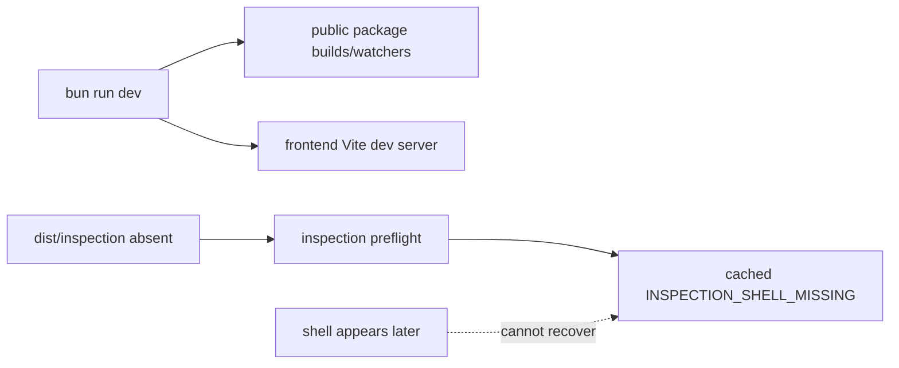

# B100 - Dev startup: Preview inspection shell is absent and failure stays cached
[Overview](../BASED.md)

A clean `bun run dev` starts a usable Omnidraw UI without building the private
Preview inspection shell. The first inspection returns
`INSPECTION_SHELL_MISSING`, and the backend caches that retryable failure for
the rest of the process even if the shell is built afterward.

## Context

[B98](./B98.md) repaired the inspection distribution layout, resolver,
token-relative assets, QuickJS loader shape, and real Chromium serving
contract. It qualified a full frontend build, but normal development startup
still does not establish that prerequisite:

- root `predev` builds only the five public packages;
- [`scripts/dev.ts`](../../scripts/dev.ts) starts the backend and delegates to
  [`scripts/dev-frontend.ts`](../../scripts/dev-frontend.ts);
- the frontend development stack runs Vite and public-package watchers, but it
  never runs the dedicated `vite.inspection.config.ts` build;
- the backend resolver correctly expects
  `apps/frontend/dist/inspection/index.html`, which therefore does not exist in
  a clean dev checkout;
- [`PreviewInspectionBrowserService.preflight()`](../../apps/backend/src/shell/preview/PreviewInspectionBrowserService.ts)
  memoizes the whole preflight promise. A retryable missing-shell result is
  retained until backend restart.

This failure is independent of [B99](./B99.md)'s visible Preview runtime bug,
but it removes the only bounded mechanism capable of identifying the exact
guest/Capsule failure. The AI agent is consequently encouraged to edit healthy
widget source while host inspection infrastructure is unavailable.

## Plan

### 1. Make the private shell an explicit dev prerequisite

- Give the inspection shell one dedicated build/watch command that uses the
  existing isolated `dist/inspection` root and verification script.
- Integrate its initial verified build into normal root `bun run dev` startup
  before inspection can be requested. Keep the main SPA Vite server and public
  package watchers independent.
- Decide whether subsequent inspection-shell source changes rebuild under a
  bounded watcher or require a clearly reported dev restart. Do not let either
  frontend build erase the other's output.
- Fail dev startup clearly if the shell cannot be built or verified instead of
  launching an apparently healthy product with broken agent tools.

### 2. Cache only valid preflight evidence

- Separate stable, expensive browser-runtime identity verification from
  mutable shell availability.
- Do not permanently memoize retryable failures such as a missing shell,
  transient shell lease failure, or browser process unavailability.
- Preserve single-flight behavior for concurrent calls and keep successful
  runtime identity evidence bounded to the current backend process and exact
  executable identity.
- Recheck the shell entry and verified build identity before issuing each
  lease, or invalidate success when the dev build changes. Never serve partial
  or unverified watcher output.

### 3. Add causal startup and recovery tests

- Start development from a checkout with no `apps/frontend/dist` and assert
  the first inspection preflight succeeds once dev reports ready.
- Start the browser service with the shell absent, observe the structured
  retryable failure, create a verified shell, and assert a later call succeeds
  without backend restart.
- Reject partial HTML, missing assets, absolute asset URLs, escaping paths,
  QuickJS loader namespace drift, and shell replacement during a lease.
- Verify cancellation, concurrent preflights, failed build, watcher rebuild,
  and shutdown clean up child processes and loopback leases.

## TODOS

- [x] Add a dedicated verified inspection-shell dev build/watch command.
- [x] Gate normal dev readiness on the initial inspection-shell build.
- [x] Stop caching retryable preflight failures for the process lifetime.
- [x] Add clean-checkout startup and build-after-failure recovery tests.
- [x] Run frontend builds, shell verifier/smoke, backend inspection tests, and browser acceptance.

## Acceptance criteria

- A clean `bun run dev` makes `od_widget_preview_inspect` operational without a
  separate manual frontend build or backend restart.
- Dev readiness is not announced while the required inspection distribution is
  absent, partial, or unverified.
- A retryable preflight failure can recover when its prerequisite becomes valid
  without weakening browser identity, tokenized serving, or exact shell-root
  checks.
- Concurrent retries share bounded work and cannot start duplicate browsers or
  leak leases, watchers, or temporary roots.
- Production/release builds retain B98's isolated relative-asset distribution
  and emitted QuickJS module-shape gate.

## NOTES

- This task repairs development/runtime prerequisites. A user-facing headless
  widget CLI or MCP boundary belongs to the separate E-series exploration.
- Do not make the backend serve frontend source directly or bypass the verified
  built-shell contract.
- No mockup or screenshot is useful for this infrastructure defect.

### LOGS

- 2026-08-15: Reproduced after `bun run dev`: the app and Canvas loaded, while
  `apps/frontend/dist/inspection/index.html` was absent and every Preview
  inspection stopped at `INSPECTION_SHELL_MISSING` before guest execution.
- 2026-08-15: Confirmed `preflight()` memoizes the failed promise, so creating
  the shell after the first failure cannot recover inspection in the current
  backend process.
- 2026-08-15: Split from B99 because inspection availability is not the cause
  of visible Preview mount failure, but it is a causal blocker for safe repair.
- 2026-08-15: Added the dedicated `build:inspection` / `dev:inspection`
  boundary. Each build is written below a private staging path, checked for
  relative assets, exact files, QuickJS namespace shape, and hashes, then
  sealed with a build receipt and atomically published through
  `dist/inspection` to an immutable build root. Watch failures retain the last
  verified root; watcher shutdown removes its staging path.
- 2026-08-15: Root development now establishes the verified shell before the
  backend starts. The frontend stack waits for its inspection watcher before
  starting public-package watchers and the independent main Vite server, and
  root readiness is printed only after Vite reports ready. A clean-output
  subprocess test proved initial readiness, rebuild, atomic publication, and
  shutdown cleanup; a causal `bun run dev` smoke reached the new ordered Ready
  lines.
- 2026-08-15: Split browser preflight state into successful process-owned
  Chromium identity evidence, one-time temp-root initialization, and a
  per-call verified-shell check. Failed runtime/shell checks are not retained;
  concurrent callers still share the current attempt. Tests proved missing
  browser and missing/partial shell recovery without restart, concurrent retry
  single-flight, cancellation, bridge/job cleanup, partial-output rejection,
  and lease pinning across atomic shell replacement.
- 2026-08-15: Verification passed: 88 focused Preview inspection/backend and
  clean-output frontend checks; 5 tokenized shell-server checks; 135 frontend
  Bun/Vitest checks; frontend/backend typechecks and builds; sealed inspection
  verifier; real Chromium tokenized-shell smoke; browser test typecheck; and
  all 64 architecture/package checks. The broader live browser acceptance was
  run twice and both runs reached the unrelated visible draft Preview lane,
  then timed out waiting for its native Reload action. It did not fail in the
  B100 startup, preflight, sealed distribution, or diagnostic shell paths and
  remains outside this task/B99 boundary.
- 2026-08-15: Follow-up review removed the verified-read/use race in the
  tokenized shell server. GET responses now own the already-read, hashed byte
  snapshot (and HEAD reports the same MIME and length without a body); a causal
  test replaces the path after that read and proves the response cannot reopen
  and serve the replacement.
- 2026-08-15: Bounded immutable-build retention now starts its fifteen-minute
  safety clock when a build is unpublished, not when it was created. Mutable
  retirement markers live outside the sealed build, current plus four recent
  identities remain protected, reverted identities reset their clock, and
  missing/malformed orphan markers receive a full grace period from discovery.
  Causal tests cover a long-current lease-equivalent followed by rapid
  publishes, eventual retirement, and first-scan orphan adoption.
- 2026-08-15: Rebased onto the reviewed B99 merge at `2c257eb5` and reconciled
  E43 startup ownership: root `predev`, `preclient:dev`, `preserver:dev`, and
  backend `predev` each own one initial build for their supported entrypoint;
  `scripts/dev.ts` never rebuilds it; the frontend watcher verifies and reuses
  it before starting the SPA/public watchers. Sealed source-fingerprint
  evidence prevents the prerequisite/watcher handoff from accepting stale
  output, retries a build when sources move during construction, and gives an
  intervening edit an immediate distinct verified identity without a second
  edit.
- 2026-08-15: Final verification after the B99 rebase passed 52 focused
  backend/frontend checks plus the clean-start, stable-build, handoff,
  retirement, orphan, verified-byte, retry, concurrency, cancellation, and
  cleanup regressions; frontend/backend typechecks and builds; the seven-file
  sealed inspection verifier; real Chromium tokenized-shell smoke; browser
  typecheck; all 64 architecture/package checks; and the full live Chromium
  acceptance (16 routes, Preview Reload, DOM/Canvas 2D/WebGL paint, complete
  backend restart recovery, persistent failure UI, and WebSocket fencing).

---
