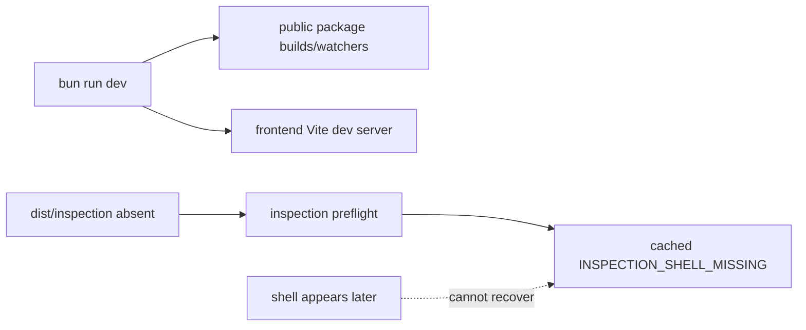

# B100 - Dev startup: Preview inspection shell is absent and failure stays cached
[Overview](../BASED.md)

A clean `bun run dev` starts a usable Omnidraw UI without building the private
Preview inspection shell. The first inspection returns
`INSPECTION_SHELL_MISSING`, and the backend caches that retryable failure for
the rest of the process even if the shell is built afterward.

## Context

[B98](./B98.md) repaired the inspection distribution layout, resolver,
token-relative assets, QuickJS loader shape, and real Chromium serving
contract. It qualified a full frontend build, but normal development startup
still does not establish that prerequisite:

- root `predev` builds only the five public packages;
- [`scripts/dev.ts`](../../scripts/dev.ts) starts the backend and delegates to
  [`scripts/dev-frontend.ts`](../../scripts/dev-frontend.ts);
- the frontend development stack runs Vite and public-package watchers, but it
  never runs the dedicated `vite.inspection.config.ts` build;
- the backend resolver correctly expects
  `apps/frontend/dist/inspection/index.html`, which therefore does not exist in
  a clean dev checkout;
- [`PreviewInspectionBrowserService.preflight()`](../../apps/backend/src/shell/preview/PreviewInspectionBrowserService.ts)
  memoizes the whole preflight promise. A retryable missing-shell result is
  retained until backend restart.

This failure is independent of [B99](./B99.md)'s visible Preview runtime bug,
but it removes the only bounded mechanism capable of identifying the exact
guest/Capsule failure. The AI agent is consequently encouraged to edit healthy
widget source while host inspection infrastructure is unavailable.

## Plan

### 1. Make the private shell an explicit dev prerequisite

- Give the inspection shell one dedicated build/watch command that uses the
  existing isolated `dist/inspection` root and verification script.
- Integrate its initial verified build into normal root `bun run dev` startup
  before inspection can be requested. Keep the main SPA Vite server and public
  package watchers independent.
- Decide whether subsequent inspection-shell source changes rebuild under a
  bounded watcher or require a clearly reported dev restart. Do not let either
  frontend build erase the other's output.
- Fail dev startup clearly if the shell cannot be built or verified instead of
  launching an apparently healthy product with broken agent tools.

### 2. Cache only valid preflight evidence

- Separate stable, expensive browser-runtime identity verification from
  mutable shell availability.
- Do not permanently memoize retryable failures such as a missing shell,
  transient shell lease failure, or browser process unavailability.
- Preserve single-flight behavior for concurrent calls and keep successful
  runtime identity evidence bounded to the current backend process and exact
  executable identity.
- Recheck the shell entry and verified build identity before issuing each
  lease, or invalidate success when the dev build changes. Never serve partial
  or unverified watcher output.

### 3. Add causal startup and recovery tests

- Start development from a checkout with no `apps/frontend/dist` and assert
  the first inspection preflight succeeds once dev reports ready.
- Start the browser service with the shell absent, observe the structured
  retryable failure, create a verified shell, and assert a later call succeeds
  without backend restart.
- Reject partial HTML, missing assets, absolute asset URLs, escaping paths,
  QuickJS loader namespace drift, and shell replacement during a lease.
- Verify cancellation, concurrent preflights, failed build, watcher rebuild,
  and shutdown clean up child processes and loopback leases.

## TODOS

- [ ] Add a dedicated verified inspection-shell dev build/watch command.
- [ ] Gate normal dev readiness on the initial inspection-shell build.
- [ ] Stop caching retryable preflight failures for the process lifetime.
- [ ] Add clean-checkout startup and build-after-failure recovery tests.
- [ ] Run frontend builds, shell verifier/smoke, backend inspection tests, and browser acceptance.

## Acceptance criteria

- A clean `bun run dev` makes `od_widget_preview_inspect` operational without a
  separate manual frontend build or backend restart.
- Dev readiness is not announced while the required inspection distribution is
  absent, partial, or unverified.
- A retryable preflight failure can recover when its prerequisite becomes valid
  without weakening browser identity, tokenized serving, or exact shell-root
  checks.
- Concurrent retries share bounded work and cannot start duplicate browsers or
  leak leases, watchers, or temporary roots.
- Production/release builds retain B98's isolated relative-asset distribution
  and emitted QuickJS module-shape gate.

## NOTES

- This task repairs development/runtime prerequisites. A user-facing headless
  widget CLI or MCP boundary belongs to the separate E-series exploration.
- Do not make the backend serve frontend source directly or bypass the verified
  built-shell contract.
- No mockup or screenshot is useful for this infrastructure defect.

### LOGS

- 2026-08-15: Reproduced after `bun run dev`: the app and Canvas loaded, while
  `apps/frontend/dist/inspection/index.html` was absent and every Preview
  inspection stopped at `INSPECTION_SHELL_MISSING` before guest execution.
- 2026-08-15: Confirmed `preflight()` memoizes the failed promise, so creating
  the shell after the first failure cannot recover inspection in the current
  backend process.
- 2026-08-15: Split from B99 because inspection availability is not the cause
  of visible Preview mount failure, but it is a causal blocker for safe repair.

---
