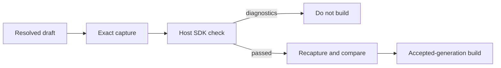

# B101 - Widget validation: enforce the current SDK source policy before host acceptance
[Overview](../BASED.md)

The host validation facade accepts a widget generation after manifest and
required-file lint plus a successful distribution build, but it does not run
the current SDK offline source-policy checker. A draft pinned to an older SDK
can therefore pass host validation and fail only when Capsule mounts it.

## Context

[B99](./B99.md) added the SDK `SOURCE_DOM_EVENT_UNSUPPORTED` diagnostic for a
DOM widget that registers `window.addEventListener("pagehide", ...)`. The
current Little Pomodoro draft is pinned to SDK `0.7.0`, while the host uses SDK
`0.8.2`. Its own `npm run check` passes, the host accepts its build, and both
artifact and Preview inspection later fail with `GUEST_EXCEPTION` and
`MOUNT_FAILED`.

The shared validation facade in
[`WidgetAuthoringVerificationService.ts`](../../apps/backend/src/shell/widget-authoring/WidgetAuthoringVerificationService.ts)
currently runs only the legacy manifest/required-file lints before calling the
accepted-generation builder. It must use the host-installed SDK checker as the
authoritative source-policy boundary and fail closed before building.

## Plan

## TODOS

- [x] Run the host-installed current SDK checker from the shared validation facade.
- [x] Convert bounded checker output into safe `widget://` source diagnostics.
- [x] Fence source changes across checking and accepted-generation construction.
- [x] Add regression coverage for `SOURCE_DOM_EVENT_UNSUPPORTED` and build suppression.
- [x] Repair and validate the Little Pomodoro draft against the current SDK.
- [x] Keep host checking independent of generated SDK `dist` output.
- [x] Prepare dependencies in an isolated capture workspace instead of reading draft `node_modules`.
- [x] Reuse the bounded host process-tree runner for cancellation and timeout ownership.

## Acceptance criteria

- Host validation rejects a pure-DOM `pagehide` registration with
  `SOURCE_DOM_EVENT_UNSUPPORTED` before any accepted build runs.
- AI Chat, private RPC, and the source-run CLI observe the same validation
  result from one host-owned checker.
- A draft change during checking cannot be accepted under stale diagnostics.
- Little Pomodoro passes validation and both inspection modes after repair.

### LOGS

- 2026-08-15: Reproduced the parity gap: SDK `0.8.2` rejects Little Pomodoro at
  `widget://ui/main.ts:173:1`, while its SDK `0.7.0` local check and the host
  validation build both pass. Capsule then reports `GUEST_EXCEPTION` followed
  by `MOUNT_FAILED`.
- 2026-08-15: Added the host-owned SDK checker runner and wired it into the
  shared validation facade. Validation now fails closed, recaptures and fences
  the draft after checking, and suppresses the accepted build when current SDK
  policy reports an error. A regression proves a fixture declaring an older
  SDK is still checked by the host's current SDK.
- 2026-08-15: Removed Little Pomodoro's unsupported `pagehide` registration.
  Current SDK checking and exact-digest host validation pass; artifact and
  manifest-bound Preview inspections complete with no diagnostics. A bounded
  interaction clicked Start and observed Pause, and the persisted Canvas frame
  rebuilt and visibly rendered the timer.
- 2026-08-15: Verification passed: 12 focused backend tests, backend typecheck,
  current SDK offline check, exact host validation, both runtime inspection
  modes, functional Start-to-Pause inspection, visible Canvas rebuild, and
  `git diff --check`. The 64-test architecture suite separately reached 62
  passes and two unrelated existing workspace failures: present
  `scripts/eslint-tooling` and a root-owned user npm cache.
- 2026-08-15: Review follow-up reopened the task: the first implementation
  resolved mutable generated SDK `dist`, required draft-local `node_modules`,
  and could remain pending after a child ignored `SIGTERM`.
- 2026-08-15: Review follow-up complete. The host now materializes the immutable
  capture in a private temporary project, installs its locked dependencies,
  installs the exact current SDK in a separate temporary toolchain, and invokes
  that packaged CLI without reading repository `dist` or draft `node_modules`.
  Every install and check uses the host process-tree runner; a regression proves
  a signal-ignoring child is force-terminated after the deadline.
- 2026-08-15: Final verification passed all 754 backend tests, backend
  typechecking, `git diff --check`, exact Pomodoro host validation, artifact and
  Preview inspection, a Start-to-Pause interaction, and the visible Canvas
  mount with no failure frame. The source-run stability harness stalled without
  output while its watcher remained active in this workspace; it was interrupted
  without leaving its test watcher running.

---
