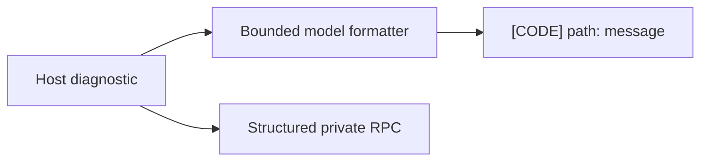

# B102 - AI widget validation: preserve actionable diagnostic identity and location
[Overview](../BASED.md)

The AI widget validation tool receives the shared host validation result, but
it projects each source/build diagnostic to `diagnostic.message`. Stable codes
and safe widget-relative paths are discarded before the model can adapt its
source.

## Context

The host authoring contract already carries `{ code, message, path }` for each
diagnostic. [`tool.widget-workspace.ts`](../../apps/backend/src/shell/agent/tools/tool.widget-workspace.ts)
currently flattens that structure to message-only strings. For policy failures
such as `SOURCE_DOM_EVENT_UNSUPPORTED`, the code identifies the violated
contract and the path identifies the file to edit; both are material AI repair
context.

## Plan

## TODOS

- [x] Format AI-facing validation errors with stable code, safe path, and message.
- [x] Preserve truncation and bounded-output behavior.
- [x] Add an AI tool regression for a source-policy diagnostic.

## Acceptance criteria

- `od_widget_validate` exposes the stable diagnostic code and safe source path
  to AI Chat without leaking host filesystem paths.
- Existing successful and accepted-build failure summaries remain compatible.
- Diagnostics remain capped and deterministically ordered.

### LOGS

- 2026-08-15: Confirmed the shared host capability is used by AI Chat, but its
  model projection drops `code` and `path` before producing `errors`.
- 2026-08-15: AI-facing validation errors now use the bounded form
  `[CODE] path: message`, while private RPC retains its structured diagnostic.
  The existing 40-error cap and truncation accounting are unchanged.
- 2026-08-15: Added a causal tool regression for
  `SOURCE_DOM_EVENT_UNSUPPORTED` at `ui/main.ts`; the focused AI validation and
  host authoring suites pass with backend typechecking.

---
