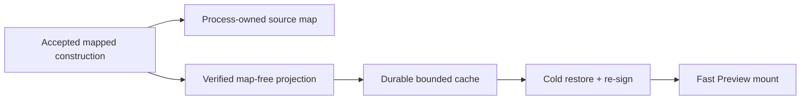

# B103 - Preview restart: source maps bypass the durable construction cache
[Overview](../BASED.md)

Restarting the backend leaves accepted draft Preview frames white for roughly
two minutes even though their portable `dist/` outputs and build receipts are
already durable.

## Context

[B79](./B79.md) added a bounded durable construction cache so a cold backend
could recover an accepted Preview without repeating npm, Vite, and Capsule
construction. [A114](../a/A114.md) later required verified source maps to stay
process-owned. The implementation enforced that rule by refusing to read or
write the entire construction whenever `sourceMapArtifact` is present.

Current widget builds produce source maps, so every practical cache lookup is
disabled. On restart,
[`WidgetBuildGenerationService.ts`](../../apps/backend/src/shell/widget/WidgetBuildGenerationService.ts)
validates the durable receipt and distribution, then calls
[`WidgetFilesystemBuildService.construct`](../../apps/backend/src/shell/agent/widget-filesystem/build/WidgetFilesystemBuildService.ts),
which repeats the full distribution build before Preview can return an
artifact. The accepted build is durable; the recoverable runtime form is not.

## Plan

1. Let the trusted Capsule builder derive and revalidate a map-free construction
   whose construction-contract digest no longer claims a source map.
2. Persist only that map-free projection in the existing bounded cache while
   returning the mapped construction to the current process.
3. Reject and remove legacy mapped cache entries; exact environment and input
   digest fences remain unchanged.
4. Prove a fresh build-service instance restores without invoking the private
   distribution/Capsule constructor, then qualify a real backend restart.

## TODOS

- [x] Add the trusted map-free durable construction projection.
- [x] Reuse the projected construction across a fresh service instance.
- [x] Preserve process-owned source-map inspection for the live build.
- [x] Add focused and full backend verification.
- [x] Time a complete backend restart against the supplied three-Preview canvas.

## NOTES

- Do not persist source-map bytes or weaken A114's source-map lease boundary.
- Do not treat a valid receipt alone as executable runtime bytes; the restored
  construction must pass the existing exact identity and contract checks.
- The unrelated user-owned `bun.lock` change present at investigation start is
  outside this task and must be preserved.

### LOGS

- 2026-08-15: Reproduced three white Preview frames after restart; they later
  mounted without visible failure surfaces. Each draft has a valid SDK `0.8.2`
  receipt and durable `dist/` output.
- 2026-08-15: Located the delay after receipt/output validation: cold generation
  import calls `builder.construct`, while the construction cache rejects every
  entry containing a source map. All current cache entries contain maps, so the
  intended B79 restart fast path is unreachable.
- 2026-08-15: Added a trusted Capsule-owned projection that removes only the
  source-map artifact and recomputes the construction-contract digest before
  caching. The current process retains its mapped construction; a fresh build
  service restores the map-free construction without invoking the distribution
  or Capsule constructor. Legacy mapped cache entries are still rejected.
- 2026-08-15: The supplied three-Preview canvas needed one legacy cache-seeding
  run. On the following backend restart all three targets were ready with no
  failure surface 12.5 seconds after restart timing began (about nine seconds
  after navigation), versus roughly 74–120 seconds before the cache was usable.
  No npm/Vite build process ran during the cached recovery.
- 2026-08-15: Verification passed 34 focused cache/generation/trust-boundary
  tests, all 754 backend tests, all seven workspace typechecks, whitespace
  validation, and the full live-browser suite including a real backend process
  replacement for DOM, Canvas 2D, and WebGL Preview profiles.

---
