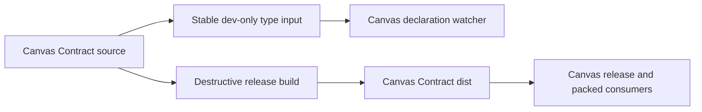

# B107 - public package dev: Canvas Contract build races Canvas type watcher

[Overview](../BASED.md)

Rebuilding public packages while `bun run dev` is active can make the Canvas
declaration watcher report false unresolved-import and downstream inference
errors until Canvas Contract's release declarations reappear.

## Context

[`scripts/dev-frontend.ts`](../../scripts/dev-frontend.ts) runs the Canvas type
watcher with `packages/canvas/tsconfig.build.json`. That configuration resolves
`@omnidraw/canvas-contract` through the workspace package export at
`packages/canvas-contract/dist/index.d.ts`.

[`packages/canvas-contract/scripts/build.ts`](../../packages/canvas-contract/scripts/build.ts)
deletes the release `dist/` directory before emitting a new build. If
`build:public` overlaps the live Canvas watcher during that gap, TypeScript
first reports `TS2307` for Canvas Contract imports, then reports secondary
`TS2345`, `TS2322`, and `TS7006` errors where the missing contract types would
normally provide inference.

[B97](./B97.md) fixed the same shared-`dist` race for the downstream AI Chat
watcher by adding explicit dev-only source resolution. The Canvas watcher and
the causal source-run build-stability test were not included in that fix.

## Plan

1. Add a bounded Canvas dev TypeScript configuration that resolves the exact
   Canvas Contract source entrypoints needed by Canvas without changing normal
   typecheck or release-build resolution.
2. Make the frontend development supervisor use the stable dev configuration
   for the Canvas declaration watcher.
3. Extend the source-run build-stability regression to keep the real Canvas
   watcher alive during `build:public` and reject unresolved imports or any
   TypeScript diagnostic.
4. Verify Canvas, frontend, architecture, and public-package build behavior.

## TODOS

- [x] Add stable dev-only Canvas dependency resolution.
- [x] Use the dev configuration in the frontend stack.
- [x] Add a causal watcher-versus-`build:public` regression.
- [x] Run focused typecheck, architecture, and build-stability verification.

## Acceptance criteria

- Rebuilding Canvas Contract or running `build:public` while frontend dev is
  active cannot produce unresolved `@omnidraw/canvas-contract` imports or the
  resulting Canvas inference errors.
- The Canvas development watcher continues to emit declarations needed by the
  live frontend stack.
- Normal Canvas typecheck, release build, and packed-package verification still
  resolve and validate the standalone Canvas Contract `dist` API.
- The fix does not add redundant local annotations that merely hide a missing
  dependency contract and does not change a public runtime API.

## NOTES

- The `[frontend-stack]` prefix belongs to the supervising process; the
  diagnostics originate from the `canvas-types` child watcher.
- Preserve the existing package dependency direction and exact public
  entrypoints. Do not add wildcard source mappings.

### LOGS

- 2026-08-16: Confirmed current Canvas and frontend typechecks pass once the
  Canvas Contract declarations exist. TypeScript resolution tracing showed the
  live Canvas configuration consuming `packages/canvas-contract/dist/index.d.ts`.
- 2026-08-16: Identified the destructive release-build window and the missing
  Canvas-watcher coverage in the B97 source-run stability regression.
- 2026-08-16: Added a build-mode dev declaration graph with exact Canvas
  Contract root and `CONSTANTS` source mappings. Stable declaration-only
  dependency outputs keep both Canvas Contract and Theme outside destructive
  release `dist/` churn while Canvas continues to emit `dist/index.d.ts`.
- 2026-08-16: Updated the frontend supervisor to run the Canvas dev build graph
  and extended the source-run regression with the real Canvas watcher. The
  causal run completed `build:public` with zero watcher diagnostics, one
  uninterrupted backend process, 681 health checks, and a readable Canvas
  declaration entry.
- 2026-08-16: Canvas and frontend typechecks passed; the frontend production
  and inspection builds passed; all 21 architecture-boundary tests passed;
  public package dist/pack/install plus Bun and Node import smoke passed; and
  packed public composition passed clean install, typecheck, tests, and runtime
  smoke. The umbrella architecture command's other 65 tests passed, with one
  unrelated committed local-registry fixture mismatch (`@omnidraw/capsule`
  0.15.0 expected versus 0.15.1 current) left unchanged.

---
