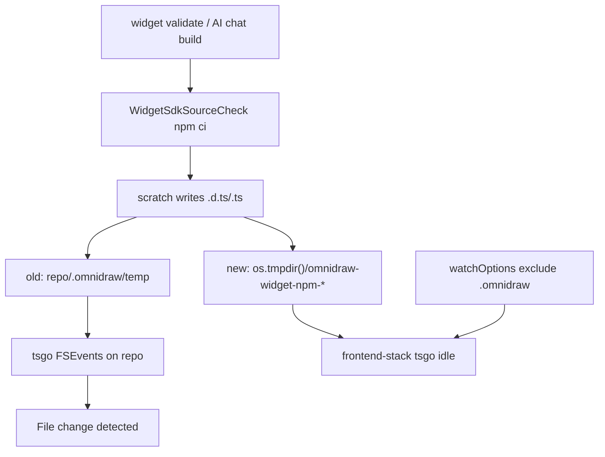

# B108 - widget validate: tsgo frontend-stack rebuilds during source-check npm ci
[Overview](../BASED.md)

In `bun run dev`, an AI chat widget update or `widget validate` prints a burst
of `[frontend-stack]` tsgo lines (`File change detected. Starting incremental
compilation...`) even though no public-package source changed. Cause and
prototype: [E44](../e/E44.md).

## Context

[`scripts/dev.ts`](../../scripts/dev.ts) sets `OMNIDRAW_HOME` to
`<repo>/.omnidraw`. [`scripts/dev-frontend.ts`](../../scripts/dev-frontend.ts)
runs four tsgo watches (canvas-contract, theme, canvas-types, ai-chat-types).
tsgo's watch root is the **repo** because program files realpath through
`node_modules/.bun`.

Every accepted widget build runs
[`WidgetSdkSourceCheck`](../../apps/backend/src/shell/widget-authoring/WidgetSdkSourceCheck.ts)
(`npm ci` + `omnidraw-widget check`). That used to dump thousands of `.d.ts`/`.ts`
files under `home.tempRoot/widget-source-checks` =
`<repo>/.omnidraw/temp/widget-source-checks`. FSEvents on the repo then woke
every frontend-stack tsgo. A lone `.omnidraw` write does **not** fire tsgo;
the npm type-definition storm does. Vite / `node_modules/.vite-temp` is not
the trigger.

E44 already prototyped two defenses in the worktree:

1. Causal:
   [`layer.live-mechanics.ts`](../../apps/backend/src/shell/runtime/layer.live-mechanics.ts)
   puts widget-builds, function-descriptor temp, and source-check scratch under
   `os.tmpdir()/omnidraw-widget-npm-<home-hash>/`. Drafts/db stay in `.omnidraw`.
2. Defense: `watchOptions.excludeDirectories` on canvas, canvas-contract,
   theme, and component-ai-chat `tsconfig.json`.

`watchOptions` alone quiets a fresh `tsc -p`; `tsc -b` still fired until
scratch left the repo tree. Preview `.staging` under
`.omnidraw/widgets/.staging` is still in-tree and must be checked during
verify.

## Plan

1. Keep widget npm/source-check/build scratch **outside** the repo and outside
   `OMNIDRAW_HOME`. Do not move drafts, db, or keys. Hash the home dir so two
   worktrees do not share one scratch tree.
2. Keep tsgo `watchOptions` as defense-in-depth. Do not treat them as the
   causal fix.
3. During verify, confirm remaining in-tree trees (`.omnidraw/widgets/.staging`,
   `.preview`) do not retrigger tsgo. If they do, isolate those npm dumps the
   same way — do not expand into publication-journal redesign.
4. Add a cheap assertion that live mechanics does not place
   `widget-source-checks` / `widget-builds` under `home.tempRoot`.
5. Verify with frontend-stack up: `widget validate` produces zero new
   `[frontend-stack]` incremental compilation lines and does not rewrite
   `packages/canvas/dist/tsconfig.dev.tsbuildinfo`.

## TODOS

- [x] Land widget npm scratch under `os.tmpdir()` in live mechanics (review the
      E44 prototype; keep drafts/db in `.omnidraw`).
- [x] Keep public-package `watchOptions` excluding `.omnidraw` / `node_modules`.
- [x] Assert live scratch roots are not under `home.tempRoot`.
- [x] Check leftover in-tree `.staging` / `.preview` during validate; isolate
      only if they still wake tsgo.
- [x] Verify: `widget validate` with frontend-stack running → zero incremental
      compilation lines; canvas `tsbuildinfo` untouched.

## Acceptance criteria

- `widget validate` (same path as AI chat accepted build) while `bun run dev`
  is running produces **zero** new `[frontend-stack]`
  `File change detected. Starting incremental compilation...` lines.
- `packages/canvas/dist/tsconfig.dev.tsbuildinfo` is not rewritten by that
  validate.
- Widget drafts, db, and keys stay under `OMNIDRAW_HOME`. Only npm/build
  scratch moves off the repo tree.
- No public runtime API change and no public package version bump.

## NOTES

- Reproducer: with `bun run dev` ready,
  `bun run apps/backend/src/main.ts widget validate --widget-key <slug> --json`
  (pass `--port` / `--data-dir` if needed). Cache-hit (~35s) and cold (~70s)
  both used to reproduce.
- Backend must be restarted to pick up `layer.live-mechanics.ts` if it was
  started without `--watch`.
- macOS `os.tmpdir()` is under `/var/folders/...`, not `/tmp`.
- Do not ignore the symptom by silencing Vite; the printer is tsgo.

### LOGS

- 2026-08-17: Opened from E44. Cause is source-check `npm ci` under repo
  `.omnidraw/temp`. Prototype isolation + `watchOptions` already in the
  worktree; this task lands and verifies them.
- 2026-08-17: Landed `fnWidgetNpmScratchRoot` and wired it in
  `layer.live-mechanics.ts`. Source-check / widget-builds / function-descriptor
  temp live under `os.tmpdir()/omnidraw-widget-npm-<home-hash>/`. Tests in
  `fn.widget-npm-scratch-root.test.ts` plus composition assert the dirs are
  not under `home.tempRoot`.
- 2026-08-17: `.staging` still gets a short `preview-build-*` projection during
  validate. A tiny staging probe and a full validate (B108B/B108C) did **not**
  wake tsgo. No further isolation.
- 2026-08-17: Watch ignore path is `../../.omnidraw` from each public package
  (not `**/.omnidraw`, which would not exclude the repo home). Restart
  `bun run dev` so backend and tsgo pick this up.

---
