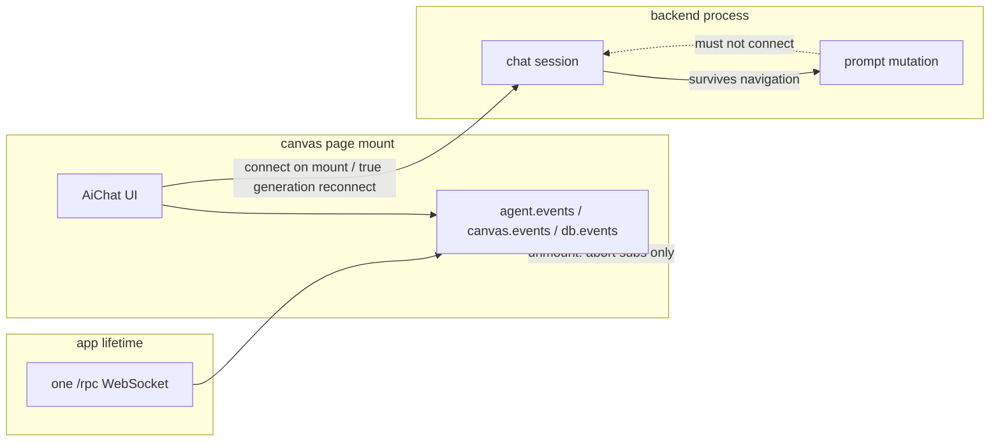

# B109 - SPA navigation: chat RPC teardown shows CHAT_BUSY as disconnect
[Overview](../BASED.md)

Leaving a canvas while a prompt is running shows **Chat updates disconnected** /
**Chat prompt operation is already active.** Unmount aborts the chat event
stream; recovery then calls `agent.chat.connect` against a still-held prompt.
The one app WebSocket is correct. Client ownership is not.

## Context

Report (2026-08-17): navigate away from a canvas, intermittently:

```text
Chat updates disconnected
Chat prompt operation is already active.
```

Backend also logs `GET /rpc` 499 `ClientAbort` on the shared WebSocket. Vite
HMR (`solid-devtools/setup` optimize) can abort `/rpc` too; that is not this
bug. SPA `navigate()` must not.

Intended architecture (already true at the app edge):

- One frontend runtime, one native WebSocket at `/rpc`.
- Every canvas, page, sidebar, settings, chat, and notification uses that
  socket. Effect RPC owns physical retry. Domain adapters own generation,
  resubscribe, and stale-lease rejection.
- Canvas unmount may abort **subscriptions**. It must not dispose the runtime
  or treat a local abort as lost session ownership.

What actually happens:

1. [`CanvasPage`](../../apps/frontend/src/shell/framework/pages/canvas.tsx)
   keyed-unmounts composition. Chat widget dispose aborts `agent.events`.
   [`startFrontendDatabaseEvents`](../../apps/frontend/src/shell/browser/database-events.ts)
   aborts `db.events`. Canvas transport drops `canvas.events`.
2. Backend `promptChat` still holds `#chatMutations` until `session.prompt()`
   finishes. Unmount does not `cancelChat`. The prompt RPC ignores the
   lifecycle `AbortSignal`.
3. Stream recovery in
   [`createChatPort`](../../apps/frontend/src/shell/chat/adapters.ts) calls
   [`fxRecoverChat`](../../apps/frontend/src/core/chat/fx.recover-chat.ts) →
   `agent.chat.connect` reuse. Host `subscribeReconnect` also reconnects and
   restarts the stream. Remount starts connect and events in parallel.
4. [`AgentService.#claimChatMutation`](../../apps/backend/src/shell/agent/AgentService.ts)
   rejects connect during prompt with `CHAT_BUSY`. The iterator throws. The
   widget reports kind `stream` via
   [`fnCreateAiChatWidgetError`](../../packages/component-ai-chat/src/chat/components/fn.error.ts).
5. Chat unmount is not a quiet abort. Database events swallow
   `lifetime.signal.aborted`. Chat `startStream` still reports `onEnd` as a
   user error, and `resumableStream` can recover/throw after abort.

Relevant files:

- [`apps/frontend/src/index.tsx`](../../apps/frontend/src/index.tsx) — one runtime
- [`apps/frontend/src/shell/runtime/frontend-runtime.ts`](../../apps/frontend/src/shell/runtime/frontend-runtime.ts)
- [`apps/frontend/src/shell/transport/rpc.ts`](../../apps/frontend/src/shell/transport/rpc.ts)
- [`apps/frontend/src/shell/chat/adapters.ts`](../../apps/frontend/src/shell/chat/adapters.ts)
- [`apps/frontend/src/core/chat/fx.recover-chat.ts`](../../apps/frontend/src/core/chat/fx.recover-chat.ts)
- [`packages/component-ai-chat/src/chat/components/index.tsx`](../../packages/component-ai-chat/src/chat/components/index.tsx)
- [`packages/component-ai-chat/src/internal/stream-lifecycle.ts`](../../packages/component-ai-chat/src/internal/stream-lifecycle.ts)
- [`apps/frontend/src/shell/browser/database-events.ts`](../../apps/frontend/src/shell/browser/database-events.ts)

## Plan



Client-only rearchitecture is allowed if it makes this ownership obvious.
Keep the one-socket rule. Do not add per-page RPC. Do not weaken backend
`CHAT_BUSY` for overlapping user actions (prompt vs edit vs replace).

### Ownership

- Widget mount owns UI and local subscriptions.
- Backend owns the chat session and in-flight prompt across SPA navigation.
- `connect` is first mount and true physical-generation reconnect, not stream
  iterator abort and not “the canvas page came back.”
- `agent.events` is a log subscription. Dropping it is not lost session
  ownership. Listening again is enough while a prompt is active.

### Fix (minimal, prefer delete)

1. Unmount / abort of `agent.events` is silent. No
   **Chat updates disconnected**. Same rule `db.events` already uses.
   `startStream` must not call `onError` / `onEnd` after abort. Dispose the
   stream through the same lifecycle map as other tasks if that is the
   smallest way to make abort win the race.
2. Stop using `fxRecoverChat` → `connect` as the default stream-recovery
   primitive. Cursor gap recovery may still need history; it must not
   `connect` while a prompt owns the session. If `CHAT_BUSY` means “prompt
   already running,” keep the event stream and treat the session as owned.
3. Do not double-recover. `subscribeReconnect` plus `afterReconnect` plus
   remount connect currently can all `connect`. Collapse to one path.
4. `resumableStream` must stop when `options.signal` is aborted. Do not
   `afterReconnect` / `recoverAfterDomainError` after abort, and do not throw
   that recovery error out of the iterator. Aborting canvas-scoped streams
   must not take down the app WebSocket.
5. Leave backend mutation exclusivity as-is unless a client-only fix cannot
   attach to a still-running prompt without `connect`.

### Tests (few, causal)

Do not add a live browser suite for this. Extend existing unit tests:

1. [`packages/component-ai-chat/tests/chat/index.render.test.ts`](../../packages/component-ai-chat/tests/chat/index.render.test.ts)
   — dispose already aborts the stream signal; assert no stream error banner
   / no `onError` user report.
2. [`apps/frontend/src/shell/transport/rpc-generation.test.ts`](../../apps/frontend/src/shell/transport/rpc-generation.test.ts)
   — aborting a `resumableStream` signal completes quietly and does not call
   `afterReconnect` or `recoverAfterDomainError`.
3. One chat-adapter or recover-chat test: stream recovery during `CHAT_BUSY`
   does not surface as a stream failure and does not require a second
   `connect` to keep listening.

If connect is removed from stream recovery, update
[`apps/frontend/src/conformance/chat.suite.ts`](../../apps/frontend/src/conformance/chat.suite.ts)
to match the new recovery contract. Do not keep “connect then history” if
that is no longer the client path.

## TODOS

- [ ] Make chat stream abort on unmount silent (`startStream` / `AiChat`).
- [ ] Stop treating `agent.events` drop as lost session; remove or gate
      `connect` in stream recovery / reconnect so a live prompt is not
      `CHAT_BUSY`-failed into a red banner.
- [ ] Collapse duplicate reconnect connect paths.
- [ ] Make `resumableStream` abort-closed; prove canvas stream abort does not
      imply app socket death.
- [ ] Add the three causal tests above. Update chat conformance only if the
      recovery contract changes.

## NOTES

- One `/rpc` WebSocket for the SPA is the architecture, not the bug.
- `GET /rpc` 499 is the WebSocket handshake/connection abort, logged as HTTP
  GET. Expected on full reload / `pagehide` / HMR. Not expected on sidebar
  `navigate()` between `/c/:id`, `/widgets/...`, `/resources/...`.
- Backend `connect` during prompt is intentionally `CHAT_BUSY`. Client must
  stop asking.
- Do not cancel the in-flight prompt just because the canvas unmounted unless
  product later wants leave-page-stops-agent. This task is: leave page, no
  fake disconnect.

### LOGS

- 2026-08-17: Task opened from canvas navigation report. Client ownership
  mismatch confirmed in chat adapters + `AiChat` stream lifecycle.
