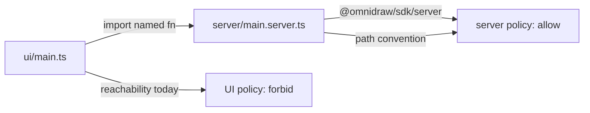

# B110 - widget check: UI import of server entry rejects `@omnidraw/sdk/server`
[Overview](../BASED.md)

SDK `check` treats `server/main.server.ts` as UI code when the UI imports it.
That rejects the allowed `@omnidraw/sdk/server` import, so `od_widget_validate`
never produces an accepted build. The widget import is the documented pattern.

## Context

Small CRM (`small-crm`) fails host validation with:

```text
[SOURCE_IMPORT_FORBIDDEN]
server/main.server.ts: Line 1, column 1:
Source import '@omnidraw/sdk/server' is outside the portable widget policy.
```

Expected: `@omnidraw/sdk/server` is allowed on server modules. It is in
[`WIDGET_SERVER_ALLOWED_PACKAGE_IMPORTS`](../../packages/sdk/src/contracts/CONSTANTS.ts)
and in the generated server starter.

Cause: UI follows the documented authoring pattern and imports named functions:

```ts
import { addContact, listContacts } from "../server/main.server";
```

[`prompt.widget-implementation.md`](../../apps/backend/src/shell/agent/prompts/prompt.widget-implementation.md)
tells authors to do this. The host builder then replaces that server path with
`createServerFunctionProxy` before the UI bundle
([`fnWidgetBuildPathIsServerOnly`](../../apps/backend/src/shell/widget-domain/local/fn.build-boundary.ts),
[`WidgetArtifactBuilderCapsule.ts`](../../apps/backend/src/shell/widget-runtime/build/WidgetArtifactBuilderCapsule.ts)).

SDK `check` does not use that convention. In
[`packages/sdk/src/cli.mjs`](../../packages/sdk/src/cli.mjs) it sets `isServer`
to `serverSources.has(path) && !uiSources.has(path)`. The UI import puts
`main.server.ts` in the UI graph, so the checker applies UI policy and rejects
`@omnidraw/sdk/server`.

`od_widget_validate` runs this checker first
([`WidgetSdkSourceCheck.ts`](../../apps/backend/src/shell/widget-authoring/WidgetSdkSourceCheck.ts)).
No accepted generation is produced. Preview inspect then returns
`BUILD_REQUIRED`.

The resource `invoke` protocol change in Small CRM is unrelated.

## Plan



Keep the authoring feature: UI may import named exports from the server
entry / `server/` / `*.server.ts`. Do not tell widgets to stop doing that.
Do not allow `@omnidraw/sdk/server` in real UI or `shared/` files.

1. Classify a path as server for import policy using the same rule the builder
   already uses: manifest `server.entry`, `server/`, or `*.server.ts`.
   Reachability may still mark server-only helpers that are not on those paths.
   A file that is both UI-reachable and server-convention stays server.
2. Keep the existing forbid for `@omnidraw/sdk/server` in UI/shared modules,
   and keep node/unqualified package forbids.
3. Add one causal offline-check test: UI imports named exports from
   `server/main.server.ts`, that file imports `@omnidraw/sdk/server`, and
   `SOURCE_IMPORT_FORBIDDEN` is absent for that server import. Keep or add a
   case that a UI file importing `@omnidraw/sdk/server` still fails.
4. Patch-bump `@omnidraw/sdk` because `cli.mjs` is public runtime behavior.
   Do not change the portable widget ABI or authoring docs except to match
   the checker if a sentence is now wrong.

Simplification is allowed only if the UI→server named-import feature stays.

## TODOS

- [x] Classify server-only paths in SDK `check` with the host builder convention.
- [x] Keep `@omnidraw/sdk/server` forbidden in UI and shared modules.
- [x] Add the causal offline-check regression (UI imports `server/main.server.ts`).
- [x] Patch-bump `@omnidraw/sdk` and regenerate the lockfile.

## Acceptance criteria

- `omnidraw-widget check` accepts `@omnidraw/sdk/server` in `server/main.server.ts`
  when UI imports named functions from that file.
- A UI file that imports `@omnidraw/sdk/server` still fails
  `SOURCE_IMPORT_FORBIDDEN`.
- Host `od_widget_validate` can produce an accepted generation for that shape.
  Small CRM is evidence, not a required live fixture if a repo test covers it.

### LOGS

- 2026-08-17: Opened from Small CRM `SOURCE_IMPORT_FORBIDDEN` on
  `@omnidraw/sdk/server`. Cause is UI-graph classification in SDK `check`,
  not the server import itself.
- 2026-08-17: SDK `check` now treats manifest `server.entry`, `server/`, and
  `*.server.ts` as server for import policy, even when UI imports them.
  `@omnidraw/sdk/server` stays forbidden in UI and `shared/` modules.
  Added a causal offline-check regression. Patched `@omnidraw/sdk` to `0.12.1`.
  Focused tests passed: offline-check, package-boundaries, portable-build,
  and host source-check version pin.
- 2026-08-17: Review of the B110 change found no defects. Custom
  `server.entry` paths still classify as server; UI and `shared/` still
  reject `@omnidraw/sdk/server`.
