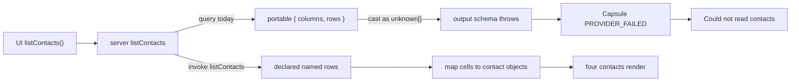
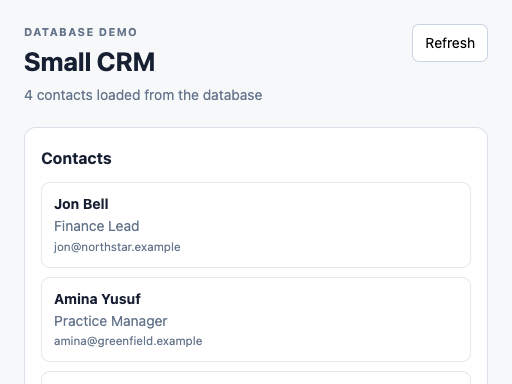

# B111 - Small CRM Preview: listContacts treats portable db rows as contact objects
[Overview](../BASED.md)

Preview shows **Could not read contacts** with `PROVIDER_FAILED`. The bound
database has four rows. The widget casts portable `{ columns, rows }` as a
contact array, so the function throws.

## Context

Report (2026-08-17): Small CRM Preview status is **Could not read contacts**.
Inspect diagnostics:

```text
origin: capability
phase: runtime
code: PROVIDER_FAILED
message: The resource provider call failed safely.
```

Live evidence against the running backend (`--data-dir .omnidraw`):

- Direct SQL on `small-crm-db`
  ([`.omnidraw/resources/a3773c74-60b5-4e83-bc0e-4f78ed4be636/data.db`](../../.omnidraw/resources/a3773c74-60b5-4e83-bc0e-4f78ed4be636/data.db))
  returned four contacts: Maya Chen, Theo Martin, Amina Yusuf, Jon Bell.
- `widget validate --widget-key small-crm` passed (source + accepted artifact).
- `widget inspect --mode preview` mounted the UI, then failed at runtime with
  the same status text and diagnostic.

This is **not** a broken Preview resource provider and **not** a replay of
[B110](B110.md). Preview bound the ready `crmDb` and ran `listContacts`.
Capsule reported `PROVIDER_FAILED` because the **function capability host
threw**. Inspect maps any `PROVIDER*` code to a resource-sounding message in
[`fnSafeRuntimeMessage`](../../apps/backend/src/shell/widget/fn.widget-preview-inspection.ts).

The widget is the failure. `listContacts` in
[`.omnidraw/widgets/drafts/small-crm/server/main.server.ts`](../../.omnidraw/widgets/drafts/small-crm/server/main.server.ts)
does:

```ts
async (context) => ({
  contacts: (await context.resources.read("crmDb", "query", {
    sql: "SELECT id, first_name, last_name, email, title, status FROM contacts ORDER BY id DESC LIMIT 50",
    parameters: {},
  })) as readonly unknown[],
});
```

Portable `query` returns `{ columns, rows }` (column-ordered cell rows), not
an array of `{ first_name, … }` objects.
[`fnDecodePortableResourceDbRows`](../../packages/sdk/src/contracts/core/fn.resource-wire.ts)
and the `db-rows` result schema in
[`fn.resource-operation-registry.ts`](../../packages/sdk/src/contracts/core/fn.resource-operation-registry.ts)
define that shape. The function output schema requires `contacts` to be an
array, so the handler throws. The UI catch in
[`.omnidraw/widgets/drafts/small-crm/ui/main.tsx`](../../.omnidraw/widgets/drafts/small-crm/ui/main.tsx)
shows **Could not read contacts**.

Agent `od_resource_data_read` SQL is a different API: it returns ordinary row
objects. That is why the same `SELECT` looked healthy there.

The manifest already declares a named `listContacts` operation on `crmDb` in
[`.omnidraw/widgets/drafts/small-crm/omnidraw.json`](../../.omnidraw/widgets/drafts/small-crm/omnidraw.json).
Prefer `invoke` of that operation over ad-hoc `query`.

Relevant host mapping (do not treat as the root cause):

- [`fn.capsule-mount-error-diagnostic.ts`](../../packages/sdk/src/internal/fn.capsule-mount-error-diagnostic.ts)
- [`WidgetPreviewService.ts`](../../apps/backend/src/shell/widget/WidgetPreviewService.ts)
- [`fn.widget-preview-inspection.ts`](../../apps/backend/src/shell/widget/fn.widget-preview-inspection.ts)

## Plan





Fix Small CRM. Do not change Preview resource execution unless the widget
still fails after the shape is correct.

1. Change `listContacts` to consume portable database rows. Prefer the
   declared named operation: `context.resources.read("crmDb", "invoke", { operation: "listContacts" })`.
2. Map `{ columns, rows }` into contact objects the UI already expects
   (`id`, `first_name`, `last_name`, `email`, `title`, `status`, optional
   `company_name`). Keep SQLite integer ids JSON-safe (bigint is not JSON).
3. Re-run host `widget validate`, then `widget inspect --mode preview`.
   Assert the four existing contacts render and the status is not
   **Could not read contacts**.

## TODOS

- [x] Change Small CRM `listContacts` to consume portable `{ columns, rows }`.
- [x] Prefer declared `invoke` + `listContacts` over ad-hoc `query`.
- [x] Map cells into UI contact objects with JSON-safe ids.
- [x] Re-run `widget validate` then `widget inspect --mode preview`.
- [x] Leave Preview resource execution unchanged unless a host bug remains.

## Acceptance criteria

- Preview shows the four existing contacts (Maya, Theo, Amina, Jon).
- Status is not **Could not read contacts**.
- Inspect no longer reports `PROVIDER_FAILED` for this load path.
- No change to Preview resource execution unless the widget fix still fails.

## NOTES

- Agent `od_resource_data_read` returns ordinary row objects. Portable
  `query` / named `invoke` with `result: "rows"` returns `{ columns, rows }`.
  Do not copy the agent SQL result shape into widget server functions.
- Capsule `PROVIDER_FAILED` plus inspect's `/RESOURCE|PROVIDER/` message map
  look like a dead DB provider. They are not. The function threw first.
- B110 (`@omnidraw/sdk/server` UI-graph classification) is already closed and
  unrelated.
- A 0-byte `data.db-wal` next to Turso `multiprocess_wal` makes new guest
  opens fail with `RESOURCE_QUERY_FAILED`. That is a sidecar problem, not
  Preview resource execution. Do not treat sqlite3 CLI as a Turso-safe writer.

### LOGS

- 2026-08-17: Opened from Small CRM Preview **Could not read contacts** with
  inspect `PROVIDER_FAILED`. Live SQL on `a3773c74-…` returned four rows.
  Validate passed. Inspect reproduced the UI failure. Cause is
  `listContacts` treating portable db rows as a contact array.
- 2026-08-17: `listContacts` now invokes the declared `crmDb` operation and
  maps `{ columns, rows }` into contact objects with JSON-safe ids. Host
  `widget validate` passed. `widget inspect --mode preview` showed Maya,
  Theo, Amina, and Jon with status **4 contacts loaded from the database**
  and no `PROVIDER_FAILED`. Preview resource execution was not changed.
