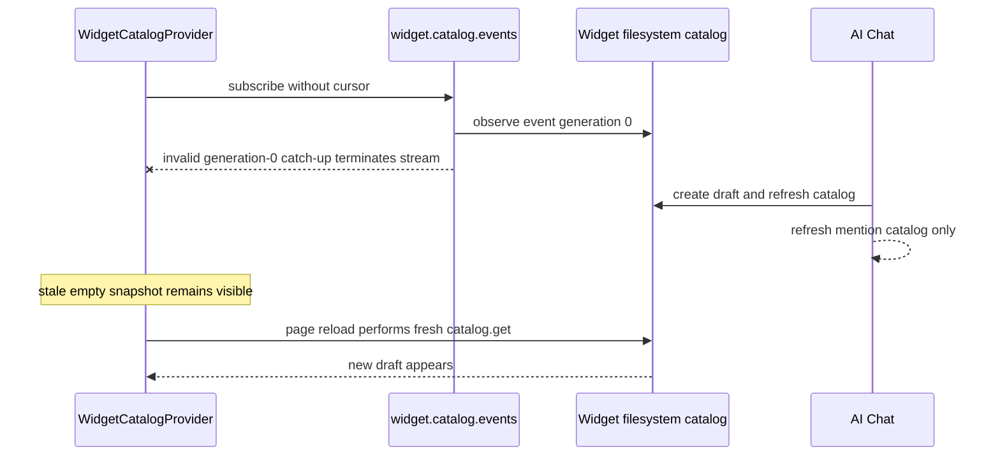

# B114 - AI-created first widget stays missing from sidebar until reload
[Overview](../BASED.md)

When the widget catalog starts empty, creating the first draft in AI Chat
updates the backend but leaves the sidebar stale. Keep the catalog stream alive
from generation zero and propagate the AI catalog notification so the new row
appears without reloading the page.

## Context

The supplied screenshot shows **Click Counter** correctly projected as a Draft
with a Preview action, but only after a manual reload:

- [`WidgetCatalogProvider.tsx`](../../apps/frontend/src/shell/framework/feature/sidebar/widgets/WidgetCatalogProvider.tsx)
  loads the current catalog once, then relies on `widget.catalog.events`, the
  shared invalidation bus, or a physical reconnect to schedule later reads.
- [`WidgetFilesystemRuntimeCatalog.ts`](../../apps/backend/src/shell/widget/WidgetFilesystemRuntimeCatalog.ts)
  initializes its event generation at `0`. An empty startup scan publishes no
  change, so `catalogObservation()` continues to report generation zero.
- [`fnWidgetCatalogCatchUpEvent`](../../apps/backend/src/shell/api/widget/fn.catalog-event.ts)
  compares an omitted cursor directly with the current generation. For an
  initial subscription, `undefined !== 0`, so it constructs a full-resync event
  with `generation: 0`.
- The `widget.catalog.events` output in
  [`contract.ts`](../../apps/backend/src/shell/api/widget/contract.ts) correctly
  requires every emitted generation to be a positive integer. Validation
  therefore rejects the synthetic zero event and terminates the provider's
  stream before any widget exists.

AI widget authoring does update the durable in-memory catalog. The tool
`onDraftChanged` callback reaches
[`AgentService.#publishWidgetDraftsChanged`](../../apps/backend/src/shell/agent/AgentService.ts),
which publishes a global `widget-catalog` agent event and asks the live shell to
refresh the filesystem catalog. Once that refresh completes, the new draft is
available to a fresh `widget.catalog.get`, which is why a page reload fixes the
sidebar.

There is also a missing recovery signal in the browser. The frontend adapter in
[`adapters.ts`](../../apps/frontend/src/shell/chat/adapters.ts) normalizes the
global agent event to `{ kind: "catalog", catalog: "widgets" }` and supplies a
shared `host.invalidateCatalog` action. The
[`AiChat`](../../packages/component-ai-chat/src/chat/components/index.tsx)
catalog-event branch refreshes only its private mention catalog and returns
without calling that host action. The sidebar therefore receives no local
invalidation after its dedicated stream has failed.

The failure is caused by the interaction of two notification paths, not by the
sidebar row projection or Solid reactivity. A direct empty-catalog API probe
reproduces the terminal validation error: generation zero is rejected as
smaller than the public minimum.

## Plan

1. Keep the positive emitted-generation contract and correct the catch-up
   comparison so an omitted cursor has the semantic starting position `0`.
   When both the effective cursor and current event generation are zero, emit
   no catch-up event and wait for the first real generation-1 change.
2. Preserve reconnect behavior: an omitted cursor against a positive current
   generation still emits one bounded `fullResync`, and an explicit equal
   cursor emits nothing. Do not weaken stale-generation fencing or turn catalog
   events into polling.
3. Forward every AI Chat catalog event to
   `props.host.invalidateCatalog(event.catalog)` as well as refreshing the
   component's mention catalog. The host action is optional for embedders, but
   the Omnidraw frontend already provides it through the shared invalidation
   bus.
4. Make the notification ordering explicit enough that a sidebar refresh cannot
   win a race against the backend filesystem scan. The dedicated catalog event
   remains the authoritative post-refresh signal; if the agent notification is
   also used as a recovery signal, publish or consume it only after the refreshed
   catalog can be read. Do not depend on the provider's 80 ms debounce for
   correctness.
5. Add backend regression coverage for an initially empty event authority:
   opening the stream must remain pending rather than fail, and the first real
   catalog change must arrive as generation 1. Cover omitted, explicit zero,
   equal positive, and behind-positive cursor cases.
6. Add component and frontend coverage proving a normalized widget-catalog
   agent event invalidates the shared widgets catalog and that an empty sidebar
   renders the first newly returned draft row without remounting the app.
7. Run the focused backend event/contract tests, AI Chat component tests,
   frontend Vitest sidebar tests, frontend/backend typechecks, and the private
   transport generation tests.

## TODOS

- [x] Suppress the invalid generation-zero catch-up for an empty catalog.
- [x] Preserve positive catch-up, duplicate, and reconnect cursor semantics.
- [x] Forward AI Chat catalog events through the optional host invalidation action.
- [x] Ensure sidebar refresh cannot race ahead of the authoritative catalog scan.
- [x] Add empty-to-first-widget backend event-stream regression coverage.
- [x] Add AI Chat host-invalidation coverage for widget catalog events.
- [x] Add a frontend sidebar test for empty catalog to first draft without reload.
- [x] Run focused event, component, sidebar, transport, and typecheck verification.

## Acceptance criteria

- Starting the application with no widget drafts or publications does not
  terminate `widget.catalog.events` and does not surface a schema-validation
  error for generation zero.
- Creating the first healthy widget draft through AI Chat makes its sidebar row
  appear automatically in the already-mounted application.
- The row uses the existing projection: correct icon/name, Draft badge, health,
  grouping, and Preview action. No new visual design is introduced.
- The AI Chat mention catalog and the shared sidebar catalog both observe the
  change without a browser reload, route remount, reconnect, or manual **Refresh
  widget folders** action.
- A later subscriber with no cursor receives one positive-generation full
  resync when catalog events already exist; an up-to-date subscriber receives
  no duplicate.
- Reconnect and coalescing behavior remain bounded, and the event stream remains
  authoritative rather than adding polling or filesystem access to the
  frontend.
- Backend and frontend regression tests cover the exact empty-catalog creation
  path.

## NOTES

- Prefer suppressing a meaningless zero catch-up over allowing zero in the
  public event schema. Real emitted catalog events already begin at generation
  1, and the positive contract makes that invariant explicit.
- The filesystem catalog snapshot generation and the catalog event generation
  are separate counters. The snapshot remains valid and readable while the
  event counter is zero.
- The AI Chat invalidation path is defense in depth and keeps host integrations
  coherent; it does not replace the dedicated resumable catalog event stream.
- The supplied screenshot is the observed post-reload state and is retained as
  the visual reference. The fix changes update timing only.
- Existing focused tests cover positive catch-up/coalescing and terminal
  provider failures, but do not cover the initial event generation of zero or
  AI Chat forwarding a catalog event to the host invalidation action.

### LOGS

- 2026-08-18: Investigated the empty-catalog creation path. Confirmed that an
  omitted stream cursor creates an invalid generation-zero catch-up, terminating
  the sidebar subscription, while the AI Chat catalog branch refreshes only
  mentions. A direct API probe reproduced the positive-integer schema failure.
  Focused catalog-event tests passed 3/3 and correctly configured frontend
  provider tests passed 2/2, demonstrating the missing regression case. Planning
  only; no implementation code changed.
- 2026-08-19: Treated an omitted event cursor as generation zero, kept the empty
  stream pending until generation 1, forwarded AI Chat catalog events to the
  host invalidation bus, and ordered global agent notification after the
  filesystem refresh. Added backend stream, component, adapter, and mounted
  sidebar regressions. Focused suites, transport generation tests, and all
  affected typechecks passed.
- 2026-08-19: Applied review follow-ups: aligned isolated consumer fixtures to
  AI Chat 0.8.4, isolated throwing host invalidation callbacks from the chat
  stream, logged catalog refresh failures without publishing an early recovery
  signal, and added explicit refresh-order/failure and zero-cursor coverage.
  Public builds, architecture boundaries, focused frontend/backend suites, and
  the complete AI Chat suite passed.

---
