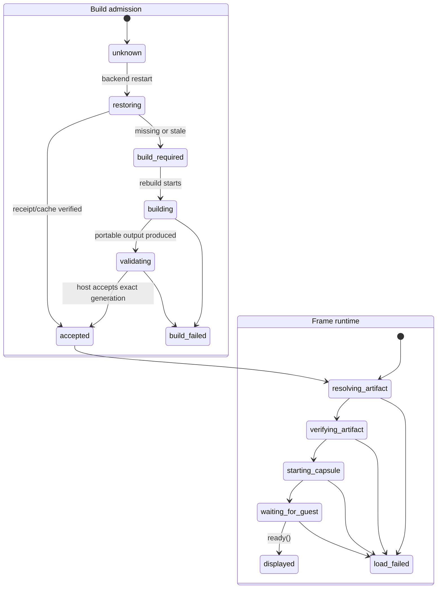

# B116 - Widget lifecycle: distinguish runtime loading from Preview building
[Overview](../BASED.md)

Canvas widget frames show **Building Preview** during cold startup even when the
widget already has an accepted build and the host is only restoring, verifying,
signing, and starting its Capsule runtime. Separate build admission from runtime
loading so every frame reports the work that is actually happening.

## Context

This is a frontend/backend lifecycle-model bug, not a database-schema bug. The
Canvas document correctly persists two distinct extension types in
[`fn.placed-widget-node.ts`](../../apps/frontend/src/core/widgets/fn.placed-widget-node.ts):

- `widget-instance` follows the current published artifact;
- `widget-preview` follows a draft's process-owned Preview lifecycle.

The incorrect presentation comes from several current behaviors:

1. [`canvas-extension/index.ts`](../../apps/frontend/src/shell/framework/feature/canvas-extension/index.ts)
   emits a Preview `request` before it asks the backend what work is needed.
   [`fn.widget-preview-state.ts`](../../apps/frontend/src/core/widgets/fn.widget-preview-state.ts)
   maps every such request directly to `building`, so an ordinary load starts
   with **Building Preview — Preparing the widget source and dependencies.**
2. The same frontend maps backend generation phase `validating` to
   `transpiling`. After restart,
   [`WidgetBuildGenerationService.ts`](../../apps/backend/src/shell/widget/WidgetBuildGenerationService.ts)
   begins with no process-owned accepted generation, observes the durable
   `dist/omnidraw.build.json`, verifies it against source and outputs, restores
   the exact construction from the bounded cache, signs it, and accepts it in
   the new process. That recovery is presented as compilation even when
   `buildPortable` never runs.
3. [`WidgetPreviewService.ts`](../../apps/backend/src/shell/widget/WidgetPreviewService.ts)
   owns ephemeral sessions. The browser always calls `widget.preview.open`, not
   `widget.preview.load`, so a persisted Preview frame automatically recreates
   its session after restart.
4. A real rebuild happens only when the current generation is missing/stale or
   the human explicitly selects **Rebuild**. The frontend's retry branch then
   calls `widget.preview.rebuildDraft`. That path is correctly build work but is
   currently indistinguishable from recovery and loading.
5. A published `widget-instance` already bypasses the draft build-generation
   service. `widget.runtime.load` resolves the published release and returns
   the exact signed `capsule.artifact`. The browser verifies it, creates a
   Capsule host, mounts into a hidden candidate target, waits for `ready()`, and
   reveals it. This can take visible time, but the generic loading surface is
   currently gated to `widget-preview`, so published frames can remain blank
   instead of explaining that they are loading.
6. **Build and Publish** publishes the current generation but intentionally
   does not rewrite the existing Canvas node from `widget-preview` to
   `widget-instance`. The frame therefore remains a Preview after publication.
   The lifecycle UI must keep that distinction explicit rather than making the
   remaining Preview look like a published instance that is rebuilding.

The current product contract in
[`SCREENS.md`](../../docs/internal/screens/SCREENS.md) already says Preview
**Reload** remounts without building and a published placement restores its
published manifest directly. B116 makes the implementation and status copy
match that contract. It does not change Canvas persistence or widget
publication storage.

## Plan

### 1. Separate the two lifecycle authorities

- Keep draft build admission distinct from frame runtime loading. A mount
  request must begin in `loading`, not `building`.
- Represent cold accepted-generation recovery as `restoring`/`admitting`, not
  `building` or `transpiling`.
- Enter `building` only when the backend actually starts the portable build
  boundary, including explicit **Rebuild** and the genuine build-required
  fallback.
- Keep request/generation fencing so late recovery, build, or mount results
  cannot replace a newer ready candidate.

### 2. Give every widget frame a truthful loading surface

- Show a compact accessible **Loading widget…** or **Starting Preview…**
  surface while resolving the artifact, verifying it, creating Capsule, and
  waiting for guest readiness.
- Apply the loading surface to both `widget-instance` and `widget-preview`.
- Keep the candidate hidden and non-interactive until `ready()` succeeds.
- During an in-process replacement, retain the current interactive mount and
  use the existing non-blocking overlay treatment. On a cold mount, fill the
  frame so it is never unexplained blank content.
- Keep build-specific copy only for an actual active build. Build failure and
  load/runtime failure remain distinct terminal states with appropriate retry
  actions.

### 3. Make restart recovery prove that it did not rebuild

- With a current durable receipt and compatible construction-cache entry,
  restore and re-sign the accepted Preview generation without calling
  `buildPortable`, npm, Vite, or Capsule construction.
- Do not call `widget.preview.rebuildDraft` during that successful cold
  recovery path.
- If the receipt, source fence, output, or cache is unavailable or invalid,
  surface the resulting build-required or failure state honestly before any
  real rebuild begins.
- Preserve the published path as direct signed-artifact resolution; it must
  never consult draft build state.

### 4. Keep Preview and publication semantics explicit

- Preserve the existing persisted extension type; no database migration or
  Canvas schema change is needed.
- After **Build and Publish**, make the success message clear that the current
  frame remains a draft Preview. Converting or replacing it with a published
  placement must be a separate explicit product action, not an implicit type
  mutation.
- Keep the title `Preview: <name>` and Preview lifecycle actions visible so a
  published definition and its authoring Preview cannot be confused.

### 5. Verify the complete matrix

- Published cold load: `loading -> ready`, no build-state request or build
  action, and no blank frame while Capsule starts.
- Preview cold load with valid receipt/cache: `restoring/loading -> ready`, no
  `rebuildDraft` or portable build.
- Preview with no current accepted generation: `build required -> building ->
  validating -> loading -> ready`.
- Explicit Reload: loading only. Explicit Rebuild: building followed by
  loading. Build and Publish: actual build state only when required.
- Failed build, failed artifact verification, failed Capsule mount, fatal
  post-ready runtime, cancellation, stale result, last-good replacement, and
  Canvas teardown each retain their correct bounded terminal behavior.

## TODOS

- [x] Introduce separate fenced build-admission and frame-runtime lifecycle states.
- [x] Start ordinary Preview requests in loading/restoring instead of building.
- [x] Stop presenting backend restart admission as transpilation.
- [x] Add the shared accessible loading surface for Preview and published frames.
- [x] Preserve last-good content while a replacement loads and fill cold frames while waiting.
- [x] Prove valid cold Preview recovery never calls `rebuildDraft` or `buildPortable`.
- [x] Clarify that Build and Publish leaves the current Canvas frame as a Preview.
- [x] Add focused reducer, orchestration, backend recovery, and real-browser restart tests.
- [x] Update the transient lifecycle descriptions in the screen atlas after implementation.

## Acceptance criteria

- An already-built widget never displays **Building** unless a real portable
  build is running.
- Published and accepted-Preview frames show a loading animation until Capsule
  reports ready, then reveal the widget without an unexplained blank interval.
- A normal backend restart with a valid accepted receipt/cache performs no npm,
  Vite, portable, or Capsule construction build.
- Explicit Reload does not build; explicit Rebuild does build.
- Build failures and runtime-load failures are distinguishable and actionable.
- Last-good content remains interactive until a replacement is ready.
- Build and Publish does not silently change the Canvas frame's Preview versus
  published identity.
- No database schema, migration, compatibility reader, Canvas document schema,
  or widget publication format changes are introduced.

## NOTES

- [B103](./B103.md) owns the durable map-free construction-cache repair. B116
  consumes and qualifies that fast path; it does not redesign the cache.
- [B70](./B70.md) owns cross-surface exact-revision readiness. B116 is narrower:
  it owns truthful build-versus-load phases and the in-frame waiting state.
- [B99](./B99.md) owns fatal cold-remount correctness. B116 preserves its
  persistent failure behavior and adds truthful pre-ready presentation.
- No mockup is needed. The existing Canvas/Preview visual language in the
  screen atlas plus the state diagram defines the change; written behavior is
  authoritative.

### LOGS

- 2026-08-20: Traced fresh-server Canvas hydration through persisted frame
  identity, generation recovery, Preview session recreation, transport
  artifact validation, Capsule mount, hidden candidate readiness, and reveal.
  Confirmed that the only host **Building Preview** spinner is Preview-gated,
  while published instances bypass draft build generation entirely.
- 2026-08-20: Confirmed the primary defect: every Preview `request` enters
  `building` before backend state is known, and backend `validating` is rendered
  as `transpiling` even during cold receipt/cache admission. Confirmed that a
  real automatic build occurs only after `BUILD_REQUIRED`/`BUILD_PENDING`
  causes the frontend to call `widget.preview.rebuildDraft`.
- 2026-08-20: Ran the existing Preview lifecycle, build-generation,
  WidgetPreviewService, and SDK browser-host suites: 50 tests passed. Planning
  only; no runtime or database code changed.
- 2026-08-20: Split the frontend lifecycle reducer into independently fenced
  build-admission and runtime-loading authorities. Ordinary Preview and
  published mounts now start with accessible loading copy, cold receipt/cache
  import is `restoring`, real portable work alone is `building`, and build
  versus runtime failures route to Rebuild versus Reload respectively.
- 2026-08-20: Kept hidden candidates and last-good mounts intact, added a
  full-frame cold surface plus non-blocking replacement overlay, clarified the
  Preview identity after Build and Publish, and updated the screen atlas.
- 2026-08-20: Added reducer, DOM surface, backend cold-admission, API, and live
  browser restart assertions. Passed 789 backend tests, 127 frontend Bun tests,
  70 frontend Vitest tests, focused lifecycle suites, all affected typechecks,
  and the production frontend build. The monolithic live-browser run was
  attempted twice but stopped before widget coverage at its unrelated AI model
  fixture (`Browser Streaming Model` absent from the menu).
- 2026-08-20: Review follow-up made durable restart admission strictly
  cache-only, kept explicit Reload from falling through to `rebuildDraft`, and
  removed the frontend's eager `building` transition so only observed backend
  work can display build copy. The focused regressions, both application
  typechecks, 128 frontend Bun tests, 70 frontend Vitest tests, browser
  typecheck, production build, and all 790 backend tests passed; the 12
  loopback-bound backend cases required execution outside the filesystem
  sandbox and then passed.

---
