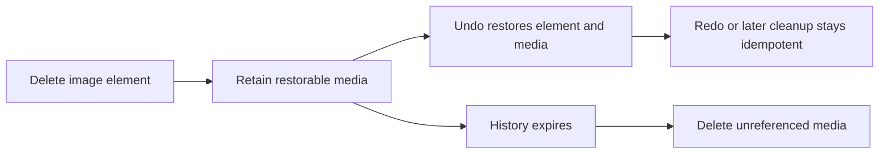

# B55 - image undo: hard delete removes the only restorable media record
[Overview](../BASED.md)

Undoing image deletion must restore a loadable image without leaking abandoned
media records during rapid undo/redo.

## Context

- [`Image.plugin.ts`](../../packages/canvas/src/plugins/image/Image.plugin.ts)
  hard-deletes the backing file in `onDelete`, then tries to clone that same URL
  in `onRestore`.
- [`api.remove-file.ts`](../../packages/api/src/file/api.remove-file.ts) deletes
  the database record immediately.
- [`api.clone-file.ts`](../../packages/api/src/file/api.clone-file.ts) requires
  the source record to exist and throws `File not found` after deletion.
- Consequently, undo can restore the CRDT element with a dead URL. Rapid
  undo/redo can also leave a successfully cloned file unowned if the element is
  deleted again before the clone resolves.

## Plan

1. Define media ownership across delete, undo, redo, and history eviction.
2. Replace eager irreversible deletion with a restorable retention or
   soft-delete mechanism.
3. Cancel or compensate in-flight restore clones when the element disappears.
4. Add API-backed lifecycle tests covering settled delete, undo, rapid
   undo/redo, failures, and final cleanup.

## TODOS

- [ ] Choose and document the media-retention boundary for undo history.
- [ ] Make image deletion reversible while its history entry is live.
- [ ] Compensate abandoned asynchronous restore work.
- [ ] Add deletion/undo/redo race and cleanup regression tests.
- [ ] Run canvas, API, database, typecheck, and functional-core verification.

## Acceptance criteria

- Undo after a completed image deletion restores a loadable image.
- Redo deletes or releases the restored media exactly once.
- Rapid undo/redo leaves no orphaned cloned media record.
- API failures preserve a consistent element/file state and surface one useful
  error.

## NOTES

- This task intentionally does not prescribe cloning versus soft deletion; the
  chosen design must account for history-entry disposal, not only undo.
- Existing orphan-retention work in A41 may provide the eventual cleanup
  boundary, but it does not by itself make the current restore callback valid.

### LOGS

- 2026-07-24: Created from canvas-migration review finding 2. Confirmed the
  remove API deletes the source row and the clone API rejects a missing source.

---
