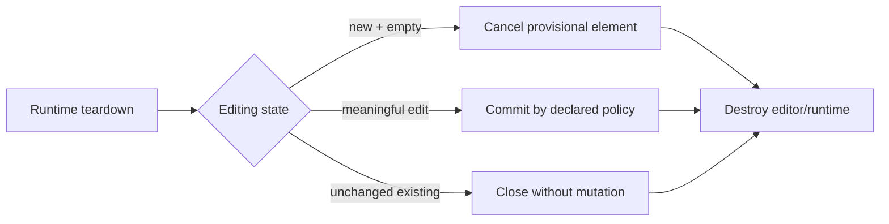

# B57 - canvas text: resolve active editing during runtime teardown
[Overview](../BASED.md)

Give active text editing an explicit commit-or-cancel outcome before the canvas
runtime is destroyed.

## Context

- `Text.plugin.ts` closes the editor with mode `destroy` from its teardown hook.
- That path removes the editor without committing meaningful edits or
  cancelling provisional text creation.
- Runtime replacement or unmount can consequently lose typed text, retain a
  blank provisional element, or leave history without the same terminal
  semantics as normal commit/cancel.

## Plan

1. Define teardown semantics for new-empty, new-nonempty, modified-existing,
   and unchanged-existing text sessions.
2. Resolve the active edit while document/history services are still valid,
   then destroy DOM and listeners.
3. Make teardown idempotent and prevent late callbacks from writing after the
   runtime boundary.
4. Exercise canvas replacement, component unmount, and repeated destruction.

## TODOS

- [ ] Document the commit/cancel policy for every active text state.
- [ ] Resolve active text state before dependent services are torn down.
- [ ] Guard late editor callbacks and repeated destroy calls.
- [ ] Add replacement/unmount tests for new and existing text.
- [ ] Run focused text tests and the canvas package suite.

## Acceptance criteria

- Teardown cannot silently discard meaningful text typed into an active edit.
- An empty provisional text element is not retained after teardown.
- Existing unchanged text is not mutated merely because the runtime closes.
- History and CRDT state reach one deterministic terminal outcome, with no
  writes after the teardown boundary.
- Repeated teardown is safe.

## NOTES

- The task requires an explicit lifecycle policy; it does not assume every
  teardown should always commit.

### LOGS

- 2026-07-24: Created from the post-migration audit of the text plugin's
  `closeEditor("destroy")` teardown path.

---
