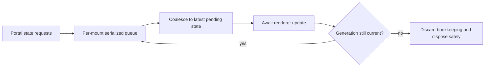

# B58 - widget portals: serialize asynchronous renderer updates
[Overview](../BASED.md)

Ensure asynchronous widget portal updates are applied in authoritative order
and cannot leave stale DOM after a newer state has been requested.

## Context

- `CanvasPortalService` starts refreshes without awaiting the previous refresh.
- Each refresh awaits the renderer's `update`, so multiple updates for the same
  mount can overlap.
- Generation checks protect service bookkeeping, but they cannot undo stale DOM
  mutations when an older renderer promise finishes after a newer one.
- Renderer replacement and disposal add the same ordering risk to in-flight
  work.

## Plan

1. Add a per-mount update lane that permits only one renderer mutation at a
   time and coalesces queued work to the latest authoritative state.
2. Define renderer replacement and disposal behavior for queued and in-flight
   updates.
3. Keep errors associated with the generation and state that produced them.
4. Test deterministic deferred promises that complete in adversarial order.

## TODOS

- [x] Define the per-mount serialization and coalescing contract.
- [x] Serialize renderer updates and prevent stale completion from winning.
- [x] Make renderer replacement and disposal safe with in-flight work.
- [x] Add delayed-resolution, rejection, replacement, and disposal tests.
- [~] Run focused portal tests, widget-host tests, and the canvas package suite.

## Acceptance criteria

- At most one asynchronous renderer update mutates a mount at a time.
- The mounted DOM converges to the newest requested portal state regardless of
  individual promise latency.
- Replaced or disposed mounts cannot be mutated by queued stale work.
- A stale failure cannot overwrite the current generation's healthy status.
- Bursty updates are bounded through documented latest-state coalescing.

## NOTES

- Generation checks remain useful for ownership, but serialization is required
  because a completed renderer call may already have changed external DOM.

### LOGS

- 2026-07-24: Created from the post-migration audit of fire-and-forget portal
  refreshes in `CanvasPortalService`.
- 2026-07-24: Added one deferred per-mount refresh lane with latest-state
  coalescing. Renderer mounts/updates no longer overlap; stale failures do not
  replace healthy state; replacement and final disposal wait behind in-flight
  work. Five focused portal tests and canvas TypeScript pass.

---
