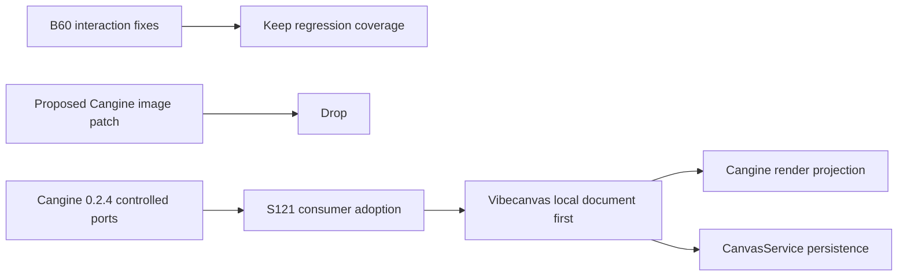

# B60 - canvas: finish Cangine interaction and image integration
[Overview](../BASED.md)

Superseded by [S121](../s/S121.md). The interaction bugs were fixed, while the
remaining image work now belongs to Cangine's shipped controlled-transaction
integration rather than a Vibecanvas-specific Cangine patch.

## Context

B60 originally combined five failures from the pre-S116 canvas stack:

- Cangine completed draw gestures before a parallel Vibecanvas tool session
  observed the terminal pointer event.
- Semantic selection was cleared before Cangine could give transform handles
  precedence over marquee.
- Vibecanvas and the standard editor both wrote the transform overlay.
- Repeated Alt-drag previews reused stable clone IDs without replacing the
  previous transient owner.
- Vibecanvas duplicated Cangine's clipboard/drop extraction, decode, sizing,
  placement, and resource preparation because Cangine could only commit image
  nodes directly to `engine.scene`.

The first four failures were fixed and covered by real-engine regressions. The
old Automerge/product-element architecture cited by the original task was then
deleted by [S116](../s/S116.md); the current durable authority is
`CanvasService`, storing one authored Cangine node per `canvas_items` row.

Cangine `0.2.4` now ships the missing public boundaries:

- `sceneMutationPort.commit(request)` synchronously hands every standard
  durable editor action to the host before any scene write.
- `imageImportPort.commitPrepared(request)` synchronously hands the host final
  image nodes, exact mutation commands, intrinsic metadata, and original
  `Blob`s after Cangine has performed browser filtering, decode, sizing,
  placement, ordering, and temporary resource registration.

This is broader and cleaner than B60's proposed asynchronous image callback.
Vibecanvas must become the local first writer for all editor commands, not add
an image-only adapter beside its recorder-driven persistence path. S121 owns
that consumer migration and the deletion it enables.

## Resolution

### Keep from B60

- Cangine terminal callbacks settle the gesture that owns them.
- Transform handles win before marquee mutates selection.
- One editor-owned selection overlay reflects semantic selection.
- Stable clone preview IDs replace the preceding transient owner.
- Durable canvas nodes stay inside Cangine's public node union.

### Move to S121

- Adopt Cangine `0.2.4`; do not patch Cangine source or generated `dist/`.
- Install `CanvasDocumentService` as both the controlled scene mutation port
  and prepared-image import port.
- Remove recorder-after-the-fact persistence and every product direct scene
  writer.
- Render prepared image `Blob`s immediately from document-owned local state,
  upload in the background, and persist only after a durable media URL exists.
- Use the Cangine clipboard, drop, and file controllers without duplicating
  extraction, decode, fit, placement, order, or temporary resource cleanup.

## TODOS

- [x] Settle product draw sessions from Cangine terminal callbacks.
- [x] Add consecutive-draw regression coverage.
- [x] Defer marquee selection changes until Cangine accepts the interaction.
- [x] Keep semantic selection and the visible transform overlay synchronized.
- [x] Cover handle and widget-frame selection with the real engine.
- [x] Replace repeated transient clone ownership correctly.
- [x] Verify durable projection uses Cangine built-in node kinds.
- [-] Add a custom Cangine image commit patch; superseded by Cangine `0.2.4`.
- [-] Complete image-controller adoption inside B60; moved to S121 with the
      controlled mutation migration.

## Acceptance criteria

- The completed interaction fixes retain their existing regression coverage.
- No implementation treats B60 as authority to modify Cangine source,
  generated declarations, `dist/`, or a Bun dependency patch.
- The unfinished image acceptance criteria are owned and strengthened by S121;
  they are not claimed complete in B60.

## NOTES

- The new Cangine ports are synchronous by design. Upload and server I/O must
  start only after the host has accepted the local mutation and returned the
  immediate projected scene revision.
- Cangine remains the interaction, command-planning, resource-preparation, and
  rendering layer. It does not become Vibecanvas's local or durable document
  authority.
- A mockup is not useful for this ownership correction; the transaction flow
  and executable ordering tests are the relevant artifacts.

### LOGS

- 2026-07-26: Fixed the draw-session, transform-handle, widget-frame overlay,
  and Alt-drag preview failures. Image integration remained blocked on a host
  commit seam.
- 2026-07-28: Cangine `0.2.4` added controlled scene mutations and
  host-owned prepared-image import. Dropped the planned Cangine patch and
  superseded B60's remaining work with S121.

---
