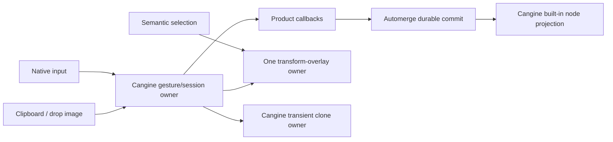

# B60 - canvas: finish Cangine interaction and image integration
[Overview](../BASED.md)

Remove the remaining split ownership between Vibecanvas and Cangine that
causes lost draw clicks, handle deselection, invisible widget selection, broken
clone previews, and duplicate image-import behavior.

## Context

The Cangine whiteboard does not reproduce these failures because its standard
editor is the single owner of gesture sessions, selection-overlay ordering,
transient clone updates, and browser image import. Vibecanvas currently composes
those facilities with parallel product state:

- `packages/canvas/src/services/tool/ToolService.ts` keeps a product session
  after starting a Cangine interaction. Cangine consumes the committing
  pointer-up before `ToolService` receives it, so the next pointer-down is
  ignored and its pointer-up only clears the stale session.
- `packages/canvas/src/plugins/select/Select.plugin.ts` clears semantic
  selection before `beginMarquee`. A transform handle is not a durable semantic
  scene hit, so this removes the overlay before Cangine can make marquee yield
  to its handle/move-region guard.
- `packages/canvas/src/engine/editor/CanvasEditorBridge.ts` creates a Cangine
  editor with `selectionOverlay: false` while
  `packages/canvas/src/plugins/transform/Transform.plugin.ts` separately owns
  `engine.transforms` selection. Entering widget frame mode first synchronizes
  product selection, then the editor writes a null overlay and removes the
  visible selection box.
- `packages/canvas/src/engine/product-runtime/CanvasProductTransformService.ts`
  uses Cangine `cloneFromScene` with stable clone IDs but omits
  `replaceOwnerId` on later gesture updates. The transient scene rejects those
  IDs because the previous preview owner still occupies them.
- `packages/canvas/src/plugins/image/Image.plugin.ts` still implements native
  paste/drop filtering, decode, fit, preview, and import orchestration. Image
  rendering itself already projects to Cangine's built-in `TImageNode`.
- Vibecanvas still needs a persisted Automerge `TElement` and product behavior
  registry, but it must not introduce a second renderer-element model. All
  projected renderer nodes must remain Cangine built-ins.

Two Cangine composition gaps must be resolved explicitly rather than copied
into another local implementation:

1. An external selection-overlay ownership mode where editor selection does
   not clear or overwrite a host-owned `engine.transforms` selection.
2. A browser image import preparation/commit adapter that lets Cangine own
   clipboard/drop extraction, decoding, sizing, and resource semantics while
   Vibecanvas uploads media and commits the durable Automerge element.

The installed dependency is `@omnidraw/cangine@0.2.1`, but
`packages/canvas/package.json` points to an absolute machine-local tarball.
Keep dependency changes reproducible with a repository-relative immutable
artifact.

## Plan

### 1. Make gesture completion authoritative

- Remove or adapt the parallel draw-session lifetime so Cangine `onCommit` and
  `onCancel` settle product state immediately.
- Preserve tool mode behavior after commit without depending on a later raw
  pointer-up.
- Add a routed-input regression test using the real Cangine stop-propagation
  order, not independent hook mocks.

### 2. Establish one selection-overlay ordering contract

- Let Cangine evaluate transform-handle ownership before any semantic selection
  clear or marquee state change.
- Move marquee selection mutation behind the accepted `onBegin`/`onCommit`
  lifecycle.
- Choose one writer for the visible transform overlay across ordinary elements
  and widget frame/content transitions.
- Add real-engine tests for resize, rotate, move-region, empty-canvas marquee,
  widget frame selection, and widget content focus.

### 3. Use Cangine transient clone replacement correctly

- Pass the live preview owner as `replaceOwnerId` when updating stable clone
  IDs.
- Preserve preview continuity through begin, update, commit handoff, cancel,
  and Alt release.
- Replace the permissive transient mock with the real transient scene or a
  collision-aware contract test.

### 4. Adopt Cangine browser image import through a durable host adapter

- Add or consume the missing Cangine image-import commit seam.
- Keep media upload, cleanup, history, and Automerge commit in Vibecanvas.
- Use Cangine extraction, decode, fit, offset, resource, paste, drop, and file
  input behavior rather than maintaining a second implementation.
- Project the durable image only as Cangine's built-in image node.

### 5. Audit the element boundary

- Assert that projection output contains only supported Cangine node kinds.
- Retain product `TElement` only as the durable application schema and behavior
  policy boundary.
- Remove any renderer-node factories or element state that duplicate Cangine
  ownership.

## TODOS

- [x] Settle product draw sessions from Cangine terminal callbacks.
- [x] Add consecutive draw regression coverage for terminal session ordering.
- [x] Defer marquee selection changes until Cangine accepts the interaction.
- [x] Restore the host-owned visible overlay after editor selection writes.
- [x] Add handle and widget-frame selection regression tests.
- [x] Pass `replaceOwnerId` for repeated transient clone updates.
- [x] Add a real-engine collision-aware Alt-drag preview contract test.
- [x] Avoid an upstream external-overlay addition by resynchronizing the
      existing host-owned overlay from the editor publication boundary.
- [ ] Define and land the Cangine image import commit adapter.
- [ ] Replace custom paste/drop/decode/fit orchestration with the Cangine
      controller path.
- [x] Verify that all durable element projectors emit only Cangine built-ins.
- [x] Vendor or reference the Cangine artifact reproducibly.
- [x] Run focused real-engine regressions and the complete canvas package suite.

## Acceptance criteria

- Consecutive draws start on every valid pointer-down; no clearing click is
  required between draws.
- Clicking or dragging an enabled selection handle does not clear selection and
  performs the expected transform.
- Clicking a widget frame shows the same visible selection overlay represented
  by semantic/debug selection; entering content mode still suppresses it.
- Alt-drag displays a continuously moving clone preview and commits exactly one
  durable clone.
- Paste, drop, and file-picker image insertion use Cangine's browser image
  semantics without direct durable engine-scene writes.
- Media is uploaded before the complete image element becomes durable, and
  failure leaves neither a CRDT image nor a leaked resource.
- Vibecanvas owns no renderer element kinds outside Cangine's public node
  contracts.
- The Cangine whiteboard and Vibecanvas integration share contract-level
  regression coverage for these behaviors.

## NOTES

- Do not fix routed-input bugs by changing subscriber order alone; terminal
  session state must be driven by the owner that actually commits or cancels.
- Do not call the existing Cangine image controllers directly while they commit
  to `engine.scene`; that would bypass Automerge authority and be overwritten
  by projection.
- Required Cangine seam: both image controllers need an optional asynchronous,
  abort-aware host commit callback invoked after trusted extraction, decode,
  intrinsic sizing, fit, and world-anchor offset. Its immutable batch must
  include each original `Blob`, MIME type, intrinsic size, fitted world size,
  and world anchor. When supplied, the controller must skip its durable
  `engine.scene` transaction, long-lived resource lease, and editor-selection
  write; Vibecanvas will upload the bytes, commit one CRDT/history batch, and
  return the resulting projected node/resource IDs. Temporary decode resources
  remain controller-owned and must be cleaned on success, cancellation, or
  failure.
- A static mockup would not clarify these interaction-state bugs. The Mermaid
  ownership flow and executable pointer-sequence tests are the useful visuals.

### LOGS

- 2026-07-26: Created after comparing Vibecanvas with Cangine 0.2.1 and the
  reference whiteboard. Confirmed stale parallel tool sessions, premature
  marquee clearing, widget overlay overwrite, missing transient
  `replaceOwnerId`, and custom image-import orchestration.
- 2026-07-26: Fixed the draw-session, transform-handle, widget-frame overlay,
  and Alt-drag preview failures. Replaced local image fitting with Cangine's
  public helper, retained only Cangine built-in image-node projection, and
  vendored the audited 0.2.1 artifact. The protected canvas regression suite
  passes. The task is blocked only on a Cangine controller hook that delegates
  durable image commit to the host instead of writing `engine.scene` directly.

---
