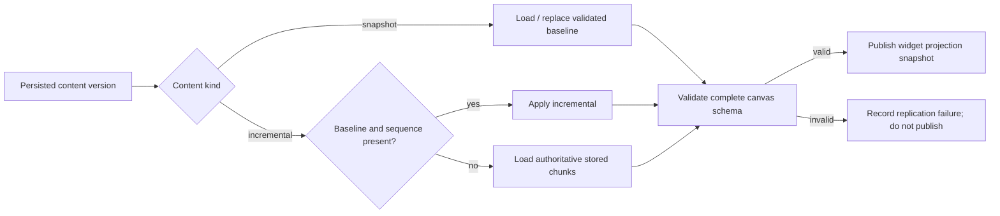

# B61 - widget projection: never publish a partial persisted canvas snapshot
[Overview](../BASED.md)

Prevent persisted Automerge replication from sending a partial document to the
widget metadata projector when only a later incremental chunk is available.

## Context

Drawing an element can surface this notification:

- `apps/cli/src/setup-services.ts` forwards every persisted canvas snapshot to
  `WidgetInstanceMetadataProjector`.
- `packages/service-automerge/src/projection/fn.widget-instance-projection.ts`
  calls `Object.entries(source.elements)` and quarantines the source sequence
  when `elements` is undefined.
- `packages/service-automerge/src/AutomergeService.ts` uses an existing
  persisted projection replica or `Automerge.init()`, applies
  `loadIncremental`, and immediately publishes `persistedDocument.elements`.
  It does not validate the canvas schema or distinguish the recovery required
  by snapshot and incremental content kinds.

The failure mechanism is reproducible: applying a later Automerge incremental
change to a fresh `Automerge.init()` can return an empty `{}` document without
throwing. Publishing that partial replica produces the native
`Object.entries` error at source sequence 12 instead of waiting for or loading
the authoritative baseline.

## Plan

### 1. Reproduce missing-baseline ordering

- Add a service-level test where the first observed persisted callback is a
  later incremental version and the in-memory projection map has no baseline.
- Cover restart, admission/load ordering, idle eviction, flush, and delayed save
  callbacks.
- Assert that an incremental dependency gap never emits a document snapshot.

### 2. Reconstruct exact persisted authority

- Define snapshot replacement and incremental application behavior using
  `contentKind`, source sequence, and the admitted persisted identity.
- Load the ordered authoritative snapshot/incremental chunks when the in-memory
  replica cannot prove it has the preceding baseline.
- Avoid projecting speculative `DocHandle` state that has not crossed the
  storage durability boundary.

### 3. Validate before publication

- Validate the persisted canvas identity, exact source sequence, and complete
  `elements` record required by `onDocumentSnapshot` before publication.
- Treat an incomplete Automerge replica as a projection replication failure,
  not as a valid empty canvas and not as widget metadata quarantine.
- Make projector validation produce an explicit boundary error if invalid input
  nevertheless reaches it.

### 4. Verify lifecycle and recovery

- Confirm sequence ordering through restart and migration from version zero.
- Confirm the next complete authoritative snapshot can recover without process
  restart.
- Keep widget metadata quarantine for malformed widget records, but never use it
  for incomplete canvas replication.

## TODOS

- [x] Add a missing-baseline later-incremental reproduction test.
- [x] Add restart, eviction, and delayed-save ordering coverage.
- [x] Define snapshot versus incremental replica update rules.
- [x] Reconstruct the persisted baseline when the in-memory projection is
      absent or behind.
- [x] Validate the complete projection payload before snapshot publication.
- [x] Replace the native `Object.entries` failure with explicit boundary
      diagnostics.
- [x] Verify recovery on a later complete persisted version.
- [x] Run Automerge service, adapter, widget projection, and protected canvas
      suites.

## Acceptance criteria

- `onDocumentSnapshot` is called only with a complete `elements` record,
  admitted canvas identity, and source sequence matching the same persisted
  database snapshot.
- A later incremental chunk applied without its baseline cannot publish `{}` or
  `elements: undefined`.
- Restart, version-zero migration, idle eviction, and delayed persistence
  preserve exact projection contents and sequence ordering.
- Drawing any element does not emit a widget metadata quarantine notification.
- Malformed widget metadata remains isolated and quarantined with a precise
  reason.
- Projection recovery does not require deleting the canvas or restarting the
  server.

## NOTES

- The notification is downstream evidence; it is not a Cangine rendering or
  widget-frame failure.
- Do not paper over the fault with `source.elements ?? {}`. That would project
  a false empty widget set and could erase valid metadata.

### LOGS

- 2026-07-26: Created after tracing the supplied source-sequence-12 quarantine
  to a partial persisted Automerge replica. Reproduced that a dependency-missing
  incremental load can return `{}` without throwing.
- 2026-07-26: Persisted projection now tracks its exact content version,
  reconstructs a missing or gapped baseline from ordered Turso chunks, awaits
  recovery within the document write tail, and refuses to publish an invalid
  `elements` record or mismatched source sequence. Added service and projector
  regressions; the complete service and protected canvas suites pass.

---
