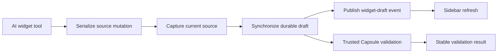

# B62 - AI widget authoring: restore durable validation and sidebar refresh
[Overview](../BASED.md)

Restore the AI widget authoring path so a committed source mutation is captured
durably, reaches trusted validation, and refreshes the widget sidebar.

## Context

The React Hello World request recorded in the supplied Pi chat created and
edited the filesystem draft, but every draft capture and validation callback
failed with `Cannot access private method or accessor ... this.#delegate`.

`apps/cli/src/services/WidgetServicePool.ts` exposes `captureSource` and
`validateBuild` through the frozen authoring capability without preserving the
pool receiver. The failure occurs before `WidgetDraftController` can synchronize
the durable draft or publish the `widget-draft` refresh event.

The investigation also found that:

- trusted widget imports are resolved from `apps/cli/src`, while the CLI does
  not directly own the complete trusted build dependency set;
- source writes can commit before draft synchronization reports failure;
- direct pool tests do not exercise the frozen authoring capability where the
  receiver failure occurs.

## Plan

### 1. Repair the authoring boundary

- Preserve the `WidgetServicePool` receiver for source capture and validation.
- Exercise both methods through the frozen authoring capability.

### 2. Restore trusted build resolution

- Make the trusted dependency owner explicit at the CLI composition boundary.
- Verify that the React and Capsule imports used by generated widgets resolve
  in the same process that performs validation.

### 3. Verify synchronization semantics

- Confirm successful capture can create the durable draft and publish its
  refresh event.
- Keep committed source state and reported tool results consistent.

### 4. Add regression coverage

- Add the smallest capability-level test reproducing the private receiver
  failure.
- Run the complete widget service and relevant agent draft suites.

## TODOS

- [x] Bind the authoring capture and validation operations to their pool.
- [x] Add capability-level regression coverage.
- [x] Resolve trusted React/Capsule dependencies from an explicit owner.
- [x] Verify durable draft synchronization and sidebar event publication.
- [x] Run the relevant widget authoring test gates.
- [x] Stop advertising Preview placement for filesystem-only orphan drafts.
- [x] Render an actionable publication state when durable identity is missing.
- [x] Add orphan-draft UI and management regressions.
- [x] Re-run the affected service-agent and UI test gates.
- [x] Gate draft placement on a successful build validation for the exact revision.
- [x] Explain invalid and unvalidated placement attempts without claiming a stale draft.
- [x] Add build-readiness placement regressions and re-run affected gates.
- [x] Reproduce the repaired React theme widget through the production validator.
- [x] Verify the same source reaches a signed Preview artifact.
- [x] Fix any remaining source/build incompatibility and re-run affected gates.
- [x] Exercise the generated React/CSS widget through the real production OCI runner.
- [x] Detect an unavailable OCI daemon or pinned image during startup.
- [x] Preserve bounded OCI runner failure codes in widget validation diagnostics.

## Acceptance criteria

- Calling `captureSource` and `validateBuild` through the frozen authoring
  capability delegates to the correct tenant service without a private receiver
  error.
- A generated React widget reaches trusted validation with resolvable approved
  imports.
- Successful draft synchronization emits the event used for immediate sidebar
  refresh.
- A tool never reports an unchanged generic failure after silently committing
  a source mutation.
- A filesystem-only orphan is visibly marked as needing validation and does not
  expose placement or remain indefinitely in a publication checking state.
- A durable draft exposes Preview placement only after trusted validation
  successfully builds that exact revision.
- Relevant widget service and draft-controller regression tests pass.

## NOTES

- The incident did not reach Capsule compilation; the original generated React
  source was not the primary failure.
- The existing filesystem-only Hello World draft is an orphan and should be
  reconciled through the normal authoring path after the pipeline is repaired.

### LOGS

- 2026-07-26: Created from the AI widget authoring incident investigation.
- 2026-07-26: Bound source capture and trusted validation as lexical pool
  operations and added a frozen-capability regression for the exact private
  receiver failure.
- 2026-07-26: Made the CLI own the exact approved Capsule and React build
  dependencies, and made local development rebuild the materialized SDK before
  startup.
- 2026-07-26: Added a shared per-draft authoring lane around create, edit,
  patch, and validation so parallel chat tools cannot advance source while
  durable capture is in progress. Partial failures now report whether their
  source mutation already committed.
- 2026-07-26: Adapted structured tool failures through Pi's `tool_result`
  lifecycle so transcript entries carry `isError: true`.
- 2026-07-26: Added durable-before-event and structured-error regressions.
  WidgetService passed 14/14, service-agent passed 63/63, CLI passed 154/154,
  both affected package typechecks passed, and functional-core lint passed.
  The architecture gate passed 9/10; its only failure is unrelated ignored
  `tsconfig.tsbuildinfo` residue in retired `packages/api-*` directories dated
  2026-07-11.
- 2026-07-26: Review follow-up replaced text-based tool-error detection with
  an internal symbol marker, prepared the SDK for backend-only development,
  and removed broken cross-repository documentation links. Service-agent
  passed 63/63 and WidgetService passed 14/14 afterward.
- 2026-07-26: Follow-up for the reported placement/checking screenshots marks
  filesystem-only drafts with `DRAFT_IDENTITY_UNAVAILABLE`, removes their
  unusable placement descriptor, renders `Needs validation` instead of an
  indefinite publication checker, and reports an actionable stale placement
  error. Service-agent passed 64/64, UI AI chat passed 218/218, both package
  typechecks passed, functional-core lint passed, and `git diff --check`
  passed. Live verification could not restart the disconnected local server
  because the selected `.vibecanvas` home independently failed its read-only
  database-layout preflight; no existing data was modified.
- 2026-07-26: Build-readiness follow-up stopped treating durable identity as
  Preview readiness. Draft placement now requires a valid trusted build for the
  exact current revision, while stale calls report invalid or unvalidated state
  without invoking the resolver. The supplied Hello World build failure was
  isolated to generated `var(--theme-token)` CSS, which Capsule rejects; its
  source now consumes the bounded SDK theme channel, and the AI style guide no
  longer instructs models to emit rejected custom-property syntax. Structured
  Capsule phase, code, path, and import diagnostics now survive the trusted
  build wrapper. CLI passed 154/154, capsule-vibecanvas passed 33/33,
  service-agent passed 65/65, UI AI chat passed 219/219, all four affected
  package typechecks passed, functional-core lint passed, and
  `git diff --check` passed.
- 2026-07-26: Added a production `WidgetService` regression matching the
  supplied React theme-channel widget and expanded it declaration-by-
  declaration until it reproduced the real CSS transform failure. Capsule
  rejects `color: inherit`, `font: inherit`, and the supplied custom focus
  rule; all three came from unused button styling. Removed those declarations
  from the supplied draft and the generated scaffold, retained native focus
  visibility, and kept the complete React/theme/static-CSS fixture exercising
  both no-commit validation and signed Preview build. CLI passed 155/155,
  service-agent passed 65/65, both affected package typechecks passed,
  functional-core lint passed, and `git diff --check` passed.
- 2026-07-26: The reported revision
  `082d29d21881f77c8fa1443be0bbc3283aae57cd33ed1058ececf5e3b963c3a8`
  matched the current six-file draft byte-for-byte and passed the in-process
  production service regression. The real OCI acceptance initially failed
  before source ingestion because Docker Desktop was stopped; the runner's
  stable `SANDBOX_IMAGE_IDENTITY_MISMATCH` code had been collapsed into the
  generic UI-build message. Startup now verifies both the pinned engine client
  and pinned image through the daemon, validation preserves bounded runner
  codes, and the permanent OCI gate compiles a full six-file React/theme/CSS
  Hello World fixture. After starting Docker, the extended OCI gate passed and
  produced Capsule artifact
  `sha256:342c179391b7495294b9f1a0119319b22105fbf87b04559b1bc78709321c60e8`.
  Focused regressions passed 36/36; the combined CLI/Capsule run passed all 183
  relevant tests, and its four sandbox-blocked localhost updater cases passed
  5/5 when rerun with socket access. CLI, root, and Capsule typechecks,
  functional-core lint, and `git diff --check` passed.

---
