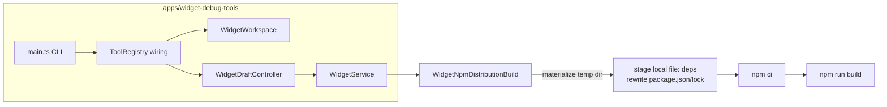

# B63 - widgets: `npm ci` rejects draft lockfile; add widget-debug-tools lab
[Overview](../../`BASED`.md)

AI Chat cannot build any widget (even the untouched scaffold): validation ends
with the generic "Widget ui build failed". Root cause is the draft
`package-lock.json` containing machine-local `file:` link entries that npm
cannot load once the snapshot is materialized into a fresh temp dir. Fix the
build pipeline, and add a debug lab app that drives the exact same agent tools
(`vc_widget_create` / `vc_widget_validate` / workspace file / resource tools)
from outside the server so the end-to-end loop is reproducible from a terminal.

## Context

Reported by AI chat session:
`.vibecanvas/organizations/00000000-0000-4000-8000-000000000001/agent/00000000-0000-4000-8000-000000000002/pi/agent/chats/2026-07-27/2026-07-27T17-26-41-471Z--05ef55f2-7bd6-413b-ae39-98df898971ce`

Failure chain (verified by direct repro):

1. `vc_widget_validate` → `WidgetDraftController.#validateCaptured`
   (`packages/service-agent/src/widget-drafts/WidgetDraftController.ts:800`)
   → `widgets.validateBuild` (`apps/cli/src/services/WidgetService.ts:220`)
   → `WidgetArtifactBuilderCapsule.build`
   (`packages/capsule-vibecanvas/src/build/WidgetArtifactBuilderCapsule.ts`).
2. UI build delegates to `createWidgetNpmDistributionBuild`
   (`apps/cli/src/services/WidgetNpmDistributionBuild.ts`): materializes the
   snapshot into a temp dir, requires `package.json` + `package-lock.json`
   (lockfileVersion 3), runs `npm ci`, then `npm run build` (vite).
3. Scaffold writes `package.json` with `file:` deps
   (`packages/service-agent/src/tools/tx.scaffold.ts`):
   - `@omnidraw/capsule` → `file:/Users/omarezzat/Workspace/vibecanvas/capsule`
   - `@vibecanvas/sdk` → `file:<home>/agent/<account>/sdk`
   `npm install` (via `txTryNpmInstall`, `packages/service-agent/src/tools/tx.npm-install.ts`)
   then records them in the lockfile as **relative symlink entries**:
   `"node_modules/@omnidraw/capsule": { "link": true, "resolved": "../../../../../../../../../../../capsule" }`
   `"node_modules/@vibecanvas/sdk": { "link": true, "resolved": "../../../sdk" }`
4. In the build temp dir (different depth, no `node_modules` in the snapshot)
   these relative links resolve nowhere; Arborist `loadVirtual()` crashes
   (`Cannot read properties of undefined (reading 'extraneous')`) and `npm ci`
   exits with `EUSAGE` ("can only install with an existing package-lock.json").
   Reproduced standalone: copy `package.json` + `package-lock.json` to any temp
   dir → `npm ci` fails identically.
5. The real stderr is wrapped by `fnWidgetBuildError('ui', cause)`
   (`packages/capsule-vibecanvas/src/build/fn.build-error.ts`) and only the
   generic message reaches the agent. (Related: A93 note about stopping
   file-level-only errors.)

Supporting files:
- `packages/service-agent/src/tools/tool.widget-workspace.ts` (tools to drive)
- `packages/service-agent/src/tools/tool.resources.ts` (resource tools to drive)
- `packages/service-agent/src/tools/ToolRegistry.ts` (exact tool wiring)
- `apps/cli/src/setup-services.ts` (service wiring to mirror)
- `apps/cli/src/services/WidgetServicePool.ts` (`createWidgetAuthoringCapability`)
- `packages/service-agent/src/workspace/WidgetWorkspace.ts`
- `packages/service-agent/src/widget-drafts/WidgetDraftController.ts`

## Plan

### Lane 1 - debug lab (`apps/widget-debug-tools`)

New bun app that mirrors `apps/cli/src/setup-services.ts` widget wiring for the
OSS tenant against a `--home` dir (default repo `.vibecanvas`):

- `DbServiceTurso` + `WidgetService` (same config as setup-services:
  `buildCapsuleGuest`, `createWidgetNpmDistributionBuild`, signing key store,
  builder identity, `resolveTrustedWidgetBuildPackageImport`).
- `WidgetWorkspace` on the tenant agent root, `WidgetDraftController` with the
  real `authoringStore` + `createWidgetAuthoringCapability`.
- Tool factories from `packages/service-agent/src/tools` (same code the AI chat
  uses): `createWidgetWorkspaceTools`, `createWorkspaceFileTools`,
  `createResourceTools` (resource service optional/lazy).
- CLI: `bun run lab -- <tool-name> '<json-args>'`, plus convenience commands
  `create <name>`, `validate <name>`, `list`. Prints the tool result JSON
  (modelData + details), exits non-zero on tool error.
- `authorize` always true (lab), `onDraftChanged` wired to the real
  `WidgetDraftController` so validation runs the trusted host build.

### Lane 2 - fix the lockfile bug

In `WidgetNpmDistributionBuild` (host build boundary), make the temp project
self-contained before `npm ci`:

- Detect `file:` dependencies in materialized `package.json`.
- Stage each linked target into the build root (e.g. `.vibecanvas-links/<name>`),
  excluding its `node_modules`.
- Rewrite `package.json` deps to the staged relative `file:./...` paths and
  regenerate the lockfile (`npm install --package-lock-only`) so `npm ci`
  receives a lockfile that resolves inside the build root.
- Keep the provenance digests (dependencyLockDigest now covers the regenerated
  lock; build configuration digest unchanged in shape).

### Lane 3 - surface real build errors

- Extend `fn.build-error.ts` / `validateBuild` diagnostics so the npm stderr
  tail (already captured in the cause chain) reaches the agent as a bounded
  diagnostic instead of only "Widget ui build failed." (delivers A93 note).

### Verification

- `bun run lab -- validate "React Counter Example"` passes against the existing
  broken draft (after re-install or lock repair) — before fix it must reproduce
  the `npm ci` EUSAGE failure with a useful message.
- `bun run lab -- create "Lab Counter"` + `validate` succeeds end-to-end.
- Existing tests: `apps/cli/tests/WidgetService.test.ts`,
  `packages/capsule-vibecanvas/tests/*` stay green.

## TODOS

- [x] Scaffold `apps/widget-debug-tools` (package.json, tsconfig, src)
- [x] Wire services mirroring setup-services (db, WidgetService, signing keys)
- [x] Wire WidgetWorkspace + WidgetDraftController + tool factories
- [x] CLI entry: call any tool by name with JSON args; pretty-print result
- [x] Reproduce the `npm ci` EUSAGE failure via `lab validate` on existing draft
- [x] Fix `WidgetNpmDistributionBuild` local `file:` dep staging + lock regen
- [x] Surface bounded npm stderr in build failure diagnostics
- [x] Green: lab create+validate loop on fresh widget
- [x] Green: existing widget/capsule test suites
- [x] Update FILES.md for new app

## NOTES

- Snapshot capture excludes `node_modules` (`WidgetWorkspace.ts:1205,1224`), so
  `npm ci` inside the build temp dir is mandatory; the lockfile must be valid
  there, not in the draft dir.
- `npm ci` EUSAGE message is misleading: lockfile exists and parses as JSON;
  Arborist crashes on the escaping relative link `resolved` paths.
- The scaffold comment "TESTING ONLY: keep the linked SDK under this project"
  (`tx.scaffold.ts`) marks the local-link setup as temporary; the host build
  must not trust draft-local link layout.
- Repro script from investigation: `apps/cli/repro-widget-build.ts` (delete
  once the lab covers the flow).

### LOGS

- 2026-07-27: Investigated build failure; root-caused to relative `file:` link
  entries in draft lockfile breaking `npm ci` after snapshot materialization.
  Created task and started lab app.
- 2026-07-27: Added the terminal debug lab, staged local dependencies inside
  build roots with regenerated locks, surfaced bounded npm diagnostics, and
  validated both the existing React draft and a fresh Lab Counter end to end.
