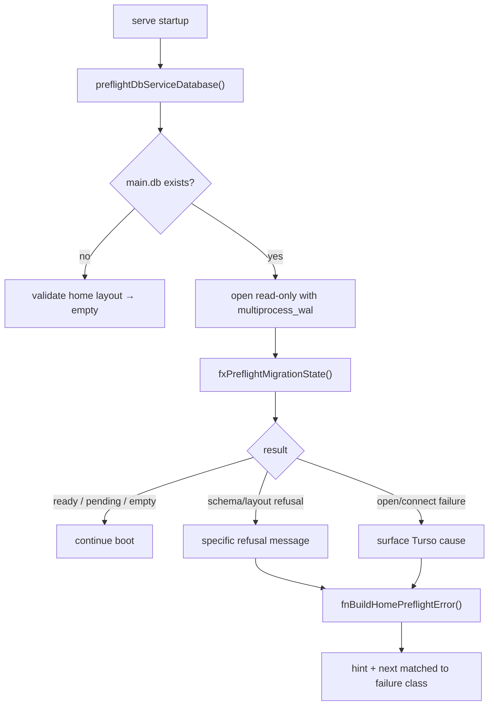

# B65 - cli: home preflight must share multiprocess WAL and report real failures
[Overview](../BASED.md)

Fix `serve` startup preflight so it can inspect an already-open `main.db`, and
replace the stale actor-era warning with failure-specific CLI guidance.

## Context

`bun run dev` fails before the backend starts when another process already holds
the selected Vibecanvas home database open in multiprocess WAL mode.

Observed failure:

```text
Refusing selected Vibecanvas home '.../.vibecanvas':
Refusing to open Vibecanvas database after a read-only preflight failed: .../main.db
Hint: Actor-era and unknown non-empty layouts are unsupported. The selected home was not modified.
```

The wrapped Turso cause is:

```text
Database is already open with experimental multiprocess WAL in another process
```

In the repro, `row-deck` (`tauri dev`) held `.vibecanvas/main.db` while Vibecanvas
CLI tried to start. The database itself was valid (`application_id` = VIBE,
`user_version` = 3).

Root causes:

1. **Preflight opens the DB without `multiprocess_wal`.** Runtime `DbServiceTurso`
   enables it for on-disk databases, but `preflightDbServiceDatabase()` does not.

   - [`packages/service-db/src/DbServiceTurso/DbServiceTurso.ts`](../../packages/service-db/src/DbServiceTurso/DbServiceTurso.ts)
     (`preflightDbServiceDatabase` vs `DbServiceTurso` constructor)

2. **CLI guidance is stale and misleading.** `fnBuildHomePreflightError()` always
   emits the actor-era hint and archive/`--data-dir` next step, even for lock
   conflicts and other unrelated failures.

   - [`apps/cli/src/fn.home-preflight-error.ts`](../../apps/cli/src/fn.home-preflight-error.ts)
   - [`apps/cli/src/main-app.ts`](../../apps/cli/src/main-app.ts)

3. **The outer preflight wrapper hides the real cause.** `preflightDbServiceDatabase()`
   rethrows a generic message and stores the Turso error on `cause`, but
   `fnBuildHomePreflightError()` only prints `error.message`.

4. **Binary coverage bakes in the stale hint.** `scripts/test-binary.ts`
   `assertHomePreflightRefusalBinaryScenario()` expects the actor-era text in
   stderr for a genuine actor-era refusal.

Relevant existing coverage:

- [`packages/service-db/src/tests/BunServiceTurso/tx.migrations.test.ts`](../../packages/service-db/src/tests/BunServiceTurso/tx.migrations.test.ts)
  (`read-only startup preflight`)
- [`packages/service-db/src/DbServiceTurso/fx.migration-state.ts`](../../packages/service-db/src/DbServiceTurso/fx.migration-state.ts)
  (schema refusal messages still start with `Refusing to open Vibecanvas database:`)

## Plan



### 1. Align preflight DB open with runtime WAL mode

- Add `multiprocess_wal` to the experimental feature list used by
  `preflightDbServiceDatabase()` for on-disk `main.db`.
- Keep `:memory:` / missing-file behavior unchanged.
- Reuse the same experimental list shape as `DbServiceTurso` to avoid future drift.

### 2. Improve preflight failure surfacing

- When preflight open/connect fails, preserve and expose the underlying Turso
  error instead of only a generic wrapper.
- Keep existing explicit schema refusal messages from `fxPreflightMigrationState()`
  unchanged (`Refusing to open Vibecanvas database: ...`).

### 3. Replace stale actor-era CLI guidance

- Remove the blanket actor-era hint from `fnBuildHomePreflightError()`.
- Classify failures and emit matching `hint` / `next` text, at minimum:
  - **schema/layout refusal** (unknown DB, actor-era marker, checksum drift):
    archive home or use `--data-dir`
  - **database lock / already open**: stop the other holder or use a separate home
  - **fallback**: short generic hint with the surfaced reason
- Walk the `error.cause` chain when building the user-visible reason.

### 4. Add regression coverage

- Service-db: preflight succeeds while another on-disk connection already holds
  the same `main.db` with `multiprocess_wal`.
- CLI: home-preflight error output includes lock-specific guidance for the
  multiprocess-WAL conflict and keeps actor-era guidance only for true schema
  refusals.
- Update `scripts/test-binary.ts` actor-era refusal assertions to match the new
  contextual messaging contract.

## TODOS

- [ ] Add `multiprocess_wal` to `preflightDbServiceDatabase()` on-disk open options.
- [ ] Surface underlying Turso/cause text in preflight failures.
- [ ] Refactor `fnBuildHomePreflightError()` to classify failures and remove the blanket actor-era hint.
- [ ] Add service-db preflight regression for an already-open multiprocess WAL holder.
- [ ] Add CLI/unit coverage for contextual hint selection.
- [ ] Update `scripts/test-binary.ts` home-preflight refusal expectations.
- [ ] Run `bun run db:recovery:test` and affected CLI/binary gates.
- [ ] Regenerate `FILES.md` if new test/helper files are added.

## NOTES

- This is not a corrupt-database bug. The repro database was managed schema v3.
- External apps sharing the same Vibecanvas home (for example Row Deck) are a
  supported real-world case once preflight uses the same WAL mode as runtime.
- Do not weaken schema-refusal behavior from `fxPreflightMigrationState()`; only
  fix open-mode compatibility and CLI messaging.

### LOGS

- 2026-07-28: Reproduced during `bun run dev` while `row-deck` held
  `.vibecanvas/main.db`; `lsof` showed PID 23304 on `main.db` and `main.db-wal`.

---
