# B67 - AI widget authoring: make shared construction provenance exact and headlessly testable
[Overview](../BASED.md)

A simple React counter can build successfully yet every validation fails with
`immutable_input_mismatch`. Repair the shared Preview/validation construction
identity, make failures specific and bounded, and extend the widget debug lab
so an agent can reproduce and verify the complete authoring loop without
starting Vibecanvas, opening AI Chat, or using browser UI.

## Context

Reported by AI chat session:

`.vibecanvas/organizations/00000000-0000-4000-8000-000000000001/agent/00000000-0000-4000-8000-000000000002/pi/agent/chats/2026-07-28/2026-07-28T19-03-38-954Z--80fb8691-dc80-4a0f-96e6-364a6f106a59/history/2026-07-28T19-04-21-712Z_019faa1d-19d0-7bbb-ad15-d4e190334f79.jsonl`

The counter request took 217 seconds. Tool execution accounted for only about
24 seconds; most normal validations completed in 65-259 ms. One 12.75-second
validation performed the expected cold dependency installation. The remaining
time came from repeated agent turns, five identical validation failures, tool
churn, and oversized tool results.

### Construction identity contradiction

Every workspace capture currently receives a new snapshot ID:

- [`WidgetSourceSnapshot.ts`](../../packages/widget-contract/src/local/WidgetSourceSnapshot.ts)
  creates an ID when none is supplied.
- [`WidgetDraftController.ts`](../../packages/service-agent/src/widget-drafts/WidgetDraftController.ts)
  captures independently for validation and Preview.

The construction cache key in
[`WidgetArtifactConstructionCache.ts`](../../packages/widget-contract/src/local/WidgetArtifactConstructionCache.ts)
and
[`fn.preview-build-key.ts`](../../packages/widget-contract/src/core/fn.preview-build-key.ts)
uses the source digest and trusted build inputs but not the snapshot ID.
Therefore two captures of unchanged files can reuse one cached construction
while carrying different snapshot IDs.

The construction retains the first capture's `sourceSnapshotId`, while
[`fn.build-integrity.ts`](../../packages/widget-contract/src/core/fn.build-integrity.ts)
requires it to equal the current capture's ID. Preview may populate the cache
with snapshot `A`; validation captures equivalent snapshot `B`, receives the
cached construction for `A`, and fails with `immutable_input_mismatch`.
Sequential validation twice in one process should expose the same defect.

Do not solve this by removing or weakening the integrity check. Define one
coherent identity model in which equivalent immutable source can be reused
without lying about provenance, while different trusted construction inputs
can never alias.

### The existing debug lab hides the defect

[`apps/widget-debug-tools/src/main.ts`](../../apps/widget-debug-tools/src/main.ts)
executes one tool under the hard-coded `widget-debug-tools` chat and then
destroys the controller, service, and in-memory construction cache. Running
two separate commands therefore cannot reproduce a cache collision:

```sh
bun run lab -- validate "Counter"
bun run lab -- validate "Counter"
```

The lab uses the production workspace, database, builder, signing, and agent
tool factories, but it needs a session/scenario mode that performs multiple
authoring operations against one live service graph. It also needs a headless
Preview action so the Preview-versus-validation path can be tested without the
frontend.

### Tool output amplifies the failure

[`tool.widget-workspace.ts`](../../packages/service-agent/src/tools/tool.widget-workspace.ts)
returns up to 500 paths after validation.
[`fx.walk-files.ts`](../../packages/service-agent/src/core/fx.walk-files.ts)
recursively walks the draft and does not exclude `node_modules`. The reported
draft contained 7,116 dependency files and five validation responses repeated
roughly 112 KB of mostly irrelevant paths. The chat accumulated about 501K
input/cache tokens.

`immutable_input_mismatch` also collapses several possible trusted-field
mismatches into one reason. The agent cannot distinguish snapshot identity,
source digest, manifest, builder, Capsule identity, or policy failures and
starts changing unrelated widget code.

## Plan

```mermaid
flowchart LR
  subgraph Platform["Mode A: code Vibecanvas"]
    Red["Reproduce in one live service process"] --> Fix["Repair identity, cache, and diagnostics"]
    Fix --> Gates["Run focused service and contract gates"]
  end

  subgraph Author["Mode B: code as a widget author"]
    Create["vc_widget_create"] --> Edit["read / edit / patch React counter"]
    Edit --> Validate1["vc_widget_validate"]
    Validate1 --> Validate2["validate unchanged source again"]
    Validate2 --> Preview["headless Preview build"]
    Preview --> Change["edit counter behavior"]
    Change --> Recheck["validate + Preview again"]
  end

  Gates --> Create
  Recheck -->|"any tool, build, diagnostic, or latency failure"| Red
  Recheck -->|"all black-box assertions pass"| Done["Authoring loop works"]
```



### 1. Reproduce before repairing

- Add a deterministic cache-level regression using two snapshots with equal
  source digest and different capture IDs.
- Add a production-wiring regression that keeps one `WidgetService` and
  `WidgetDraftController` alive and validates unchanged source twice.
- Add a Preview-plus-validation regression. Exercise both sequential and
  concurrent callers so the result does not depend on which caller populates
  the single-flight cache first.
- Assert the pre-fix failure is `immutable_input_mismatch`; do not infer success
  only from build call counts.
- Record snapshot ID, source digest, construction key/cache hit, construction
  provenance, and integrity result in test assertions or bounded debug output.

### 2. Define and repair exact construction identity

- Decide and document which source identity is content identity and which is a
  capture/event identity. A random capture ID must not accidentally become a
  trusted construction input while being omitted from the cache key.
- Preserve A96's intended reuse: validation, Preview, and later promotion of
  one unchanged trusted input set should share one unsigned construction.
- Preserve exact provenance: a construction must never claim another
  non-equivalent source, manifest, builder, Capsule build, policy, environment,
  dependency, or build configuration.
- Update the cache key, snapshot identity, construction contract, or the
  boundary between them as required. Avoid per-caller mutation of cached
  immutable results.
- Extend the existing “invalidates every trusted key input” test so it covers
  all identity inputs, including the source identity decision made here.
- Prove one unchanged revision performs one guest construction across
  validation and Preview, regardless of call order.

### 3. Make integrity failures actionable

- Preserve the fail-closed public integrity result while distinguishing the
  mismatched trusted field in bounded internal/authoring diagnostics.
- At minimum distinguish source snapshot identity, source digest, canonical
  manifest, builder identity, Capsule build identity, and build policy.
- Do not expose host paths, environment values, keys, artifact bytes, or
  unbounded serialized inputs.
- Make the widget tools tell the author that the failure is host/integrity
  related and that unrelated source edits cannot repair it.

### 4. Bound widget-tool results

- Define authored workspace files separately from installed dependencies,
  generated output, build workspaces, and internal metadata.
- Exclude `node_modules`, build output, caches, and internal/transient
  directories from the validation file listing.
- Return a small deterministic authored-file summary, total counts, and an
  explicit truncation marker when necessary.
- Add a regression containing a large dependency tree and prove tool output
  size depends on authored files, not dependency count.
- Keep useful validation diagnostics even when the file summary is truncated.

### 5. Add a persistent headless authoring session

- Extend `apps/widget-debug-tools` with a non-interactive session/scenario
  command that runs an ordered list of operations inside one service lifetime.
  A line-oriented stdin protocol is also acceptable if it is scriptable and
  deterministic.
- Reuse the same production tool definitions as AI Chat for create, list,
  read, edit, patch, grep, resource, and validate operations.
- Add only the smallest lab-owned adapter needed to request Preview directly
  from `WidgetDraftController`; do not invent a second Preview implementation.
- Allow an isolated `--home` and explicit lab chat/session identity so tests
  never depend on or mutate a developer's active `.vibecanvas` home.
- Output one bounded JSON record per operation with duration, revision/source
  identity, cache/build disposition where authorized, validation status, and
  Preview status.
- Return non-zero when an assertion or operation fails. Make scenario results
  usable in CI and by another coding agent.
- Keep single-command compatibility for the existing B63 create/list/validate
  workflow.

### 6. Alternate platform and widget-author work

Implementation must deliberately switch between these two modes:

1. **Vibecanvas platform engineer:** reproduce one failing system invariant,
   repair the production implementation, and run focused white-box tests.
2. **Widget author:** stop importing or calling internal classes. Start from an
   isolated home and use only the debug lab's public widget/file operations to
   create and modify a real React counter.
3. If the author cannot understand a failure from tool output, Preview cannot
   reuse the validated construction, or another redundant install/build
   occurs, switch back to platform mode and repair the product/tool boundary.
4. Repeat the same black-box author scenario after every platform repair.
5. Finish only when the untouched scenario passes from a clean isolated home
   and again with a warm workspace.

Do not “help” the author by editing draft files directly from platform tests,
calling private controller methods from the black-box scenario, or inspecting
database state to decide that the authoring flow passed.

### 7. Verify the complete author experience

The permanent headless scenario should:

1. Create a new widget through `vc_widget_create`.
2. Read the scaffold through the workspace `read` tool.
3. Use `edit` or `patch` to implement a small React counter with increment and
   decrement controls.
4. Validate it through `vc_widget_validate`.
5. Validate it again without changing source.
6. Build Preview from the same unchanged revision.
7. Assert both validations and Preview are ready and share the expected source
   and construction provenance.
8. Assert unchanged validation/Preview causes one guest construction and no
   second dependency installation.
9. Edit only counter behavior or text, then validate and Preview again.
10. Assert the new revision is used, the previous construction is not returned,
    and a source-only edit does not reinstall unchanged dependencies.
11. Introduce one deliberate widget-source error and assert the tool returns a
    bounded, actionable source/build diagnostic rather than a host integrity
    error.
12. Repair the source using only widget file tools and finish with valid,
    Preview-ready output.

The scenario may inspect returned metadata and instrumented build call counts,
but it does not need a browser to prove DOM interaction. Existing Capsule
runtime/browser acceptance remains responsible for executing the mounted UI.

#### How an agent tests through widget tools

After the persistent lab command exists, the agent should open one isolated
session and keep feeding operations to that same process. The precise CLI
syntax may follow the implementation, but the observable exchange should be
equivalent to this JSONL sequence:

```jsonl
{"tool":"vc_widget_create","args":{"name":"B67 Counter"}}
{"tool":"read","args":{"path":"widgets/B67 Counter/ui/main.ts"}}
{"tool":"edit","args":{"path":"widgets/B67 Counter/ui/main.ts","edits":[{"oldText":"<scaffold marker>","newText":"<React counter source>"}]}}
{"tool":"vc_widget_validate","args":{"name":"B67 Counter"}}
{"tool":"vc_widget_validate","args":{"name":"B67 Counter"}}
{"lab":"preview","args":{"name":"B67 Counter"}}
{"tool":"edit","args":{"path":"widgets/B67 Counter/ui/main.ts","edits":[{"oldText":"Increment","newText":"Add one"}]}}
{"tool":"vc_widget_validate","args":{"name":"B67 Counter"}}
{"lab":"preview","args":{"name":"B67 Counter"}}
```

Run the session with a newly created temporary `--home`, never the repository's
active `.vibecanvas` home. Before the production fix, the reproduction must
show the second unchanged construction or Preview failing the integrity
invariant. After the fix, the agent judges success only from tool/session
results:

- both unchanged validations report valid;
- Preview reports ready for the same source revision;
- telemetry reports one construction and one dependency install;
- the source-only edit produces a new revision/construction without install;
- returned file summaries contain authored files and no dependency tree;
- deliberate broken source reports an actionable widget error; and
- repairing it through `edit` or `patch` returns the session to valid/ready.

This is intentionally black-box. The agent may use white-box tests and internal
instrumentation while coding Vibecanvas, but must switch back to these public
operations for the final author check.

## TODOS

- [ ] Add the equal-digest/different-capture cache regression.
- [ ] Reproduce validation twice in one live production-wired service graph.
- [ ] Reproduce Preview and validation sharing the construction cache in both call orders.
- [ ] Define and document content identity versus capture/event identity.
- [ ] Repair shared construction provenance without weakening integrity checks.
- [ ] Cover every trusted construction-key input and call-count reuse invariant.
- [ ] Return safe field-specific integrity diagnostics.
- [ ] Exclude dependencies/generated files and bound validation tool output.
- [ ] Add persistent isolated session/scenario support to widget-debug-tools.
- [ ] Add a lab-owned headless Preview operation backed by the production controller.
- [ ] Implement the permanent React-counter author scenario using only widget/file tools.
- [ ] Prove cold, warm, unchanged, source-edit, dependency-edit, error, and repair paths.
- [ ] Run relevant widget-contract, service-agent, CLI, Capsule, and lab gates.
- [ ] Update `llm.widget-system.md`, `FILES.md`, and A96 findings/latency notes.

## Acceptance criteria

- Two captures of equivalent immutable source cannot produce
  `immutable_input_mismatch` merely because they received different incidental
  capture IDs.
- Validation and Preview of one unchanged trusted input set succeed in either
  order and perform exactly one unsigned guest construction.
- Non-equivalent trusted inputs never reuse a construction.
- Integrity validation remains fail-closed and identifies the mismatched field
  safely enough that an agent does not edit unrelated widget source.
- Validation tool output excludes dependency/generated trees and remains
  bounded when `node_modules` contains thousands of files.
- A coding agent can reproduce the original failure and verify the repair using
  `apps/widget-debug-tools`, without running the app, opening AI Chat, or using
  a browser.
- The same agent can work entirely as a widget author—create, read, edit,
  validate, Preview, break, diagnose, repair—using public widget/file tools in
  one isolated persistent lab session.
- The clean React-counter scenario passes from a cold home and a warm home.
- Warm unchanged validation/Preview is observably reused; a source-only edit
  rebuilds without dependency installation; a dependency change reports its
  install phase explicitly.
- Relevant package tests, typechecks, functional-core checks, and
  `git diff --check` pass.

## NOTES

- This is a correctness bug exposed while A96 is in progress, not evidence that
  React compilation itself takes several minutes.
- The A96 p95-under-two-seconds target applies to warm source-only changes.
  Initial dependency installation must remain explicit and separately timed.
- Prefer a stable black-box scenario over a one-off reproduction script. The
  scenario is the contract that lets future agents alternate between platform
  implementation and realistic widget authoring.
- A browser is not required for this bug because the failure occurs before
  mount. Browser/Capsule acceptance is still required for separate runtime and
  interaction claims.

### LOGS

- 2026-07-28: Created from the React counter chat-history investigation.
  Correlated five identical integrity failures with random capture IDs, a
  digest-keyed construction cache, exact snapshot-ID integrity validation,
  dependency-heavy tool output, and the debug lab's one-operation lifecycle.

---
