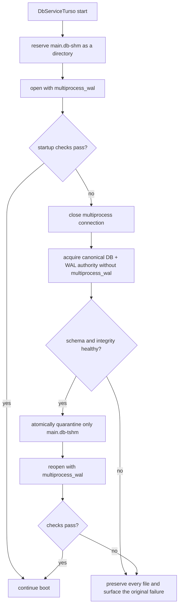

# B68 - db: self-heal stale Turso WAL coordination and remove actor-era startup warning
[Overview](../BASED.md)

Make `main.db` recover automatically when an external SQLite client leaves
Turso's multiprocess WAL coordinator stale, prevent ordinary SQLite clients
from writing through an incompatible `-shm` coordinator, and remove the
retired actor-era startup warning.

## Context

Vibecanvas opens on-disk databases with Turso's experimental
`multiprocess_wal` feature. Turso coordinates participating processes through
`main.db-tshm`, while generic SQLite clients use `main.db-shm`.

The reported failure had two stages:

1. While the SQLite client was live, Turso correctly refused the mixed open
   with `Database is already open without experimental multiprocess WAL`.
2. After the client closed, Turso reused a stale `main.db-tshm` page-to-frame
   index. `PRAGMA integrity_check` then reported impossible NULL
   `canvas_items` fields and missing index entries.

Read-only recovery experiments proved that the durable files were healthy:

- `main.db` + `main.db-wal` + stale `main.db-tshm` produced integrity errors.
- The same `main.db` + `main.db-wal` without `main.db-tshm` returned
  `integrity_check = ok` and the correct canvas UUID rows.
- Reopening regenerated a healthy `main.db-tshm`.

Never delete or replace `main.db-wal`; it can contain committed pages not yet
checkpointed into the small main database file.

Relevant code:

- [`packages/service-db/src/DbServiceTurso/DbServiceTurso.ts`](../../packages/service-db/src/DbServiceTurso/DbServiceTurso.ts)
- [`packages/service-db/src/DbServiceTurso/tx.migrations.ts`](../../packages/service-db/src/DbServiceTurso/tx.migrations.ts)
- [`packages/service-db/src/DbServiceTurso/fx.migration-state.ts`](../../packages/service-db/src/DbServiceTurso/fx.migration-state.ts)
- [`apps/cli/src/main-app.ts`](../../apps/cli/src/main-app.ts)
- [`apps/cli/src/fn.home-preflight-error.ts`](../../apps/cli/src/fn.home-preflight-error.ts)

## Plan

### 1. Prevent incompatible SQLite writes

- Reserve `main.db-shm` as a directory for every on-disk control database.
- Turso continues using `main.db-tshm`; ordinary SQLite readers may inspect the
  WAL, but normal SQLite writes cannot create/map their incompatible `-shm`
  file.
- Refuse a pre-existing non-directory `main.db-shm` because it is evidence of
  an active or unclean external SQLite session.

### 2. Heal only disposable coordinator metadata

- On an on-disk startup failure, close the multiprocess connection.
- Acquire Turso's write-capable single-process authority while executing only
  read statements. A read-only open is advisory; the write-capable open must
  fail while any multiprocess Turso or legacy SQLite opener is live.
- Validate the canonical `main.db` + `main.db-wal` view with the managed schema
  contract plus full and quick integrity checks.
- Only after those checks pass, atomically move `main.db-tshm` into a recovery
  directory and retry normal multiprocess startup once.
- Never move, truncate, delete, or overwrite `main.db-wal`.

### 3. Remove retired actor-era warning

- Stop probing for the unused sibling `vibecanvas.turso` marker during CLI
  startup.
- Remove actor-era-specific wording from generic unknown-database refusals and
  CLI guidance.
- Continue refusing an unknown database when it is selected as `main.db`.

### 4. Verification

- Cover shared health checks and coordinator quarantine.
- Prove a live multiprocess holder prevents healing.
- Prove a healthy canonical DB can regenerate its coordinator and boot.
- Cover the SQLite `-shm` sentinel and removed actor-era marker warning.
- Run database recovery, CLI, functional-core, type, and architecture checks.

## TODOS

- [x] Add the `main.db-shm` write-prevention sentinel.
- [x] Share complete integrity diagnostics between migrations and healing.
- [x] Add canonical single-process validation and `main.db-tshm` quarantine.
- [x] Retry `DbServiceTurso` startup once after safe coordinator healing.
- [x] Remove the actor-era marker warning and actor-era-specific guidance.
- [x] Add focused service-db and CLI regression coverage.
- [x] Run affected verification and regenerate `FILES.md`.
- [x] Mark B68 complete with execution logs.

## NOTES

- A UI mockup is not useful for this database lifecycle task.
- Automatic repair is deliberately limited to Turso's disposable `-tshm`
  coordinator. Real DB/WAL corruption remains a hard failure requiring a
  verified backup.
- The `main.db-shm` sentinel is prevention, not a security boundary; a user can
  deliberately remove it. Its purpose is to make accidental generic-client
  writes fail safely.

### LOGS

- 2026-07-28: Reproduced generic SQLite and Turso split-brain behavior against
  disposable databases and recovered the reported database by rebuilding only
  `main.db-tshm`; the DB and WAL hashes remained unchanged.
- 2026-07-28: Added complete shared integrity diagnostics, canonical DB/WAL
  validation, atomic `main.db-tshm` quarantine, and one bounded startup retry.
  Preflight uses the same healing path when stale coordinator state prevents
  schema inspection.
- 2026-07-28: Reserved `main.db-shm` as a directory so ordinary SQLite clients
  cannot create their incompatible shared-memory coordinator. Existing
  non-directory `-shm` state is preserved and refused.
- 2026-07-28: A cross-process regression proved that a read-only legacy Turso
  open is advisory; healing now acquires a write-capable single-process
  authority while executing only read statements, and refuses to quarantine a
  live multiprocess coordinator.
- 2026-07-28: Removed the `vibecanvas.turso` actor-era startup probe and all
  actor-era-specific active guidance. The compiled binary now boots normally
  with the legacy marker present and leaves it untouched.
- 2026-07-28: Passed 147 service-db tests, 176 CLI tests, database recovery,
  service-db and CLI typechecks, functional-core lint, architecture checks, a
  single-target release build, and the full compiled-binary acceptance suite.
  The exact incident DB/WAL/stale-`tshm` bundle also healed automatically with
  `integrity_check = ok` and both original UUID canvas rows restored.
- 2026-07-28: Regenerated `FILES.md` for the new health reader, coordinator
  healer, and cross-process holder fixture.
- 2026-07-28: Final source boot against the working `.vibecanvas` home passed;
  the frontend returned HTTP 200 and `main.db-shm` exists as the reserved
  directory sentinel.
- 2026-07-28: Review follow-up kept the public database portal stable across a
  healed native reconnection, so stores constructed before runtime boot do not
  retain the closed connection. Home-layout validation now also runs before
  creating a recovery directory or quarantining coordinator metadata. Passed
  148 service-db tests, 176 CLI tests, both package typechecks,
  functional-core lint, and architecture checks; the final source frontend and
  backend both returned HTTP 200 against the working home.

---
