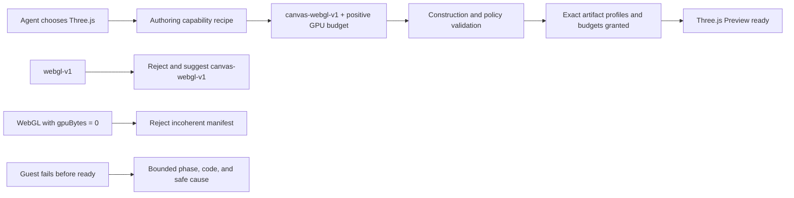

# B69 - AI widget authoring: request and diagnose Capsule WebGL authority
[Overview](../BASED.md)

AI can generate a valid Three.js bundle that cannot mount because its widget
manifest requests neither Capsule WebGL authority nor GPU memory. Make the
authoring path select the exact supported profile, reject incoherent GPU
requests, and report the real Preview failure instead of a generic mount error.

## Context

Reported on 2026-07-29 while creating the `Three.js Neon Orb` widget. The agent:

1. added Three.js `0.180.0` and constructed `THREE.WebGLRenderer`;
2. guessed the unsupported feature profile `webgl-v1`;
3. received a correct validation rejection;
4. removed the profile instead of replacing it with `canvas-webgl-v1`;
5. received `Widget "Three.js Neon Orb" is valid`; and
6. opened revision `b35ad1ec...` in Preview, where Capsule failed before ready.

The final artifact requests only `artifact-resources-v1` and
`shadow-browser-css-v1`. It also omits `ui.budgets`, so the product default
`gpuBytes` is zero. Capsule therefore gives the guest no WebGL facade.
Three.js requests `canvas.getContext("webgl2")`, receives `null`, and throws
`Error creating WebGL context.` before the guest reports ready.

This is consistent with Capsule's passing Three.js tests. Those tests use the
exact `canvas-webgl-v1` profile, a positive GPU budget, and the pinned Three.js
r185 probe. Capsule's reviewed facade does not promise ambient WebGL or
arbitrary Three.js compatibility.

The widget's other early browser operations were checked against the installed
Capsule facade. HTML `innerHTML`, `ResizeObserver`, `devicePixelRatio`, and the
page lifecycle listener are supported; the first deterministic blocker is the
missing WebGL authority.

Relevant files:

- [`docs/internal/llm.capsule-documentation.md`](../../docs/internal/llm.capsule-documentation.md)
- [`packages/capsule-vibecanvas/src/build/CONSTANTS.ts`](../../packages/capsule-vibecanvas/src/build/CONSTANTS.ts)
- [`packages/capsule-vibecanvas/src/build/fn.policy.ts`](../../packages/capsule-vibecanvas/src/build/fn.policy.ts)
- [`packages/service-agent/src/tools/CONSTANTS.ts`](../../packages/service-agent/src/tools/CONSTANTS.ts)
- [`packages/service-agent/src/prompts/prompt.product-and-manifest.md`](../../packages/service-agent/src/prompts/prompt.product-and-manifest.md)
- [`packages/service-agent/src/prompts/prompt.tools.md`](../../packages/service-agent/src/prompts/prompt.tools.md)
- [`packages/ui-ai-chat/src/widget-runtime/CapsuleWidgetHostCoordinator.ts`](../../packages/ui-ai-chat/src/widget-runtime/CapsuleWidgetHostCoordinator.ts)
- [`packages/ui-ai-chat/src/canvas-extension/PreviewPortalRuntime.ts`](../../packages/ui-ai-chat/src/canvas-extension/PreviewPortalRuntime.ts)
- [`apps/widget-debug-tools/`](../../apps/widget-debug-tools/)
- [`apps/capsule-browser-acceptance/`](../../apps/capsule-browser-acceptance/)

## Plan

### 1. Preserve the failure as negative coverage

- Add a fixture matching the reported draft: Three.js renderer construction,
  no `canvas-webgl-v1`, and omitted GPU budget.
- Prove construction can currently succeed while browser mount fails before
  ready because `getContext("webgl2")` returns `null`.
- Add separate fixtures for the guessed `webgl-v1` profile and for
  `canvas-webgl-v1` with an effective zero GPU budget.
- Keep the security boundary explicit. Do not grant WebGL merely because a
  dependency or source string resembles Three.js.

### 2. Give the agent one exact capability catalog

- Expose the supported Capsule feature-profile names and relevant budget
  requirements to widget authoring from one production-owned source.
- Do not duplicate a second hand-maintained allowlist in prompts.
- Keep the default scaffold least-authority; ordinary widgets must not receive
  WebGL or GPU memory.
- Add a concise Three.js/WebGL recipe:
  - request `canvas-webgl-v1`;
  - request a positive, bounded `ui.budgets.gpuBytes`;
  - use the Three.js release exercised by the current Capsule acceptance probe;
  - validate and Preview before declaring the widget ready.
- Improve unsupported-profile diagnostics so `webgl-v1` identifies
  `canvas-webgl-v1` as the supported exact profile instead of encouraging the
  agent to delete the requirement.

### 3. Validate profile and budget coherence

- Add a pure manifest-policy rule requiring an effective positive GPU budget
  whenever `canvas-webgl-v1` or `canvas-webgpu-v1` is requested.
- Keep the existing product ceiling authoritative and return the allowed range
  in a bounded error.
- Distinguish “artifact constructed and policy-valid” from “guest mounted and
  ready” in agent-facing validation text. Construction validation must not
  imply that Preview execution occurred.
- Do not add brittle regex scanning of minified bundles as a security check.
  The signed manifest remains the runtime authority declaration.

### 4. Preserve actionable mount diagnostics

- Trace the Capsule failure from guest evaluation through the host coordinator,
  Preview runtime, persisted diagnostic, and Preview frame.
- Preserve a bounded safe diagnostic containing at least phase, stable code,
  and actionable message. Do not expose guest stacks, host paths, artifact
  bytes, signing material, or unbounded exception data.
- When the guest asks for an unavailable WebGL context, tell the author to
  request `canvas-webgl-v1` and a positive GPU budget.
- Show this diagnostic in Preview and return it through the headless authoring
  session so both humans and agents can repair the manifest.

### 5. Prove the supported Three.js path

- Add a positive Three.js r185 fixture with `canvas-webgl-v1` and a measured GPU
  budget within Vibecanvas's ceiling.
- Run it through the production builder, signing, retained Preview
  construction, host target, feature grants, and browser platform.
- Assert Preview reaches ready and renders non-empty canvas pixels. Exercise at
  least one animation frame and teardown; a successful bundle alone is not
  sufficient.
- Verify the same retained construction remains publishable without rebuilding
  or widening its authority.
- Use B67's isolated persistent debug session for the agent-facing negative and
  positive flow, then use `apps/capsule-browser-acceptance` for the actual
  WebGL rendering assertion.

## TODOS

- [x] Add the reported missing-profile/zero-budget regression fixtures.
- [x] Make the supported Capsule capability catalog available to agent authoring.
- [x] Add exact Three.js/WebGL authoring guidance and profile correction.
- [x] Reject WebGL/WebGPU profiles with an effective zero GPU budget.
- [x] Clarify construction-valid versus Preview-ready tool language.
- [x] Preserve bounded actionable guest mount diagnostics in Preview and the lab.
- [x] Add a positive Three.js r185 rendered-pixel browser acceptance test.
- [x] Verify retained Preview construction remains publishable without rebuild.
- [x] Run focused tests, typecheck, functional-core lint, and frontend build.

## NOTES

- The correct serialized profile is `canvas-webgl-v1`; `webgl-v1` is invalid.
- Vibecanvas already allows the correct profile and configures Capsule's default
  browser platform. The host correctly grants only the exact feature profiles
  and budgets signed into the artifact.
- The current default and ceiling are respectively `gpuBytes: 0` and 64 MiB.
  Choose the positive fixture budget from measured probe usage rather than
  automatically granting the ceiling.
- This task should not weaken Capsule's exact-profile or default-deny model.
- No new UI mockup is needed. The supplied failure screenshot is the
  authoritative visual reference; the required UI change is diagnostic text.

### LOGS

- 2026-07-29: Reproduced revision `b35ad1ec...` failing before ready in the
  in-app Preview and confirmed the outer UI exposes only
  `Capsule mount failed before becoming ready`.
- 2026-07-29: Traced the artifact target and mount grant. The final manifest
  omits `canvas-webgl-v1`, the effective GPU budget is zero, and Three.js throws
  when Capsule correctly returns no WebGL2 context.
- 2026-07-29: Checked the generated widget's other pre-render DOM operations
  against the installed Capsule facade and ruled them out as the first failure.
- 2026-07-29: Centralized the authoring target, supported profiles, budgets, and
  tested Three.js r185 release in the production Capsule contract; agent prompts
  now render the exact catalog and WebGL recipe from that source.
- 2026-07-29: Added policy rejection for WebGL/WebGPU profiles with an effective
  zero GPU budget and an exact `webgl-v1` to `canvas-webgl-v1` correction.
- 2026-07-29: Preserved bounded `CANVAS_PROFILE_REQUIRED` and
  `WEBGL_CONTEXT_UNAVAILABLE` diagnostics through the host and Preview frame
  without forwarding guest stack or exception data.
- 2026-07-29: Added a Three.js `0.185.1` browser fixture using an 8 MiB GPU
  budget. Playwright proved non-empty rendered pixels, animation progress,
  teardown, and release mounting from the retained construction.
- 2026-07-29: Verified 39 Capsule adapter tests, 99 service-agent tests, 32
  focused UI tests, the 25-check browser acceptance, four package typechecks,
  functional-core lint, the frontend production build, and the acceptance page
  in the in-app browser.
- 2026-07-29: Reproduced the supplied `Neon Orbital` draft in the retained
  Preview. The first exact guest cause was the unavailable ambient
  `performance` API through `THREE.Clock`; after removing it, the built-in PBR
  scene exceeded Capsule's default 64 KiB message budget during geometry or
  shader marshaling.
- 2026-07-29: Narrowed the authoring recipe to explicitly indexed
  `BufferGeometry`, compact `RawShaderMaterial`, monotonic animation-frame
  timestamps, and a measured 256 KiB message allowance for richer supported
  scenes. Added safe renderer-neutral diagnostics for unavailable timing and
  message-budget failures.
- 2026-07-29: Repaired the exact retained draft through the agent workflow and
  verified its animated magenta/cyan orb renders in Preview with Publish
  enabled. Superseded revision diagnostics are now hidden from the active
  successful revision.

---
