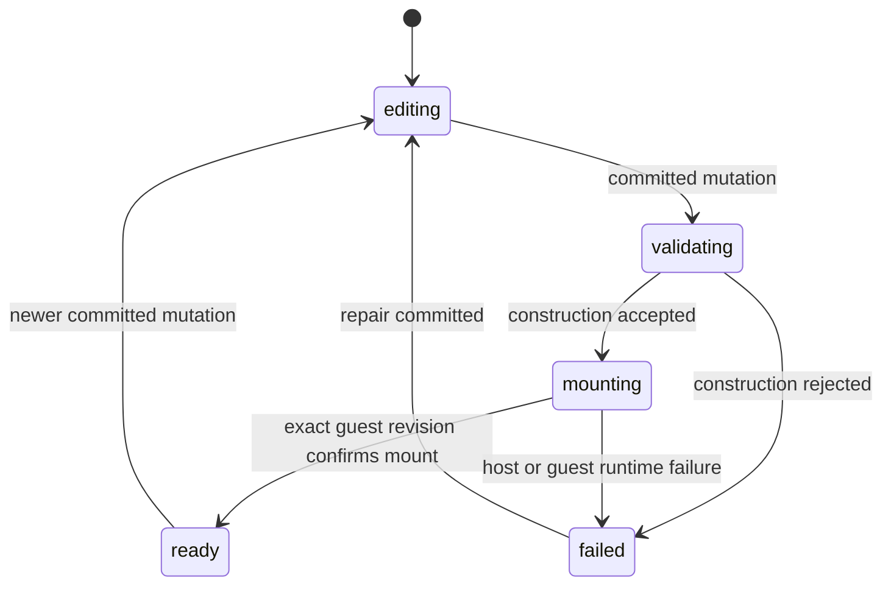

# B70 - AI widgets: one authoritative exact-revision readiness state
[Overview](../BASED.md)

Make chat, Preview, sidebar health, transient toasts, and the Preview **Manage**
menu consume one exact-revision readiness result. A last-known-good widget may
remain visible, but it must never make a failed newer revision look ready.
Publication availability separately follows the stable frame-target contract
defined by [`S133`](../s/S133.md).

## Context

The 2026-07-31 live authoring investigation found contradictory product state:

- AI Chat reported successful validation for a retained older Preview.
- Preview had already failed the newer revision with `GUEST_EXCEPTION`.
- The visible guest was the last-known-good revision, not the attempted one.
- The sidebar stopped indicating a problem after construction became valid.
- **Publish** remained enabled in the Preview **Manage** dropdown.

See
[`chat-widget-building-ux-investigation-2026-07-31.md`](../../docs/internal/chat-widget-building-ux-investigation-2026-07-31.md).

Most of the underlying data already exists:

- [`types.ts`](../../packages/service-agent/src/widget-drafts/types.ts) defines
  durable Preview-owner status, active revision, pending build, committed
  mutation, binding revision, runtime diagnostics, and publication identity.
- [`WidgetDraftController.ts`](../../packages/service-agent/src/widget-drafts/WidgetDraftController.ts)
  owns Preview build and runtime-diagnostic transitions.
- [`PreviewPortalRuntime.ts`](../../packages/ui-ai-chat/src/canvas-extension/PreviewPortalRuntime.ts)
  separately derives displayed content, status text, diagnostics, and
  publishability.
- [`fn.preview-control-presentation.ts`](../../packages/ui-ai-chat/src/canvas-extension/fn.preview-control-presentation.ts)
  controls disabled states for items in the existing **Manage** dropdown.
- [`WidgetsSidebarSection.tsx`](../../packages/ui-ai-chat/src/sidebar/widgets/components/WidgetsSidebarSection.tsx)
  renders the draft catalog.
- [`Toast.tsx`](../../apps/frontend/src/components/ui/Toast.tsx) is the existing
  application toast system.

The missing invariant is not a new global status component. It is one
authoritative projection keyed by the exact requested revision, with every
surface consuming that projection.

## Plan

### 1. Define the authoritative readiness projection

- Define one typed, revision-specific state covering `editing`, `validating`,
  `mounting`, `ready`, and `failed`.
- Bind it to draft ID, committed mutation/source digest, attempted Preview
  revision, binding revision, displayed fallback revision, build sequence, and
  latest failure.
- Keep the durable Preview owner/service as authority. UI components may derive
  presentation from the authoritative record but must not maintain competing
  readiness booleans.
- Put deterministic transition and projection logic in pure `fn.*.ts`
  functions. Keep event subscriptions, persistence, and notifications at
  orchestration edges.
- Fence every update by revision and build sequence so a late result cannot
  mark a newer edit ready or failed.

### 2. Make `ready` mean the exact revision mounted

- Do not mark a revision ready merely because construction validation passed.
- Add or reuse a bounded host mount acknowledgment for the exact Preview
  revision and binding revision.
- Preserve last-known-good rendering during builds and failures, but expose it
  as `displayedFallbackRevision`; it cannot satisfy current readiness.
- On runtime failure, atomically keep the displayed fallback and mark the
  attempted revision failed.
- Rehydrate the same state after reload without temporarily projecting a stale
  revision as publishable.

### 3. Drive existing surfaces from the same state

- AI Chat must not render a terminal “done” claim for a revision unless its
  shared state is `ready`.
- Preview logs and compact fallback text must show attempted and displayed
  revisions without covering guest content.
- The widget sidebar uses a small warning/error indicator for a failed current
  draft; do not add a large badge.
- Announce transitions through the existing toast port:
  - error: `Preview failed` with attempted and last-good revisions;
  - success: exact revision is ready;
  - avoid a toast for every internal build phase.
- Do not add a permanent canvas-wide status banner.

### 4. Keep publication inside Manage and target the durable frame

- Keep **Publish** only inside the existing Preview **Manage** dropdown created
  by [`S123`](../s/S123.md).
- Keep it available whenever the durable frame target exists and no publication
  request is active. Readiness controls whether Publish reuses or rebuilds; it
  is not a click gate.
- Keep **Cancel build** disabled when no cancellable build is active.
- On Publish, let the server build and validate the current stable source, then
  promote the exact server-selected construction. A stale UI event must never
  publish an older fallback.
- When disabled because the target is gone, expose an accessible instruction
  to open or place a Preview frame.

### 5. Verify the invariant end to end

- Cover every legal transition and reject stale transition attempts.
- Reproduce: revision A mounts, revision B fails, A remains displayed.
- Assert Chat does not claim B completed, sidebar indicates failure, the error
  toast fires once, and Manage → Publish is disabled.
- Repair with revision C and assert the same surfaces switch to ready together.
- Reload in both failed-with-fallback and ready states and assert no transient
  publishability leak.
- Add pointer and keyboard coverage for the disabled Publish menu item.

## TODOS

- [ ] Add the exact-revision readiness type and pure transition/projection functions.
- [ ] Make successful guest mount the only transition to ready.
- [ ] Route Chat, Preview, sidebar, and toast presentation through the shared projection.
- [ ] Keep Publish in Manage and gate it by stable frame ownership.
- [ ] Add stale-event, fallback, reload, toast, and publication regression tests.
- [ ] Update the Preview section of `SCREENS.md`.

## Acceptance criteria

- One durable record answers which revision is attempted, which is displayed,
  and whether the attempted revision is editing, validating, mounting, ready,
  or failed.
- A last-known-good fallback never makes a newer failed revision appear ready.
- Chat cannot say “done” for a construction-only or failed revision.
- Failure and recovery use the existing toast system without a permanent
  canvas status banner.
- Publish remains inside **Manage**, uses the durable frame target, and builds
  current source when the exact current revision is not already ready.
- Sidebar, Chat, Preview, toast, and Publish tests assert the same revision ID.

## NOTES

- The mockup was generated with the built-in image tool from the two supplied
  screenshots, resized to 1400 px, and losslessly compressed. Written behavior
  is authoritative when the mockup and task differ.
- This task owns cross-surface truth and publication gating. It does not add AI
  Preview tools; that is [`A103`](../a/A103.md).
- S133 supersedes B70's original exact-ready Publish gate. B70 still owns the
  shared readiness and diagnostic truth shown across product surfaces.
- Actionable guest error contents belong to [`B71`](./B71.md).

### LOGS

- 2026-07-31: Created from the live AI Chat widget-building investigation and
  corrected UX direction: toast transitions, subtle sidebar health, and
  Publish retained inside Manage.

---
